# AI Automation for Business: The Strategic Advantage Every Leader Needs in 2025

## Table of Contents
- [The AI Revolution: From 2016 to Today's Business Reality](#the-ai-revolution-from-2016-to-todays-business-reality)
- [The Business Case: Why AI Automation Matters Now](#the-business-case-why-ai-automation-matters-now)
- [Customer Service Automation: The 80% Solution](#customer-service-automation-the-80-solution)
- [Sales Process Acceleration: 4x Faster Revenue Cycles](#sales-process-acceleration-4x-faster-revenue-cycles)
- [Operational Excellence: 40% Efficiency Gains](#operational-excellence-40-efficiency-gains)
- [Data-Driven Decision Making at Scale](#data-driven-decision-making-at-scale)
- [HR Transformation: From Screening to Strategy](#hr-transformation-from-screening-to-strategy)
- [Implementation Strategy: A Practical Roadmap](#implementation-strategy-a-practical-roadmap)
- [ROI Analysis: Measuring Success](#roi-analysis-measuring-success)
- [Future-Proofing Your Business](#future-proofing-your-business)
- [Additional Resources and Case Studies](#additional-resources-and-case-studies)

## The AI Revolution: From 2016 to Today's Business Reality

Having worked on AI projects since 2016, I've witnessed the dramatic evolution from basic machine learning models to today's sophisticated AI ecosystems. Back then, we were implementing rudimentary neural networks and decision trees. Today's landscape encompasses not just Large Language Models (LLMs), but computer vision systems, natural language processing engines, predictive analytics platforms, and autonomous decision-making frameworks.

The transformation isn't just technological—it's fundamentally changing how businesses operate, compete, and create value.

## The Business Case: Why AI Automation Matters Now

The data speaks volumes: companies implementing AI automation are seeing 40% improvements in operational efficiency, 80% reduction in Level 1 customer support tickets, and 4x acceleration in sales cycles. These aren't future projections—they're today's measurable outcomes from companies like [Shopify](https://www.shopify.com/enterprise/ai-ecommerce), [Spotify](https://engineering.atspotify.com/2022/03/introducing-natural-language-search-for-podcast-episodes/), and [JPMorgan Chase](https://www.jpmorgan.com/technology/artificial-intelligence).

For founders, this represents competitive differentiation. For CTOs, it's about scalable infrastructure. For investors, it's about sustainable growth and margin expansion. According to [McKinsey's 2024 AI Report](https://www.mckinsey.com/capabilities/quantumblack/our-insights/the-state-of-ai), organizations using AI automation see average revenue increases of 15% and cost reductions of 20%.

## Customer Service Automation: The 80% Solution

Modern AI customer service systems handle up to 80% of Level 1 and 2 customer queries autonomously. This isn't about replacing human agents—it's about elevating them to handle complex, high-value interactions while AI manages routine inquiries.

### Key Implementation Areas:
- **Intelligent Ticket Routing**: AI analyzes incoming requests and routes them to appropriate departments ([Freshworks' Freddy AI](https://www.freshworks.com/artificial-intelligence/) routes 95% of tickets correctly)
- **Sentiment Analysis**: Real-time emotional intelligence to escalate issues requiring human empathy ([Twilio Flex](https://www.twilio.com/flex) detects customer frustration in real-time)
- **Knowledge Base Integration**: Instant access to company information with contextual responses ([Ada's AI chatbot](https://ada.cx/) resolves 70% of inquiries without human intervention)
- **Multi-channel Consistency**: Unified experience across email, chat, phone, and social media ([LivePerson's Conversational Cloud](https://www.liveperson.com/platform/) maintains context across all channels)

**Real-World Impact**: Companies like [Intercom](https://www.intercom.com/blog/machine-learning-way-more-powerful-than-you-think/) report 60% reduction in average response time and 35% increase in customer satisfaction scores within the first quarter of implementation. [Zendesk's Answer Bot](https://www.zendesk.com/service/answer-bot/) handles over 30% of customer inquiries automatically, while [Salesforce's Einstein Case Classification](https://trailhead.salesforce.com/content/learn/modules/service_cloud_einstein/service_cloud_einstein_case_classification) routes tickets with 95% accuracy.

## Sales Process Acceleration: 4x Faster Revenue Cycles

AI-driven sales automation transforms the entire revenue pipeline from lead generation to deal closure. Modern systems don't just manage data—they predict outcomes, personalize interactions, and optimize timing.

### Strategic Applications:
- **Lead Scoring and Qualification**: Predictive models identify high-probability prospects
- **Personalized Outreach**: Dynamic content generation based on prospect behavior and preferences
- **Sales Forecasting**: Accurate pipeline predictions for better resource allocation
- **Competitive Intelligence**: Real-time market analysis and positioning strategies

**Measurable Results**: Sales teams report 4x faster deal progression and 45% improvement in conversion rates when AI automation is properly implemented.

## Operational Excellence: 40% Efficiency Gains

Business process automation extends beyond simple task completion—it's about intelligent workflow orchestration that adapts to changing conditions and optimizes resource utilization.

### Core Automation Areas:
- **Document Processing**: Intelligent extraction and classification of business documents
- **Supply Chain Optimization**: Predictive inventory management and logistics coordination
- **Financial Operations**: Automated invoice processing, expense categorization, and compliance monitoring
- **Quality Assurance**: Real-time monitoring and anomaly detection across business processes

## Data-Driven Decision Making at Scale

AI transforms data analysis from periodic reporting to continuous intelligence. Modern systems process vast datasets in real-time, identifying patterns humans would miss and providing actionable insights at the speed of business.

### Intelligence Capabilities:
- **Predictive Analytics**: Forecast market trends, customer behavior, and operational needs ([Netflix's recommendation engine](https://research.netflix.com/research-area/machine-learning) drives 80% of viewer engagement)
- **Anomaly Detection**: Identify unusual patterns that may indicate opportunities or risks ([PayPal's fraud detection](https://www.paypal.com/us/smarthelp/article/how-does-paypal-protect-me-from-fraud-faq1056) prevents $20B+ in losses annually)
- **Competitive Analysis**: Monitor market positioning and competitor activities ([Crayon's competitive intelligence](https://www.crayon.co/competitive-intelligence-software) tracks 10M+ data points daily)
- **Performance Optimization**: Continuous improvement recommendations based on data analysis ([Google's Smart Bidding](https://support.google.com/google-ads/answer/7065882) improves ad performance by 15% on average)

## HR Transformation: From Screening to Strategy

Human Resources automation elevates HR from administrative functions to strategic business partnership. AI handles routine tasks while enabling HR professionals to focus on culture, development, and strategic workforce planning.

### Strategic HR Applications:
- **Intelligent Recruitment**: Automated resume screening and candidate matching ([Unilever's AI recruitment](https://www.unilever.com/news/news-search/2019/how-unilever-is-future-proofing-its-workforce/) reduced hiring time by 75%)
- **Employee Experience**: Personalized onboarding and continuous engagement monitoring ([Microsoft Viva](https://www.microsoft.com/en-us/microsoft-viva) increases employee engagement by 40%)
- **Performance Analytics**: Data-driven insights into team productivity and satisfaction ([Workday's People Analytics](https://www.workday.com/en-us/products/human-capital-management/workforce-planning-analytics.html) helps predict performance outcomes)
- **Retention Prediction**: Early identification of flight risks and intervention strategies ([IBM Watson Career Coach](https://www.ibm.com/watson/hr) reduces turnover by 25% through early intervention)

```mermaid
flowchart LR
    subgraph ACQUIRE ["🎯 Talent Acquisition"]
        A["📝 Posting<br/>●●●○○"] --> B["🔍 Screening<br/>●●●●●"]
        B --> C["📋 Interview<br/>●●●●○"]
    end
    
    subgraph ONBOARD ["🚀 Onboarding"]
        D["📄 Docs<br/>●●●●●"] --> E["🎓 Training<br/>●●●●○"]
        E --> F["📊 Tracking<br/>●●●●○"]
    end
    
    subgraph DEVELOP ["📈 Development"]
        G["🎯 Review<br/>●●●●○"] --> H["🔍 Analysis<br/>●●●●●"]
        H --> I["💡 Paths<br/>●●●●○"]
    end
    
    subgraph RETAIN ["💎 Retention"]
        J["😊 Survey<br/>●●●●○"] --> K["⚠️ Risk<br/>●●●●●"]
        K --> L["🎯 Strategy<br/>●●●○○"]
    end
    
    C --> D
    F --> G
    I --> J
    
    style ACQUIRE fill:#e3f2fd,stroke:#1976d2,stroke-width:2px
    style ONBOARD fill:#f3e5f5,stroke:#7b1fa2,stroke-width:2px
    style DEVELOP fill:#e8f5e8,stroke:#388e3c,stroke-width:2px
    style RETAIN fill:#fff8e1,stroke:#f57c00,stroke-width:2px
```

## Implementation Strategy: A Practical Roadmap

Successful AI automation requires strategic planning, not random technology adoption. The implementation should follow a structured approach that maximizes ROI while minimizing disruption.

### Phase 1: Assessment and Planning
1. **Process Audit**: Identify high-impact, low-complexity automation opportunities
2. **Technology Evaluation**: Assess current infrastructure and integration requirements
3. **ROI Modeling**: Establish baseline metrics and success criteria
4. **Change Management**: Prepare teams for automation integration

### Phase 2: Pilot Implementation
1. **Proof of Concept**: Start with limited scope, high-impact processes
2. **Integration Testing**: Ensure seamless connectivity with existing systems
3. **Performance Monitoring**: Track metrics and optimize configurations
4. **Team Training**: Develop internal capabilities for ongoing management

### Phase 3: Scale and Optimize
1. **Horizontal Expansion**: Extend automation to additional processes
2. **Advanced Features**: Implement sophisticated AI capabilities
3. **Continuous Improvement**: Regular optimization based on performance data
4. **Strategic Integration**: Align automation with long-term business objectives

## ROI Analysis: Measuring Success

AI automation investments must deliver measurable business value. Success metrics should encompass both operational efficiency and strategic advantages.

### Key Performance Indicators:
- **Cost Reduction**: Labor costs, error correction, operational overhead
- **Revenue Enhancement**: Faster sales cycles, improved customer retention, market expansion
- **Efficiency Metrics**: Process completion time, resource utilization, throughput improvements
- **Quality Improvements**: Error rates, customer satisfaction, compliance adherence

### Expected ROI Timeline:
- **Months 1-3**: Initial cost savings from basic automation (10-15% efficiency gain)
- **Months 4-6**: Compound benefits from process optimization (25-30% improvement)
- **Months 7-12**: Strategic advantages from advanced capabilities (40%+ total improvement)
- **Year 2+**: Competitive differentiation and market expansion opportunities

## Future-Proofing Your Business

AI automation isn't a destination—it's a continuous journey of optimization and innovation. Organizations that build adaptive AI capabilities today will dominate their markets tomorrow.

### Strategic Considerations:
- **Scalable Architecture**: Design systems that can evolve with advancing AI capabilities
- **Data Strategy**: Implement robust data governance for AI model training and optimization
- **Talent Development**: Build internal expertise to manage and optimize AI systems
- **Ethical AI**: Establish guidelines for responsible AI deployment and decision-making

The companies that succeed in the AI era won't be those with the most advanced technology—they'll be those that most effectively integrate AI automation into their business strategy to solve real-world problems and create sustainable competitive advantages.

**The question isn't whether to implement AI automation—it's how quickly you can begin and how strategically you can execute.**

## Additional Resources and Case Studies

### Industry Reports:
- [McKinsey Global Institute: The Age of AI](https://www.mckinsey.com/capabilities/quantumblack/our-insights/the-age-of-ai-and-our-human-future)
- [MIT Sloan: AI Adoption and Business Value](https://mitsloan.mit.edu/ideas-made-to-matter/artificial-intelligence-business-value)
- [Deloitte: State of AI in the Enterprise](https://www2.deloitte.com/us/en/insights/focus/cognitive-technologies/state-of-ai-and-intelligent-automation-in-business-survey.html)

### Company Case Studies:
- [Tesla's AI-Driven Manufacturing](https://www.tesla.com/AI): 50% reduction in production defects
- [DHL's Predictive Logistics](https://www.dhl.com/global-en/home/insights-and-innovation/insights/artificial-intelligence.html): 25% improvement in delivery accuracy
- [Mastercard's AI Fraud Prevention](https://www.mastercard.us/en-us/business/overview/safety-and-security/artificial-intelligence.html): $20B+ in prevented losses
- [Starbucks' Deep Brew AI](https://stories.starbucks.com/stories/2019/starbucks-turns-to-technology-to-brew-up-a-more-personal-connection-with-its-customers/): 30% increase in personalized recommendations

### Platform Examples:
- [Google Cloud AI Platform](https://cloud.google.com/ai-platform): Enterprise-grade machine learning
- [Microsoft Azure Cognitive Services](https://azure.microsoft.com/en-us/products/cognitive-services/): Pre-built AI capabilities
- [AWS AI Services](https://aws.amazon.com/machine-learning/ai-services/): Scalable AI infrastructure
- [IBM Watson](https://www.ibm.com/watson): Industry-specific AI solutions

---

*Ready to explore AI automation for your business? The technology is mature, the benefits are proven, and the competitive advantage awaits those bold enough to act.*
