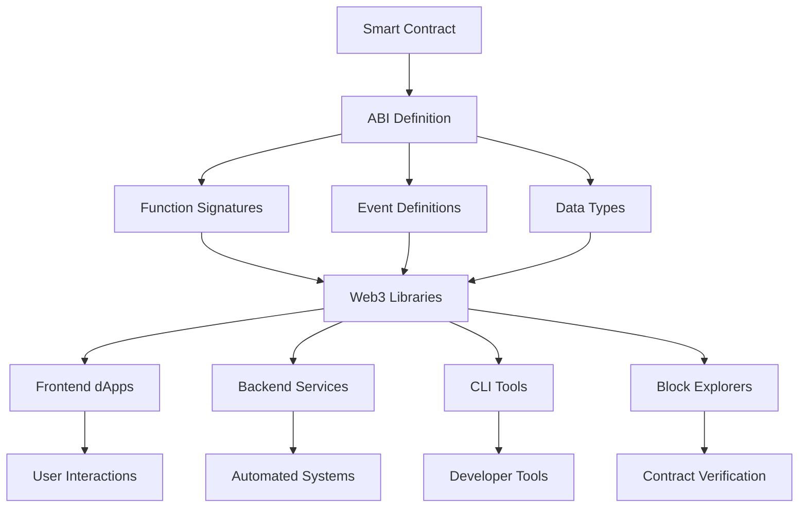
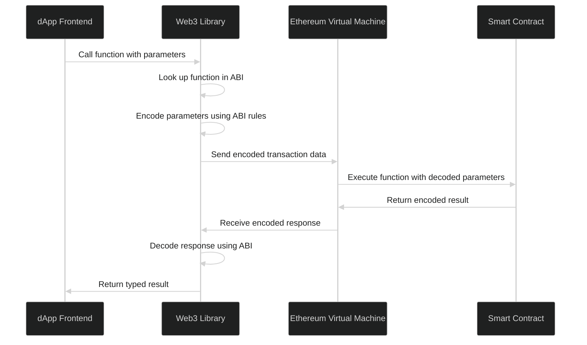

# Ethereum ABI Complete Guide: Mastering Application Binary Interface for Smart Contract Development

Understanding Ethereum's Application Binary Interface (ABI) is crucial for any developer working with smart contracts and decentralized applications (dApps). Whether you're building DeFi protocols, NFT marketplaces, or enterprise blockchain solutions, mastering ABI is essential for seamless smart contract interaction across the Ethereum ecosystem and EVM-compatible blockchains.

This comprehensive guide will take you from ABI fundamentals to advanced implementation patterns, providing you with the knowledge and tools needed to build robust blockchain applications. You'll learn how to encode and decode contract data, handle complex data types, implement security best practices, and optimize your ABI usage for production environments.

## Table of Contents

1. [What is Ethereum ABI (Application Binary Interface)?](#what-is-ethereum-abi-application-binary-interface)
2. [ABI Structure and Components](#abi-structure-and-components)
3. [How ABI Works: Under the Hood](#how-abi-works-under-the-hood)
4. [ABI Encoding and Decoding Explained](#abi-encoding-and-decoding-explained)
5. [Function Signatures and Selectors](#function-signatures-and-selectors)
6. [Event Encoding and Log Parsing](#event-encoding-and-log-parsing)
7. [Working with ABI in Different Languages](#working-with-abi-in-different-languages)
8. [ABI Generation from Smart Contracts](#abi-generation-from-smart-contracts)
9. [Advanced ABI Patterns and Best Practices](#advanced-abi-patterns-and-best-practices)
10. [ABI Security Considerations](#abi-security-considerations)
11. [Debugging ABI-Related Issues](#debugging-abi-related-issues)
12. [ABI in Multi-Chain Development](#abi-in-multi-chain-development)
13. [Future of ABI and EVM Evolution](#future-of-abi-and-evm-evolution)
14. [Real-World ABI Examples](#real-world-abi-examples)
15. [Frequently Asked Questions](#frequently-asked-questions)

---

## What is Ethereum ABI (Application Binary Interface)?

The **Ethereum ABI (Application Binary Interface)** is a standardized way to interact with smart contracts on Ethereum and EVM-compatible blockchains. Think of ABI as a **bridge between your application and smart contracts** - it defines how to encode function calls and decode responses.

In the blockchain development ecosystem, ABI serves as the critical communication layer that enables seamless interaction between off-chain applications and on-chain smart contracts. Without ABI, developers would need to manually handle low-level bytecode operations, making smart contract integration extremely complex and error-prone.

For developers building modern dApps, understanding ABI is not optional—it's fundamental. Every Web3 library, from [WAGMI to Ethers.js](/articles/wagmi-ethers/), relies heavily on ABI specifications to provide the developer-friendly interfaces that make blockchain development accessible and efficient.

### Quick Facts:
- **Purpose**: Standardizes smart contract interaction
- **Format**: JSON specification describing contract interface
- **Scope**: Works across all EVM-compatible chains
- **Usage**: Essential for dApp development and contract interaction

**Simple Definition**: ABI is like a **contract's instruction manual** that tells applications exactly how to communicate with smart contracts - what functions exist, what parameters they need, and what they return.

### Why ABI Matters:

1. **Universal Standard**: Every EVM-compatible chain uses the same ABI format, ensuring your smart contract integration code works across Ethereum, Polygon, Arbitrum, Optimism, and hundreds of other EVM-compatible networks without modification.

2. **Type Safety**: Ensures correct data types and function calls, preventing common development errors such as parameter mismatches, incorrect encoding, and failed transactions that could result in lost gas fees.

3. **Interoperability**: Enables seamless integration between different tools, frameworks, and services in the blockchain ecosystem, from development environments like Hardhat and Foundry to production monitoring tools and block explorers.

4. **Developer Experience**: Provides autocomplete and validation in development environments, reducing development time and helping catch errors before deployment, ultimately leading to more robust and secure dApp implementations.

The importance of ABI extends beyond mere convenience—it's a critical component that enables the entire Web3 ecosystem to function cohesively, allowing developers to build complex applications that interact with multiple smart contracts across different protocols and chains.




---

## ABI Structure and Components

Understanding the structure and components of Ethereum ABI is essential for effective smart contract development and integration. The ABI specification defines a standardized format that ensures consistent interaction patterns across the entire Ethereum ecosystem.

### Core ABI Components

Every ABI consists of an array of objects, each describing a contract element. This JSON-based specification provides a complete interface description that enables tools and libraries to understand how to interact with your smart contracts. The modular design of ABI allows for precise control over contract interfaces while maintaining backward compatibility and extensibility.

```json
[
  {
    "type": "function",
    "name": "transfer",
    "stateMutability": "nonpayable",
    "inputs": [
      { "name": "to", "type": "address" },
      { "name": "amount", "type": "uint256" }
    ],
    "outputs": [
      { "name": "", "type": "bool" }
    ]
  },
  {
    "type": "event",
    "name": "Transfer",
    "anonymous": false,
    "inputs": [
      { "name": "from", "type": "address", "indexed": true },
      { "name": "to", "type": "address", "indexed": true },
      { "name": "value", "type": "uint256", "indexed": false }
    ]
  }
]
```

### ABI Element Types

The ABI specification defines several distinct element types, each serving a specific purpose in smart contract interaction. Understanding these element types is crucial for both contract developers and dApp integrators, as they determine how your application will communicate with blockchain-deployed contracts.

#### 1. **Functions**

Function elements represent callable methods in your smart contract. They are the primary means of interaction between external applications and contract logic, supporting various execution patterns from simple view operations to complex state-changing transactions.
```json
{
  "type": "function",
  "name": "balanceOf",
  "stateMutability": "view",
  "inputs": [{ "name": "account", "type": "address" }],
  "outputs": [{ "name": "", "type": "uint256" }]
}
```

#### 2. **Events**

Event elements define the structure of logs emitted by your smart contract. These are essential for dApp functionality, enabling real-time notifications, historical data queries, and efficient off-chain indexing of on-chain activities.
```json
{
  "type": "event",
  "name": "Approval",
  "anonymous": false,
  "inputs": [
    { "name": "owner", "type": "address", "indexed": true },
    { "name": "spender", "type": "address", "indexed": true },
    { "name": "value", "type": "uint256", "indexed": false }
  ]
}
```

#### 3. **Constructor**

Constructor elements describe the contract initialization function, defining the parameters required during contract deployment. This is crucial for understanding how to properly deploy and initialize smart contracts with the correct configuration.
```json
{
  "type": "constructor",
  "stateMutability": "nonpayable",
  "inputs": [
    { "name": "name", "type": "string" },
    { "name": "symbol", "type": "string" }
  ]
}
```

#### 4. **Errors** (Solidity 0.8.4+)

Error elements, introduced in Solidity 0.8.4, provide structured error handling with typed parameters. This modern approach to error management offers better developer experience with detailed error information and reduced gas costs compared to traditional string-based revert messages.
```json
{
  "type": "error",
  "name": "InsufficientBalance",
  "inputs": [
    { "name": "available", "type": "uint256" },
    { "name": "required", "type": "uint256" }
  ]
}
```

### State Mutability Types

State mutability is a critical concept in Ethereum smart contract development that determines how functions interact with the blockchain state and affects both gas costs and security considerations. Understanding these mutability types is essential for optimizing contract performance and ensuring correct function usage in your dApps.

| Type | Description | Gas Cost | Blockchain State | Use Cases |
|------|-------------|----------|------------------|-----------|
| `pure` | No state read/write | Lowest | No access | Utility functions, calculations, data transformations |
| `view` | Read-only | Low | Read access | Getters, balance checks, state queries |
| `nonpayable` | State changes, no ETH | Medium-High | Write access | State updates, transfers, administrative functions |
| `payable` | State changes + ETH | Medium-High | Write + ETH | Deposits, purchases, fundraising functions |

**Performance Implications**: View and pure functions can be called locally without creating transactions, making them ideal for data retrieval in user interfaces. Nonpayable and payable functions require transactions and gas fees, making them suitable for state-changing operations that need to be permanently recorded on the blockchain.

---

## How ABI Works: Under the Hood

Understanding the internal mechanics of ABI operation is crucial for debugging issues, optimizing gas costs, and building robust blockchain applications. The ABI encoding process involves several sophisticated steps that transform high-level function calls into low-level bytecode that the Ethereum Virtual Machine can execute.

This process happens transparently when you use Web3 libraries, but understanding the underlying mechanics helps you troubleshoot issues, optimize performance, and implement advanced features like meta-transactions and contract interactions.

### The ABI Encoding Process

The ABI encoding process is a multi-step procedure that bridges the gap between human-readable function calls and EVM-executable bytecode. This process ensures type safety, data integrity, and consistent behavior across all EVM-compatible blockchains.





### Step-by-Step Interaction Example

Let's walk through a complete ABI encoding example to understand how a simple ERC-20 token transfer function call gets transformed into EVM-executable bytecode. This practical example demonstrates the entire process from high-level function parameters to the final transaction data.

**1. Function Call Setup**

The first step involves defining the function parameters in a format that your application can work with. This represents the human-readable interface that dApp developers interact with.
```javascript
// Function: transfer(address to, uint256 amount)
const functionCall = {
  to: "0x742d35Cc6634C0532925a3b8D6Cd1C532a53e047",
  amount: "1000000000000000000" // 1 ETH in wei
};
```

**2. Function Signature Generation**

The function signature is created by combining the function name with its parameter types. This signature is then hashed using Keccak-256, and the first 4 bytes become the function selector that identifies which function to call.
```javascript
// Create function signature
const signature = "transfer(address,uint256)";
const selector = keccak256(signature).slice(0, 8); // 0xa9059cbb
```

**3. Parameter Encoding**

Parameters are encoded according to ABI rules, with each type having specific encoding requirements. All parameters are padded to 32-byte boundaries, ensuring consistent memory layout and efficient EVM processing.
```javascript
// ABI encode parameters
const encodedParams = abi.encode(
  ["address", "uint256"],
  ["0x742d35Cc6634C0532925a3b8D6Cd1C532a53e047", "1000000000000000000"]
);
// Result: 0x000000000000000000000000742d35cc6634c0532925a3b8d6cd1c532a53e047
//         0000000000000000000000000000000000000000000000000de0b6b3a7640000
```

**4. Complete Transaction Data**

The final step combines the function selector with the encoded parameters to create the complete transaction data. This bytecode is what gets sent to the Ethereum network and executed by the EVM.
```javascript
const transactionData = selector + encodedParams.slice(2);
// 0xa9059cbb000000000000000000000000742d35cc6634c0532925a3b8d6cd1c532a53e047
//         0000000000000000000000000000000000000000000000000de0b6b3a7640000
```

---

## ABI Encoding and Decoding Explained

ABI encoding and decoding are fundamental processes that enable seamless data exchange between your applications and smart contracts. Mastering these concepts is essential for debugging contract interactions, implementing custom tools, and optimizing gas usage in your dApps.

The encoding rules ensure consistent data representation across all EVM-compatible chains, making your applications portable and interoperable. Understanding these rules also helps you identify and resolve common issues like parameter mismatches and type conversion errors.

### ABI Encoding Rules

ABI encoding follows strict rules that ensure data integrity and predictable behavior across all implementations. These rules define how different data types are represented in bytecode, handle dynamic content, and maintain memory alignment for efficient EVM processing.

#### Basic Types Encoding

Basic types form the foundation of ABI encoding, providing standardized representations for fundamental data types used in smart contracts. Understanding these encodings is crucial for debugging and implementing custom serialization logic.

**1. Uint/Int Types**

Unsigned and signed integers are encoded as 32-byte big-endian values, regardless of their actual size (uint8, uint256, etc.). This consistent size ensures predictable memory layout and efficient EVM operations.
```javascript
// uint256: 32-byte big-endian
const value = 42;
const encoded = "0x000000000000000000000000000000000000000000000000000000000000002a";
```

**2. Address Type**

Ethereum addresses are 20-byte values that are left-padded with zeros to fill the standard 32-byte slot. This padding ensures consistent memory alignment while preserving the actual address value.
```javascript
// address: 20 bytes, padded to 32 bytes
const address = "0x742d35Cc6634C0532925a3b8D6Cd1C532a53e047";
const encoded = "0x000000000000000000000000742d35cc6634c0532925a3b8d6cd1c532a53e047";
```

**3. Boolean Type**

Boolean values are encoded as integers (0 for false, 1 for true) and padded to 32 bytes. This simple encoding scheme ensures compatibility with integer operations and maintains the standard slot size.
```javascript
// bool: 0 for false, 1 for true, padded to 32 bytes
const value = true;
const encoded = "0x0000000000000000000000000000000000000000000000000000000000000001";
```

#### Dynamic Types Encoding

Dynamic types present more complex encoding challenges since their size isn't known at compile time. The ABI specification handles this by using a length-prefixed encoding scheme that enables efficient parsing while maintaining data integrity.

**1. String Type**

Strings are encoded with their length followed by the UTF-8 byte representation, padded to 32-byte boundaries. This encoding allows for arbitrary-length text while maintaining efficient memory access patterns.
```javascript
// string: length + UTF-8 bytes, padded to 32-byte boundaries
const text = "Hello";
const encoded = 
  "0x0000000000000000000000000000000000000000000000000000000000000005" + // length
  "48656c6c6f000000000000000000000000000000000000000000000000000000";   // "Hello" + padding
```

**2. Dynamic Arrays**

Dynamic arrays use a similar pattern to strings, starting with the array length followed by each element encoded according to its type. This approach enables efficient iteration and random access to array elements.
```javascript
// uint256[]: length + elements
const array = [1, 2, 3];
const encoded = 
  "0x0000000000000000000000000000000000000000000000000000000000000003" + // length
  "0000000000000000000000000000000000000000000000000000000000000001" + // element 1
  "0000000000000000000000000000000000000000000000000000000000000002" + // element 2
  "0000000000000000000000000000000000000000000000000000000000000003";  // element 3
```

### Advanced Encoding Examples

**Struct Encoding**
```solidity
// Solidity struct
struct User {
    address wallet;
    uint256 balance;
    string name;
}
```

```javascript
// ABI encoding for struct
const user = {
  wallet: "0x742d35Cc6634C0532925a3b8D6Cd1C532a53e047",
  balance: "1000000000000000000",
  name: "Alice"
};

// Encoded as tuple
const types = ["address", "uint256", "string"];
const values = [user.wallet, user.balance, user.name];
const encoded = abi.encode(types, values);
```

---

## Function Signatures and Selectors

Function signatures and selectors are core components of smart contract interaction that enable the EVM to route function calls to the correct contract methods. Understanding this system is essential for debugging contract interactions, implementing proxy patterns, and building advanced contract architectures.

The function selector system provides a compact and efficient way to identify functions while maintaining security through collision resistance. This 4-byte identifier system has proven robust across millions of deployed contracts and billions of transactions.

### Function Selector Generation

Every function call starts with a 4-byte selector that uniquely identifies the function to be called. This selector is derived from the function signature using cryptographic hashing, ensuring that different functions have different selectors while keeping the identifier size minimal for gas efficiency.

```javascript
function generateSelector(signature) {
  // Example: "transfer(address,uint256)"
  const hash = keccak256(signature);
  return hash.slice(0, 10); // 0x + 8 hex chars = 4 bytes
}

// Common ERC-20 selectors
const selectors = {
  "transfer(address,uint256)": "0xa9059cbb",
  "balanceOf(address)": "0x70a08231",
  "approve(address,uint256)": "0x095ea7b3",
  "totalSupply()": "0x18160ddd"
};
```

### Canonical Function Signatures

**Rules for Function Signatures:**
1. No spaces around commas or parentheses
2. Use canonical type names (no aliases)
3. Arrays include size: `uint256[3]` not `uint256[]` for fixed arrays

```javascript
// ✅ Correct signatures
"transfer(address,uint256)"
"approve(address,uint256)"
"transferFrom(address,address,uint256)"

// ❌ Incorrect signatures  
"transfer(address, uint256)"  // Space after comma
"transfer(addr,uint)"        // Type aliases
"transfer( address,uint256 )" // Spaces around parentheses
```

### Function Overloading

Solidity supports function overloading, creating different signatures:

```solidity
contract Example {
    function mint(uint256 amount) external {}
    function mint(address to, uint256 amount) external {}
    function mint(address to, uint256 amount, bytes data) external {}
}
```

```json
[
  {
    "name": "mint",
    "type": "function",
    "inputs": [{"name": "amount", "type": "uint256"}]
  },
  {
    "name": "mint", 
    "type": "function",
    "inputs": [
      {"name": "to", "type": "address"},
      {"name": "amount", "type": "uint256"}
    ]
  },
  {
    "name": "mint",
    "type": "function", 
    "inputs": [
      {"name": "to", "type": "address"},
      {"name": "amount", "type": "uint256"},
      {"name": "data", "type": "bytes"}
    ]
  }
]
```

---

## Event Encoding and Log Parsing  

Event encoding and log parsing are fundamental aspects of blockchain application development that enable real-time monitoring, historical data analysis, and efficient off-chain indexing. Understanding how events are structured and encoded is crucial for building responsive dApps and implementing robust event-driven architectures.

Events provide the primary mechanism for smart contracts to communicate with the outside world, enabling everything from simple notifications to complex multi-step workflow orchestration. The efficient encoding scheme allows for both indexed searching and detailed data retrieval.

### Event Structure

Events are encoded differently from functions - they use **topics** and **data** fields to optimize for both searchability and storage efficiency. This dual-structure approach enables efficient filtering while preserving detailed event information.

```solidity
event Transfer(
    address indexed from,
    address indexed to, 
    uint256 value
);
```

### Event Log Structure

```javascript
{
  "address": "0xContractAddress",
  "topics": [
    "0xddf252ad1be2c89b69c2b068fc378daa952ba7f163c4a11628f55a4df523b3ef", // Event signature
    "0x000000000000000000000000FromAddress",                                 // indexed from
    "0x000000000000000000000000ToAddress"                                     // indexed to  
  ],
  "data": "0x0000000000000000000000000000000000000000000000000de0b6b3a7640000" // value (1 ETH)
}
```

### Indexed vs Non-Indexed Parameters

**Indexed Parameters:**
- Stored in `topics` array (up to 3 indexed params + event signature)
- Searchable and filterable
- Hash-encoded for complex types

**Non-Indexed Parameters:**
- Stored in `data` field
- ABI-encoded together
- Cheaper gas cost

```solidity
event ComplexEvent(
    address indexed user,        // Topic 1
    uint256 indexed tokenId,     // Topic 2  
    string indexed category,     // Topic 3 (hashed)
    uint256 amount,             // Data field
    bytes metadata              // Data field
);
```

### Event Filtering and Decoding

```javascript
// Filter events by topics
const filter = {
  address: contractAddress,
  topics: [
    "0xddf252ad1be2c89b69c2b068fc378daa952ba7f163c4a11628f55a4df523b3ef", // Transfer event
    null, // Any from address
    "0x000000000000000000000000YourAddress" // Specific to address
  ],
  fromBlock: 18000000,
  toBlock: 'latest'
};

// Decode event logs
function decodeTransferEvent(log, abi) {
  const eventAbi = abi.find(item => 
    item.type === 'event' && item.name === 'Transfer'
  );
  
  return {
    from: `0x${log.topics[1].slice(26)}`,
    to: `0x${log.topics[2].slice(26)}`, 
    value: BigInt(log.data)
  };
}
```

---

## Working with ABI in Different Languages

The universal nature of ABI enables developers to interact with smart contracts using virtually any programming language, each offering unique advantages for different use cases. Whether you're building frontend dApps, backend services, mobile applications, or desktop tools, there's an ABI-compatible library for your preferred technology stack.

This cross-language compatibility is one of Ethereum's greatest strengths, enabling diverse teams to collaborate on blockchain projects while leveraging their existing expertise and tooling preferences.

### JavaScript/TypeScript

JavaScript and TypeScript remain the most popular choices for blockchain development, offering rich ecosystems of tools, libraries, and frameworks. The maturity of Web3 libraries in JavaScript makes it ideal for rapid prototyping and full-stack dApp development.

**Using WAGMI**

WAGMI is a modern React hooks library for Ethereum that provides excellent TypeScript support, caching, and developer experience. It's the preferred choice for React-based dApps with built-in type safety and optimized performance.

```tsx
import { useState } from 'react';
import { 
  useAccount, 
  useReadContract, 
  useWriteContract, 
  useWatchContractEvent,
  useWaitForTransactionReceipt 
} from 'wagmi';
import { parseEther, formatEther } from 'viem';
import { tokenAbi } from './token.abi';

interface TokenInteractionProps {
  contractAddress: `0x${string}`;
}

export function TokenInteraction({ contractAddress }: TokenInteractionProps) {
  const { address: userAddress } = useAccount();
  const [transferTo, setTransferTo] = useState('');
  const [transferAmount, setTransferAmount] = useState('');

  // Read contract data
  const { 
    data: balance, 
    isError: balanceError, 
    isLoading: balanceLoading,
    refetch: refetchBalance 
  } = useReadContract({
    address: contractAddress,
    abi: tokenAbi,
    functionName: 'balanceOf',
    args: [userAddress!],
    query: {
      enabled: !!userAddress,
      refetchInterval: 10000, // Refetch every 10 seconds
    }
  });

  const { data: tokenName } = useReadContract({
    address: contractAddress,
    abi: tokenAbi,
    functionName: 'name',
  });

  const { data: tokenSymbol } = useReadContract({
    address: contractAddress,
    abi: tokenAbi,
    functionName: 'symbol',
  });

  // Write contract functions
  const { 
    writeContract, 
    data: transferHash, 
    error: transferError,
    isPending: transferPending 
  } = useWriteContract();

  // Wait for transaction confirmation
  const { 
    isLoading: isConfirming, 
    isSuccess: isConfirmed 
  } = useWaitForTransactionReceipt({
    hash: transferHash,
  });

  // Handle transfer
  const handleTransfer = async () => {
    if (!transferTo || !transferAmount || !userAddress) return;

    try {
      writeContract({
        address: contractAddress,
        abi: tokenAbi,
        functionName: 'transfer',
        args: [transferTo as `0x${string}`, parseEther(transferAmount)]
      });
    } catch (error) {
      console.error('Transfer failed:', error);
    }
  };

  // Listen to Transfer events
  useWatchContractEvent({
    address: contractAddress,
    abi: tokenAbi,
    eventName: 'Transfer',
    args: { 
      from: userAddress,
    },
    onLogs(logs) {
      console.log('Transfer events from user:', logs);
      // Refetch balance after transfer
      refetchBalance();
    },
  });

  // Listen to incoming transfers
  useWatchContractEvent({
    address: contractAddress,
    abi: tokenAbi,
    eventName: 'Transfer',
    args: { 
      to: userAddress,
    },
    onLogs(logs) {
      console.log('Incoming transfer events:', logs);
      refetchBalance();
    },
  });

  if (!userAddress) {
    return <div>Please connect your wallet</div>;
  }

  return (
    <div className="token-interaction">
      <div className="token-info">
        <h3>{tokenName} ({tokenSymbol})</h3>
        <p>Contract: {contractAddress}</p>
      </div>

      <div className="balance-section">
        <h4>Your Balance</h4>
        {balanceLoading ? (
          <p>Loading balance...</p>
        ) : balanceError ? (
          <p>Error loading balance</p>
        ) : balance !== undefined ? (
          <p>{formatEther(balance)} {tokenSymbol}</p>
        ) : null}
      </div>

      <div className="transfer-section">
        <h4>Transfer Tokens</h4>
        <div>
          <input
            type="text"
            placeholder="Recipient address"
            value={transferTo}
            onChange={(e) => setTransferTo(e.target.value)}
          />
          <input
            type="text"
            placeholder="Amount"
            value={transferAmount}
            onChange={(e) => setTransferAmount(e.target.value)}
          />
          <button 
            onClick={handleTransfer}
            disabled={transferPending || isConfirming || !transferTo || !transferAmount}
          >
            {transferPending || isConfirming ? 'Transferring...' : 'Transfer'}
          </button>
        </div>

        {transferHash && (
          <div className="transaction-status">
            <p>Transaction Hash: {transferHash}</p>
            {isConfirming && <p>Waiting for confirmation...</p>}
            {isConfirmed && <p>✅ Transfer confirmed!</p>}
          </div>
        )}

        {transferError && (
          <div className="error">
            <p>Transfer failed: {transferError.message}</p>
          </div>
        )}
      </div>
    </div>
  );
}
```

**Using Ethers.js**

Ethers.js has gained significant popularity due to its modular architecture, TypeScript-first design, and intuitive API. It's particularly favored for modern React applications and provides excellent developer experience with built-in type safety and comprehensive error handling.
```javascript
import { ethers } from 'ethers';
import contractAbi from './token.abi.json';

const provider = new ethers.JsonRpcProvider('https://mainnet.infura.io/v3/YOUR_KEY');
const contract = new ethers.Contract(contractAddress, contractAbi, provider);

// Read function
const balance = await contract.balanceOf(userAddress);

// Write function (with signer)
const signer = provider.getSigner();
const contractWithSigner = contract.connect(signer);
const tx = await contractWithSigner.transfer(toAddress, amount);
await tx.wait();
```

**Using VIEM**

VIEM represents the latest generation of Ethereum libraries, offering exceptional performance, modern TypeScript integration, and tree-shakable modules. It's designed for high-performance applications and provides the most efficient bundle sizes for frontend applications.
```javascript
import { createPublicClient, createWalletClient, http } from 'viem';
import { mainnet } from 'viem/chains';
import contractAbi from './token.abi.json';

const publicClient = createPublicClient({
  chain: mainnet,
  transport: http()
});

// Read function
const balance = await publicClient.readContract({
  address: contractAddress,
  abi: contractAbi,
  functionName: 'balanceOf',
  args: [userAddress]
});

// Write function
const walletClient = createWalletClient({
  chain: mainnet,
  transport: http()
});

const hash = await walletClient.writeContract({
  address: contractAddress,
  abi: contractAbi,
  functionName: 'transfer',
  args: [toAddress, amount]
});
```

### Python

Python's popularity in data science, machine learning, and backend development makes Web3.py an essential tool for blockchain analytics, automated trading systems, and enterprise blockchain applications. The mature ecosystem and excellent scientific computing libraries make Python ideal for complex blockchain data analysis and algorithmic trading.

**Using Web3.py**

Web3.py provides a Pythonic interface to Ethereum, making it accessible to the large Python developer community. It's particularly well-suited for data analysis, automated scripts, and backend services that need to interact with smart contracts.
```python
from web3 import Web3
import json

# Connect to Ethereum
w3 = Web3(Web3.HTTPProvider('https://mainnet.infura.io/v3/YOUR_KEY'))

# Load ABI
with open('token.abi.json', 'r') as f:
    contract_abi = json.load(f)

# Create contract instance
contract = w3.eth.contract(address=contract_address, abi=contract_abi)

# Call function
balance = contract.functions.balanceOf(user_address).call()

# Send transaction
tx_hash = contract.functions.transfer(
    to_address, 
    amount
).transact({'from': user_address})

# Wait for confirmation
receipt = w3.eth.wait_for_transaction_receipt(tx_hash)
```

### Go

Go's excellent performance characteristics, robust concurrency model, and strong typing make it ideal for high-performance blockchain applications, infrastructure services, and enterprise-grade backend systems. The go-ethereum library provides low-level access to Ethereum functionality with excellent performance.

**Using go-ethereum**

The go-ethereum library offers the most comprehensive and performant Go interface to Ethereum, making it ideal for building high-throughput applications, blockchain infrastructure, and performance-critical services.
```go
package main

import (
    "context"
    "math/big"
    
    "github.com/ethereum/go-ethereum"
    "github.com/ethereum/go-ethereum/accounts/abi"
    "github.com/ethereum/go-ethereum/common"
    "github.com/ethereum/go-ethereum/ethclient"
)

func main() {
    client, _ := ethclient.Dial("https://mainnet.infura.io/v3/YOUR_KEY")
    
    // Parse ABI
    contractAbi, _ := abi.JSON(strings.NewReader(abiJSON))
    
    // Pack function call
    data, _ := contractAbi.Pack("balanceOf", common.HexToAddress(userAddress))
    
    // Call contract
    result, _ := client.CallContract(context.Background(), ethereum.CallMsg{
        To:   &contractAddress,
        Data: data,
    }, nil)
    
    // Unpack result  
    balance := new(big.Int)
    contractAbi.UnpackIntoInterface(&balance, "balanceOf", result)
}
```

---

## ABI Generation from Smart Contracts

Automated ABI generation is a critical part of the smart contract development workflow that ensures consistency between your contracts and client applications. Modern development frameworks provide sophisticated tooling for generating, validating, and managing ABIs throughout the development lifecycle.

Proper ABI management becomes increasingly important as your projects scale, especially when dealing with multiple contracts, proxy patterns, and cross-chain deployments. The right tooling can save significant development time while reducing the risk of integration errors.

### Using Hardhat

Hardhat has become the most popular Ethereum development framework, offering comprehensive ABI generation capabilities with extensive plugin ecosystem and excellent TypeScript integration. It's particularly well-suited for complex projects with multiple contracts and sophisticated deployment strategies.

**hardhat.config.js**

Hardhat's configuration system provides fine-grained control over ABI generation, including output formats, optimization settings, and integration with type generation tools.
```javascript
require("@nomicfoundation/hardhat-toolbox");

module.exports = {
  solidity: "0.8.19",
  paths: {
    artifacts: "./artifacts",
  },
  typechain: {
    outDir: "typechain-types",
    target: "ethers-v6",
  },
};
```

**Generate ABI:**
```bash
# Compile contracts
npx hardhat compile

# ABI location
# artifacts/contracts/Token.sol/Token.json

# Extract just ABI
jq '.abi' artifacts/contracts/Token.sol/Token.json > abis/token.abi.json
```

### Using Foundry

Foundry has gained significant traction in the Ethereum development community due to its exceptional performance, Rust-based architecture, and comprehensive testing capabilities. It's particularly favored for its speed and advanced testing features, making it ideal for security-conscious development.

**foundry.toml**

Foundry's configuration file provides powerful options for customizing ABI output and compilation behavior, with particular strength in testing and formal verification workflows.
```toml
[profile.default]
src = "src"
out = "out"
libs = ["lib"]
extra_output = ["abi"]
extra_output_files = ["abi"]

[profile.default.optimizer]
enabled = true
runs = 200
```

**Generate ABI:**
```bash
# Compile contracts
forge build

# ABI location  
# out/Token.sol/Token.json

# Extract ABI
jq '.abi' out/Token.sol/Token.json > abis/token.abi.json
```

### Automated ABI Management

**package.json scripts**
```json
{
  "scripts": {
    "compile": "hardhat compile",
    "extract-abis": "node scripts/extract-abis.js",
    "validate-abis": "node scripts/validate-abis.js",
    "build": "npm run compile && npm run extract-abis && npm run validate-abis"
  }
}
```

**scripts/extract-abis.js**
```javascript
const fs = require('fs');
const path = require('path');

const artifactsDir = './artifacts/contracts';
const abisDir = './src/abis';

// Ensure abis directory exists
if (!fs.existsSync(abisDir)) {
  fs.mkdirSync(abisDir, { recursive: true });
}

function extractABIs(dir) {
  const files = fs.readdirSync(dir);
  
  files.forEach(file => {
    const filePath = path.join(dir, file);
    const stat = fs.statSync(filePath);
    
    if (stat.isDirectory()) {
      extractABIs(filePath);
    } else if (file.endsWith('.json') && !file.includes('.dbg.')) {
      const artifact = JSON.parse(fs.readFileSync(filePath, 'utf8'));
      
      if (artifact.abi) {
        const contractName = path.basename(file, '.json');
        const abiPath = path.join(abisDir, `${contractName}.abi.json`);
        
        fs.writeFileSync(abiPath, JSON.stringify(artifact.abi, null, 2));
        console.log(`✅ Extracted ABI for ${contractName}`);
      }
    }
  });
}

extractABIs(artifactsDir);
```

---

## Advanced ABI Patterns and Best Practices

### 1. ABI Versioning Strategy

```javascript
// abis/versions/v1/token.abi.json - Legacy version
// abis/versions/v2/token.abi.json - Current version

const ABI_VERSIONS = {
  v1: require('./versions/v1/token.abi.json'),
  v2: require('./versions/v2/token.abi.json')
};

function getContractABI(address, version = 'v2') {
  // Version detection logic
  if (isLegacyContract(address)) {
    return ABI_VERSIONS.v1;
  }
  return ABI_VERSIONS[version];
}
```

### 2. Proxy Contract ABI Handling

```javascript
// Handle proxy contracts with implementation ABI
async function getProxyABI(proxyAddress) {
  // Get implementation address from proxy
  const implementationAddress = await getImplementationAddress(proxyAddress);
  
  // Get ABI from implementation contract
  const implementationABI = await fetchContractABI(implementationAddress);
  
  // Combine proxy ABI with implementation ABI
  return [...PROXY_ABI, ...implementationABI];
}

const PROXY_ABI = [
  {
    "type": "function",
    "name": "implementation", 
    "stateMutability": "view",
    "inputs": [],
    "outputs": [{"name": "", "type": "address"}]
  },
  {
    "type": "function",
    "name": "upgradeTo",
    "stateMutability": "nonpayable", 
    "inputs": [{"name": "newImplementation", "type": "address"}],
    "outputs": []
  }
];
```

### 3. Dynamic ABI Loading

```javascript
class ContractManager {
  constructor() {
    this.abiCache = new Map();
  }
  
  async getABI(contractAddress) {
    // Check cache first
    if (this.abiCache.has(contractAddress)) {
      return this.abiCache.get(contractAddress);
    }
    
    // Try to fetch from verification service
    try {
      const abi = await this.fetchFromEtherscan(contractAddress);
      this.abiCache.set(contractAddress, abi);
      return abi;
    } catch (error) {
      console.warn(`Failed to fetch ABI for ${contractAddress}:`, error);
      return null;
    }
  }
  
  async fetchFromEtherscan(address) {
    const response = await fetch(
      `https://api.etherscan.io/api?module=contract&action=getabi&address=${address}&apikey=${API_KEY}`
    );
    const data = await response.json();
    
    if (data.status === '1') {
      return JSON.parse(data.result);
    }
    throw new Error(data.result);
  }
}
```

### 4. Type-Safe ABI Definitions

```typescript
// types/contracts.ts
import type { Abi } from 'viem';

export interface TokenABI extends Abi {
  readonly [index: number]: {
    readonly name?: string;
    readonly type: 'function' | 'event' | 'constructor' | 'error';
    readonly stateMutability?: 'pure' | 'view' | 'nonpayable' | 'payable';
    readonly inputs?: ReadonlyArray<{
      readonly name: string;
      readonly type: string;
      readonly indexed?: boolean;
    }>;
    readonly outputs?: ReadonlyArray<{
      readonly name: string;
      readonly type: string;
    }>;
  };
}

// Contract type definitions
export interface ERC20Functions {
  balanceOf(account: string): Promise<bigint>;
  transfer(to: string, amount: bigint): Promise<boolean>;
  approve(spender: string, amount: bigint): Promise<boolean>;
  allowance(owner: string, spender: string): Promise<bigint>;
  totalSupply(): Promise<bigint>;
}

export interface ERC20Events {
  Transfer: {
    from: string;
    to: string; 
    value: bigint;
  };
  Approval: {
    owner: string;
    spender: string;
    value: bigint;
  };
}
```

### 5. ABI Optimization for Bundle Size

```javascript
// Only include needed functions
function createMinimalABI(fullABI, requiredFunctions) {
  return fullABI.filter(item => {
    if (item.type === 'function') {
      return requiredFunctions.includes(item.name);
    }
    return item.type === 'event'; // Keep all events
  });
}

// Usage
const minimalTokenABI = createMinimalABI(fullTokenABI, [
  'balanceOf',
  'transfer', 
  'approve',
  'allowance'
]);

// Tree-shaking friendly exports
export const TokenABIFunctions = {
  balanceOf: fullTokenABI[0],
  transfer: fullTokenABI[1], 
  approve: fullTokenABI[2]
};
```

---

## ABI Security Considerations

### 1. ABI Verification

```javascript
function verifyABI(abi, contractAddress) {
  const issues = [];
  
  // Check for suspicious patterns
  abi.forEach(item => {
    if (item.type === 'function') {
      // Check for dangerous functions
      if (['selfdestruct', 'delegatecall'].includes(item.name)) {
        issues.push(`Potentially dangerous function: ${item.name}`);
      }
      
      // Check payable functions
      if (item.stateMutability === 'payable' && !isKnownPayableFunction(item.name)) {
        issues.push(`Unexpected payable function: ${item.name}`);
      }
    }
  });
  
  return {
    valid: issues.length === 0,
    issues
  };
}

function isKnownPayableFunction(name) {
  const knownPayableFunctions = [
    'deposit',
    'mint', 
    'buy',
    'swap',
    'contribute'
  ];
  return knownPayableFunctions.includes(name);
}
```

### 2. Input Validation

```javascript
function validateFunctionInputs(functionABI, inputs) {
  if (inputs.length !== functionABI.inputs.length) {
    throw new Error(`Expected ${functionABI.inputs.length} inputs, got ${inputs.length}`);
  }
  
  functionABI.inputs.forEach((param, index) => {
    const value = inputs[index];
    
    switch (param.type) {
      case 'address':
        if (!isValidAddress(value)) {
          throw new Error(`Invalid address: ${value}`);
        }
        break;
        
      case 'uint256':
        if (!isValidUint256(value)) {
          throw new Error(`Invalid uint256: ${value}`);
        }
        break;
        
      case 'string':
        if (typeof value !== 'string') {
          throw new Error(`Expected string, got ${typeof value}`);
        }
        break;
    }
  });
}

function isValidAddress(address) {
  return /^0x[a-fA-F0-9]{40}$/.test(address);
}

function isValidUint256(value) {
  try {
    const bigIntValue = BigInt(value);
    return bigIntValue >= 0n && bigIntValue <= 2n ** 256n - 1n;
  } catch {
    return false;
  }
}
```

### 3. Function Selector Collision Detection

```javascript
function detectSelectorCollisions(abi) {
  const selectors = new Map();
  const collisions = [];
  
  abi.forEach(item => {
    if (item.type === 'function') {
      const signature = `${item.name}(${item.inputs.map(i => i.type).join(',')})`;
      const selector = keccak256(signature).slice(0, 10);
      
      if (selectors.has(selector)) {
        collisions.push({
          selector,
          functions: [selectors.get(selector), signature]
        });
      } else {
        selectors.set(selector, signature);
      }
    }
  });
  
  return collisions;
}
```

---

## Debugging ABI-Related Issues

### Common ABI Problems and Solutions

#### 1. **Function Not Found**
```javascript
// Problem: Function exists in contract but not in ABI
// Solution: Verify ABI is up-to-date

async function debugFunctionCall(contractAddress, functionName, abi) {
  // Check if function exists in ABI
  const functionABI = abi.find(item => 
    item.type === 'function' && item.name === functionName
  );
  
  if (!functionABI) {
    console.error(`Function ${functionName} not found in ABI`);
    console.log('Available functions:', 
      abi.filter(item => item.type === 'function').map(f => f.name)
    );
    return;
  }
  
  // Check if function exists on contract
  const selector = getFunctionSelector(functionABI);
  const exists = await checkFunctionExists(contractAddress, selector);
  
  if (!exists) {
    console.error(`Function ${functionName} does not exist on contract`);
  }
}
```

#### 2. **Parameter Encoding Issues**
```javascript
function debugParameterEncoding(functionABI, parameters) {
  console.log('Function signature:', getFunctionSignature(functionABI));
  console.log('Expected parameters:', functionABI.inputs);
  console.log('Provided parameters:', parameters);
  
  functionABI.inputs.forEach((input, index) => {
    const provided = parameters[index];
    console.log(`Parameter ${index} (${input.name}):`);
    console.log(`  Expected type: ${input.type}`);
    console.log(`  Provided value: ${provided}`);
    console.log(`  Provided type: ${typeof provided}`);
    
    // Type-specific validation
    try {
      validateParameterType(input.type, provided);
      console.log(`  ✅ Valid`);
    } catch (error) {
      console.log(`  ❌ Invalid: ${error.message}`);
    }
  });
}
```

#### 3. **Event Decoding Problems**
```javascript
function debugEventDecoding(eventLog, eventABI) {
  console.log('Event signature:', getEventSignature(eventABI));
  console.log('Expected topics:', eventABI.inputs.filter(i => i.indexed).length + 1);
  console.log('Actual topics:', eventLog.topics.length);
  
  // Verify event signature matches
  const expectedSignature = keccak256(getEventSignature(eventABI));
  if (eventLog.topics[0] !== expectedSignature) {
    console.error('Event signature mismatch!');
    console.log('Expected:', expectedSignature);
    console.log('Actual:', eventLog.topics[0]);
    return;
  }
  
  // Decode indexed parameters
  const indexedParams = eventABI.inputs.filter(i => i.indexed);
  indexedParams.forEach((param, index) => {
    const topicIndex = index + 1; // Skip event signature
    console.log(`Indexed parameter ${param.name} (${param.type}):`, 
      eventLog.topics[topicIndex]);
  });
  
  // Decode non-indexed parameters
  const nonIndexedParams = eventABI.inputs.filter(i => !i.indexed);
  if (nonIndexedParams.length > 0) {
    try {
      const decoded = abi.decode(
        nonIndexedParams.map(p => p.type),
        eventLog.data
      );
      console.log('Non-indexed parameters:', decoded);
    } catch (error) {
      console.error('Failed to decode non-indexed parameters:', error);
    }
  }
}
```

### ABI Debugging Tools

```javascript
class ABIDebugger {
  constructor(abi, contractAddress) {
    this.abi = abi;
    this.contractAddress = contractAddress;
  }
  
  async analyzeFunctions() {
    const functions = this.abi.filter(item => item.type === 'function');
    
    console.log(`📊 Contract Analysis: ${this.contractAddress}`);
    console.log(`Total functions: ${functions.length}`);
    
    const categorized = {
      view: functions.filter(f => f.stateMutability === 'view').length,
      pure: functions.filter(f => f.stateMutability === 'pure').length,
      nonpayable: functions.filter(f => f.stateMutability === 'nonpayable').length,
      payable: functions.filter(f => f.stateMutability === 'payable').length
    };
    
    console.table(categorized);
    
    // Function complexity analysis
    functions.forEach(func => {
      const complexity = this.calculateComplexity(func);
      if (complexity > 5) {
        console.warn(`⚠️  Complex function: ${func.name} (complexity: ${complexity})`);
      }
    });
  }
  
  calculateComplexity(functionABI) {
    let complexity = 0;
    
    // Input parameters complexity
    complexity += functionABI.inputs?.length || 0;
    
    // Output parameters complexity  
    complexity += functionABI.outputs?.length || 0;
    
    // Complex types add more complexity
    const allParams = [...(functionABI.inputs || []), ...(functionABI.outputs || [])];
    allParams.forEach(param => {
      if (param.type.includes('[]')) complexity += 2; // Arrays
      if (param.type === 'tuple') complexity += 3;    // Structs
      if (param.type === 'bytes') complexity += 1;    // Dynamic bytes
    });
    
    return complexity;
  }
  
  async testFunctionCall(functionName, parameters = []) {
    const functionABI = this.abi.find(item => 
      item.type === 'function' && item.name === functionName
    );
    
    if (!functionABI) {
      throw new Error(`Function ${functionName} not found`);
    }
    
    console.log(`🧪 Testing function: ${functionName}`);
    
    try {
      // Validate parameters
      debugParameterEncoding(functionABI, parameters);
      
      // Encode function call
      const data = encodeFunctionCall(functionABI, parameters);
      console.log(`Encoded call data: ${data}`);
      
      // For view functions, we can test the call
      if (['view', 'pure'].includes(functionABI.stateMutability)) {
        const result = await this.provider.call({
          to: this.contractAddress,
          data: data
        });
        console.log(`Call result: ${result}`);
        
        // Decode result
        if (functionABI.outputs?.length > 0) {
          const decoded = abi.decode(
            functionABI.outputs.map(o => o.type),
            result
          );
          console.log(`Decoded result:`, decoded);
        }
      }
      
    } catch (error) {
      console.error(`❌ Function call failed:`, error);
    }
  }
}
```

---

## ABI in Multi-Chain Development

### Chain-Specific ABI Considerations

```javascript
// Different chains may have different contract versions
const CHAIN_CONFIGS = {
  1: { // Ethereum Mainnet
    contractAddress: '0x1234...', 
    abiVersion: 'v2',
    features: ['permit', 'multicall']
  },
  137: { // Polygon
    contractAddress: '0x5678...',
    abiVersion: 'v2', 
    features: ['permit', 'multicall', 'gasless']
  },
  42161: { // Arbitrum
    contractAddress: '0x9abc...',
    abiVersion: 'v1',
    features: ['permit']
  }
};

function getChainSpecificABI(chainId) {
  const config = CHAIN_CONFIGS[chainId];
  if (!config) {
    throw new Error(`Unsupported chain: ${chainId}`);
  }
  
  const baseABI = require(`./abis/${config.abiVersion}/token.abi.json`);
  
  // Add chain-specific functions
  if (config.features.includes('gasless')) {
    baseABI.push(...GASLESS_ABI);
  }
  
  if (config.features.includes('multicall')) {
    baseABI.push(...MULTICALL_ABI);
  }
  
  return baseABI;
}
```

### Cross-Chain ABI Compatibility

```javascript
class MultiChainContractManager {
  constructor() {
    this.contracts = new Map();
  }
  
  async getContract(chainId, contractName) {
    const key = `${chainId}-${contractName}`;
    
    if (this.contracts.has(key)) {
      return this.contracts.get(key);
    }
    
    const config = CHAIN_CONFIGS[chainId];
    const abi = getChainSpecificABI(chainId);
    
    // Initialize chain-specific provider
    const provider = getProviderForChain(chainId);
    const contract = new ethers.Contract(config.contractAddress, abi, provider);
    
    this.contracts.set(key, {
      contract,
      config,
      abi,
      chainId
    });
    
    return this.contracts.get(key);
  }
  
  async callFunction(chainId, contractName, functionName, parameters = []) {
    const { contract, config } = await this.getContract(chainId, contractName);
    
    // Check if function is supported on this chain
    if (!this.isFunctionSupported(config, functionName)) {
      throw new Error(`Function ${functionName} not supported on chain ${chainId}`);
    }
    
    return contract[functionName](...parameters);
  }
  
  isFunctionSupported(config, functionName) {
    const FEATURE_FUNCTIONS = {
      gasless: ['executeMetaTransaction', 'getNonce'],
      multicall: ['multicall', 'aggregate'], 
      permit: ['permit', 'nonces', 'DOMAIN_SEPARATOR']
    };
    
    // Check if function requires a specific feature
    for (const [feature, functions] of Object.entries(FEATURE_FUNCTIONS)) {
      if (functions.includes(functionName)) {
        return config.features.includes(feature);
      }
    }
    
    return true; // Core functions are supported everywhere
  }
}
```

---

## Future of ABI and EVM Evolution

### ABI v2 and Advanced Features

```solidity
// Solidity 0.8+ features reflected in ABI
pragma solidity ^0.8.19;

contract ModernContract {
    // Custom errors (ABI v2)
    error InsufficientBalance(uint256 requested, uint256 available);
    error Unauthorized(address caller);
    
    // Complex structs
    struct ComplexData {
        uint256 id;
        address owner;
        uint256[] values;
        mapping(bytes32 => bool) flags; // Note: mappings not in ABI
    }
    
    // Function overloading
    function process(uint256 data) external {}
    function process(string calldata data) external {}
    function process(bytes calldata data) external {}
    
    // Custom modifiers reflected in ABI through revert reasons
    modifier onlyOwner() {
        if (msg.sender != owner) revert Unauthorized(msg.sender);
        _;
    }
}
```

### Enhanced ABI Features

```json
{
  "type": "error",
  "name": "InsufficientBalance", 
  "inputs": [
    {"name": "requested", "type": "uint256"},
    {"name": "available", "type": "uint256"}
  ]
}
```

### Future ABI Improvements

**1. Enhanced Type System**
- More specific numeric types (uint128, int64)
- Built-in decimal types for DeFi
- Time and duration types
- Currency types with automatic conversion

**2. Metadata Enrichment**
```json
{
  "type": "function",
  "name": "transfer",
  "inputs": [...],
  "outputs": [...],
  "metadata": {
    "description": "Transfer tokens to another address",
    "gasEstimate": "21000-50000",
    "security": "high",
    "tags": ["erc20", "transfer"]
  }
}
```

**3. ABI Extensions**
- Documentation generation
- Automatic UI generation
- Security annotations
- Gas optimization hints

---

## Real-World ABI Examples

### Complete ERC-20 Token ABI

```json
[
  {
    "type": "constructor",
    "inputs": [
      {"name": "name", "type": "string"},
      {"name": "symbol", "type": "string"}
    ]
  },
  {
    "type": "function", 
    "name": "name",
    "stateMutability": "view",
    "inputs": [],
    "outputs": [{"name": "", "type": "string"}]
  },
  {
    "type": "function",
    "name": "symbol", 
    "stateMutability": "view",
    "inputs": [],
    "outputs": [{"name": "", "type": "string"}]
  },
  {
    "type": "function",
    "name": "decimals",
    "stateMutability": "view", 
    "inputs": [],
    "outputs": [{"name": "", "type": "uint8"}]
  },
  {
    "type": "function",
    "name": "totalSupply",
    "stateMutability": "view",
    "inputs": [],
    "outputs": [{"name": "", "type": "uint256"}]
  },
  {
    "type": "function",
    "name": "balanceOf",
    "stateMutability": "view",
    "inputs": [{"name": "account", "type": "address"}],
    "outputs": [{"name": "", "type": "uint256"}]
  },
  {
    "type": "function",
    "name": "transfer",
    "stateMutability": "nonpayable",
    "inputs": [
      {"name": "to", "type": "address"},
      {"name": "amount", "type": "uint256"}
    ],
    "outputs": [{"name": "", "type": "bool"}]
  },
  {
    "type": "function", 
    "name": "allowance",
    "stateMutability": "view",
    "inputs": [
      {"name": "owner", "type": "address"},
      {"name": "spender", "type": "address"}
    ],
    "outputs": [{"name": "", "type": "uint256"}]
  },
  {
    "type": "function",
    "name": "approve",
    "stateMutability": "nonpayable",
    "inputs": [
      {"name": "spender", "type": "address"},
      {"name": "amount", "type": "uint256"}
    ],
    "outputs": [{"name": "", "type": "bool"}]
  },
  {
    "type": "function",
    "name": "transferFrom", 
    "stateMutability": "nonpayable",
    "inputs": [
      {"name": "from", "type": "address"},
      {"name": "to", "type": "address"},
      {"name": "amount", "type": "uint256"}
    ],
    "outputs": [{"name": "", "type": "bool"}]
  },
  {
    "type": "event",
    "name": "Transfer",
    "anonymous": false,
    "inputs": [
      {"name": "from", "type": "address", "indexed": true},
      {"name": "to", "type": "address", "indexed": true}, 
      {"name": "value", "type": "uint256", "indexed": false}
    ]
  },
  {
    "type": "event",
    "name": "Approval",
    "anonymous": false,
    "inputs": [
      {"name": "owner", "type": "address", "indexed": true},
      {"name": "spender", "type": "address", "indexed": true},
      {"name": "value", "type": "uint256", "indexed": false}
    ]
  }
]
```

### Uniswap V3 Pool ABI (Partial)

```json
[
  {
    "type": "function",
    "name": "swap",
    "stateMutability": "nonpayable",
    "inputs": [
      {"name": "recipient", "type": "address"},
      {"name": "zeroForOne", "type": "bool"},
      {"name": "amountSpecified", "type": "int256"},
      {"name": "sqrtPriceLimitX96", "type": "uint160"},
      {"name": "data", "type": "bytes"}
    ],
    "outputs": [
      {"name": "amount0", "type": "int256"},
      {"name": "amount1", "type": "int256"}
    ]
  },
  {
    "type": "function",
    "name": "mint",
    "stateMutability": "nonpayable", 
    "inputs": [
      {"name": "recipient", "type": "address"},
      {"name": "tickLower", "type": "int24"},
      {"name": "tickUpper", "type": "int24"},
      {"name": "amount", "type": "uint128"},
      {"name": "data", "type": "bytes"}
    ],
    "outputs": [
      {"name": "amount0", "type": "uint256"},
      {"name": "amount1", "type": "uint256"}
    ]
  },
  {
    "type": "event",
    "name": "Swap",
    "anonymous": false,
    "inputs": [
      {"name": "sender", "type": "address", "indexed": true},
      {"name": "recipient", "type": "address", "indexed": true},
      {"name": "amount0", "type": "int256", "indexed": false},
      {"name": "amount1", "type": "int256", "indexed": false},
      {"name": "sqrtPriceX96", "type": "uint160", "indexed": false},
      {"name": "liquidity", "type": "uint128", "indexed": false},
      {"name": "tick", "type": "int24", "indexed": false}
    ]
  }
]
```

### OpenZeppelin Governance ABI (Partial)

```json
[
  {
    "type": "function",
    "name": "propose",
    "stateMutability": "nonpayable",
    "inputs": [
      {"name": "targets", "type": "address[]"},
      {"name": "values", "type": "uint256[]"},
      {"name": "calldatas", "type": "bytes[]"},
      {"name": "description", "type": "string"}
    ],
    "outputs": [{"name": "", "type": "uint256"}]
  },
  {
    "type": "function",
    "name": "castVote",
    "stateMutability": "nonpayable",
    "inputs": [
      {"name": "proposalId", "type": "uint256"},
      {"name": "support", "type": "uint8"}
    ],
    "outputs": [{"name": "", "type": "uint256"}]
  },
  {
    "type": "function",
    "name": "execute",
    "stateMutability": "payable",
    "inputs": [
      {"name": "targets", "type": "address[]"},
      {"name": "values", "type": "uint256[]"},
      {"name": "calldatas", "type": "bytes[]"},
      {"name": "descriptionHash", "type": "bytes32"}
    ],
    "outputs": [{"name": "", "type": "uint256"}]
  },
  {
    "type": "event",
    "name": "ProposalCreated",
    "anonymous": false,
    "inputs": [
      {"name": "proposalId", "type": "uint256", "indexed": false},
      {"name": "proposer", "type": "address", "indexed": false},
      {"name": "targets", "type": "address[]", "indexed": false},
      {"name": "values", "type": "uint256[]", "indexed": false},
      {"name": "signatures", "type": "string[]", "indexed": false},
      {"name": "calldatas", "type": "bytes[]", "indexed": false},
      {"name": "startBlock", "type": "uint256", "indexed": false},
      {"name": "endBlock", "type": "uint256", "indexed": false},
      {"name": "description", "type": "string", "indexed": false}
    ]
  }
]
```

---

## Frequently Asked Questions

### Q: What's the difference between ABI and bytecode?
**A**: ABI is the **interface specification** (like a menu), while bytecode is the **actual contract code** (like the kitchen). ABI tells you what functions exist and how to call them, bytecode is what actually executes on the blockchain.

### Q: Can I interact with a contract without its ABI?
**A**: Technically yes, but it's very difficult. You'd need to manually encode function calls and decode responses. Some tools can reverse-engineer ABIs from bytecode, but having the original ABI is always preferable.

### Q: Why do some functions appear multiple times in an ABI?
**A**: This happens with **function overloading** - multiple functions with the same name but different parameters. Each overloaded function gets its own ABI entry with different input types.

### Q: How do I handle ABI changes when upgrading contracts?
**A**: Use **versioning strategies**:
- Keep old ABIs for legacy contracts
- Use proxy patterns for upgradeable contracts  
- Implement graceful degradation in your dApp
- Version your ABI files (v1, v2, etc.)

### Q: What happens if I use the wrong ABI?
**A**: You'll get **encoding/decoding errors**, failed transactions, or incorrect data interpretation. Always verify the ABI matches the deployed contract version.

### Q: How can I automatically generate ABIs?
**A**: Use development frameworks:
- **Hardhat**: `npx hardhat compile`
- **Foundry**: `forge build`
- **Truffle**: `truffle compile`
- **Brownie**: `brownie compile`

### Q: Are ABIs the same across all EVM chains?
**A**: Yes! ABI is an **EVM standard**, so the same ABI works on Ethereum, Polygon, BSC, Arbitrum, and all other EVM-compatible chains.

### Q: How do I optimize ABI for production?
**A**: 
- **Tree-shake**: Include only needed functions
- **Minimize**: Remove unnecessary metadata
- **Cache**: Store ABIs locally
- **Version**: Use CDN for ABI distribution

### Q: What's the maximum size of an ABI?
**A**: There's no hard limit, but practical considerations apply:
- Large ABIs slow down compilation
- Network transfer costs increase
- Browser memory usage grows
- Aim for modular, focused contracts

### Q: How do I debug ABI-related issues?
**A**: 
- **Verify function signatures** match exactly
- **Check parameter types** and order
- **Validate addresses** and network
- **Use ABI debugging tools** 
- **Test with known working examples**

---

**Key Takeaways**:

### 🎯 **Essential Points to Remember**:

1. **ABI = Contract Interface**: Defines how to interact with smart contracts
2. **Universal Standard**: Works across all EVM-compatible blockchains  
3. **Type Safety**: Ensures correct function calls and data handling
4. **Development Essential**: Required for all dApp development
5. **Versioning Matters**: Keep ABIs synchronized with contract versions

### 🚀 **ABI Best Practices**:
- Always verify ABI matches deployed contract
- Use automated generation from source code
- Implement proper error handling
- Keep ABIs modular and focused
- Version ABIs for upgradeable contracts

---

*This comprehensive guide covers everything you need to know about Ethereum ABI for smart contract development. From basic concepts to advanced patterns, you now have the knowledge to effectively work with ABIs in your blockchain applications.*

**Sources**: 
- [Ethereum ABI Specification](https://docs.soliditylang.org/en/latest/abi-spec.html)
- [EVM Documentation](https://ethereum.github.io/yellowpaper/paper.pdf)
- [Web3.py ABI Documentation](https://web3py.readthedocs.io/en/stable/contracts.html)
- [Ethers.js ABI Documentation](https://docs.ethers.org/v6/api/abi/)

---

## Conclusion

Mastering Ethereum ABI is essential for anyone serious about blockchain development in 2025 and beyond. As the blockchain ecosystem continues to evolve with Layer 2 solutions, cross-chain protocols, and advanced smart contract patterns, ABI remains the fundamental interface that enables seamless interaction between applications and on-chain logic.

The concepts, patterns, and best practices covered in this guide provide a solid foundation for building robust, scalable, and secure blockchain applications. From understanding basic encoding rules to implementing advanced debugging techniques, these skills will serve you well throughout your blockchain development journey.

### Key Success Factors for ABI Mastery:

1. **Practice with Real Contracts**: Work with popular protocols like Uniswap, Compound, and OpenZeppelin to understand real-world ABI patterns
2. **Stay Updated**: Follow ABI specification updates and new features in development frameworks
3. **Build Tools**: Create custom ABI validation and debugging tools for your specific use cases
4. **Security First**: Always validate ABIs against deployed contracts and implement proper error handling
5. **Performance Optimization**: Use modern libraries like VIEM for optimal bundle sizes and performance

### The Future of ABI Development

As the Ethereum ecosystem matures, we can expect continued improvements in ABI tooling, enhanced type safety features, and better integration with development workflows. The rise of account abstraction, meta-transactions, and cross-chain protocols will likely drive new ABI patterns and conventions.

Developers who master ABI fundamentals today will be well-positioned to leverage these future innovations and build the next generation of blockchain applications that define the decentralized web.

**Tags**: #EthereumABI #SmartContracts #BlockchainDevelopment #EVM #dAppDevelopment #Web3 #Solidity #ContractInteraction #DeFi #NFT #Layer2 #CrossChain 
