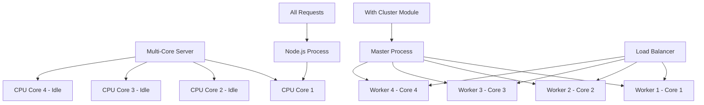

# Unlocking Node.js Performance: Harnessing Multi-Core Power with the `cluster` Module

It's a common sight in the Node.js world: powerful servers with multiple CPU cores, yet our applications often hum along on just a single core. Many Node.js production applications, even on a 16-core machine, are still effectively single-threaded.

**Why?** The rush to adopt tools like Docker, Kubernetes, or process managers like PM2 often leads developers to overlook a powerful, built-in solution: the Node.js `cluster` module.

This article dives into how you can leverage the `cluster` module to effortlessly scale your Node.js applications across all available CPU cores, often in under 20 lines of code, with no external dependencies.

## Table of Contents
- [The Single-Core Bottleneck](#the-single-core-bottleneck)
- [Enter the `cluster` Module](#enter-the-cluster-module)
  - [A Simple Clustering Example](#a-simple-clustering-example)
- [`cluster` vs. `worker_threads`: Understanding the Difference](#cluster-vs-worker_threads-understanding-the-difference)
- [Why Not Just Use PM2, Docker, or Kubernetes?](#why-not-just-use-pm2-docker-or-kubernetes)
- [Benefits of Using `cluster`](#benefits-of-using-cluster)
- [Graceful Shutdown and Inter-Process Communication (IPC)](#graceful-shutdown-and-inter-process-communication-ipc)
  - [Example: Graceful Shutdown](#example-graceful-shutdown)
- [When is `cluster` the Right Choice?](#when-is-cluster-the-right-choice)
- [When to Look Beyond `cluster` (or use it in conjunction)](#when-to-look-beyond-cluster-or-use-it-in-conjunction)
- [Conclusion: Don't Leave Performance on the Table](#conclusion-dont-leave-performance-on-the-table)

## The Single-Core Bottleneck

Node.js is renowned for its non-blocking, event-driven architecture, making it highly efficient for I/O-bound operations. However, by default, a single Node.js process runs on a single CPU core. If you have a multi-core server, the other cores remain idle, and your application's performance is capped by the capacity of that one core. This is like having a multi-lane highway but forcing all traffic into a single lane.




## Enter the `cluster` Module

The `cluster` module is a native part of Node.js that allows you to create child processes (workers) that can all share server ports. This enables true multi-process parallelism, allowing your application to utilize multiple CPU cores effectively.

Here's the core idea:
*   One **master process** is responsible for forking worker processes.
*   Multiple **worker processes** (typically one per CPU core) handle incoming requests.
*   All worker processes can listen on the same port, and the master process distributes incoming connections among them.

### A Simple Clustering Example

Let's see how easy it is to set up a basic clustered HTTP server.

```javascript
const cluster = require('node:cluster');
const http = require('node:http');
const numCPUs = require('node:os').availableParallelism();
const process = require('node:process');

if (cluster.isPrimary) {
  console.log(`Primary ${process.pid} is running`);

  // Fork workers.
  for (let i = 0; i < numCPUs; i++) {
    cluster.fork();
  }

  cluster.on('exit', (worker, code, signal) => {
    console.log(`worker ${worker.process.pid} died`);
    // Optionally, fork a new worker to replace the dead one
    // cluster.fork(); 
  });
} else {
  // Workers can share any TCP connection
  // In this case it is an HTTP server
  http.createServer((req, res) => {
    res.writeHead(200);
    res.end(`Hello from worker ${process.pid}\n`);
  }).listen(8000);

  console.log(`Worker ${process.pid} started`);
}
```

In this example:
1.  We import the necessary modules: `cluster`, `http`, `os` (to get the number of CPUs), and `process`.
2.  We check if the current process is the `cluster.isPrimary` (master) process.
3.  **If it's the primary process:**
    *   It logs its PID.
    *   It iterates `numCPUs` times, calling `cluster.fork()` to create a new worker process for each core.
    *   It listens for the `exit` event on the `cluster` object to know if a worker process has died. You might want to restart a worker if it crashes.
4.  **If it's a worker process (`else` block):**
    *   It creates an HTTP server that listens on port 8000.
    *   It logs its PID and a message indicating it has started.

Now, if you run this code on a machine with 4 CPU cores, the primary process will spawn 4 worker processes. Each worker will share port 8000, and incoming requests will be distributed among them.

**To run this:**
1. Save the code as `app.js`.
2. Run `node app.js` in your terminal.
3. Open your browser or use `curl` to access `http://localhost:8000` multiple times. You should see responses from different worker PIDs.

## `cluster` vs. `worker_threads`: Understanding the Difference

It's crucial not to confuse the `cluster` module with `worker_threads`. They serve different purposes:

*   **`cluster`**: Designed for scaling **I/O-bound workloads** by creating separate **processes**. Each worker process has its own memory space and event loop. This is ideal for applications like web servers that handle many concurrent connections.
*   **`worker_threads`**: Designed for offloading **CPU-intensive tasks** to separate **threads** *within the same process*. Threads share memory space with the parent process, making them suitable for parallelizing computationally heavy operations without the overhead of inter-process communication for data sharing.

**Think of it this way:**
*   Use `cluster` when you want multiple instances of your application handling network requests.
*   Use `worker_threads` when you have a specific, long-running calculation (like image processing or complex data analysis) within a single request that would otherwise block the main event loop.

## Why Not Just Use PM2, Docker, or Kubernetes?

Tools like PM2, Docker, and Kubernetes are fantastic for process management, deployment, and orchestration at scale. However, for the specific task of utilizing multiple CPU cores for a *single Node.js application on a single machine*, the `cluster` module is often a simpler, more direct, and dependency-free solution.

*   **PM2's cluster mode** essentially uses the `cluster` module under the hood. While PM2 adds features like monitoring, logging, and automatic restarts, understanding the `cluster` module itself gives you foundational knowledge.
*   **Docker and Kubernetes** are about containerization and orchestration. You can run a clustered Node.js app *inside* a Docker container. If you configure your K8s deployment to run one container per core, you might be overcomplicating things if simple process-based scaling with `cluster` would suffice for that node.

The point isn't that these tools are bad; it's that **real engineers understand their runtime before reaching for higher-level abstractions.** Knowing how Node.js handles concurrency natively can lead to more efficient and lightweight solutions.

## Benefits of Using `cluster`

*   **Maximized CPU Utilization:** Directly leverage all available CPU cores on your server.
*   **Improved Performance & Throughput:** Handle more concurrent requests and potentially reduce latency for I/O-bound tasks.
*   **Increased Resilience:** If a worker process crashes, the primary process can restart it, and other workers can continue handling requests, leading to zero-downtime deployments or graceful degradation.
*   **No External Dependencies:** It's built into Node.js.
*   **Simplicity for Core Scaling:** As shown, basic implementation is very straightforward.

## Graceful Shutdown and Inter-Process Communication (IPC)

The `cluster` module also provides mechanisms for:

*   **Graceful Shutdown:** You can instruct workers to finish handling existing requests before shutting down, preventing abrupt disconnections for users.
*   **Inter-Process Communication (IPC):** The primary and worker processes can send messages to each other using `process.send()` (in workers) and `worker.send()` (in the primary), and listening to `message` events. This can be used for coordinating tasks, sharing state (carefully!), or custom load balancing logic.

### Example: Graceful Shutdown

```javascript
// (Continuing from the previous example, in the primary process block)

// ... inside cluster.isPrimary block
// cluster.on('exit', ...); // Keep this

// Handle SIGINT (Ctrl+C) for graceful shutdown
process.on('SIGINT', () => {
  console.log('SIGINT received. Shutting down workers...');
  for (const id in cluster.workers) {
    const worker = cluster.workers[id];
    if (worker) {
      console.log(`Sending disconnect to worker ${worker.process.pid}`);
      worker.disconnect(); // Ask worker to disconnect
    }
  }
  // Allow workers time to disconnect before primary exits
  setTimeout(() => {
    console.log('Exiting primary process.');
    process.exit(0);
  }, 5000); // Adjust timeout as needed
});

// ...

// (In the worker process block)
// ... inside the else block (worker process)
// http.createServer(...).listen(8000); // Keep this
// console.log(`Worker ${process.pid} started`); // Keep this

process.on('disconnect', () => {
  console.log(`Worker ${process.pid} disconnecting...`);
  // Perform any cleanup here, e.g., close database connections
  // This example doesn't have specific cleanup, server will close automatically
});

```

In the worker, when `disconnect` is called by the primary, the server will stop accepting new connections, and once all existing connections are closed, the worker will exit. The `SIGINT` handler in the primary process ensures that all workers are signaled to disconnect before the primary itself exits.

## When is `cluster` the Right Choice?

*   **I/O-Bound Applications:** Web servers, API backends, applications handling many network requests.
*   **Improving Throughput on Multi-Core Machines:** When your single Node.js process is becoming a CPU bottleneck due to the sheer volume of requests (even if each request is I/O-bound).
*   **Basic Fault Tolerance:** Restarting crashed workers.

## When to Look Beyond `cluster` (or use it in conjunction):

*   **CPU-Bound Tasks:** For heavy computations within a single request path, use `worker_threads` to offload that specific task without blocking the event loop of a cluster worker.
*   **Complex Orchestration & Scaling Across Multiple Machines:** This is where Kubernetes, Docker Swarm, or similar platforms shine. `cluster` scales *within* a single machine.
*   **Advanced Process Management Features:** If you need sophisticated monitoring, log aggregation, and deployment strategies out-of-the-box, tools like PM2 can be very helpful (and as mentioned, PM2 uses `cluster` for its clustering mode).
*   **Shared State Management:** Sharing state between worker processes in a `cluster` can be complex as they have separate memory. If your application relies heavily on in-memory shared state that is difficult to manage via IPC or external stores (like Redis), you might need to rethink your architecture or accept that `cluster` might add complexity here.

## Conclusion: Don't Leave Performance on the Table

If you're running a Node.js HTTP server or any I/O-intensive application in production on a multi-core machine without utilizing the `cluster` module, you are likely bottlenecking your application by design.

Before reaching for complex orchestration tools or simply spinning up one container per core without understanding the underlying mechanisms, take a moment to explore the power and simplicity of Node.js's native `cluster` module. It's a testament to the "batteries-included" philosophy of Node.js and a critical tool for any engineer serious about performance and scalability.

**So, have you shipped a clustered Node.js app? Or are you still letting those extra CPU cores gather dust?** It's time to understand your runtime and unlock the full potential of your Node.js applications.

---

**Further Reading:**
*   [Node.js Cluster Documentation](https://nodejs.org/api/cluster.html)
*   [Node.js Worker Threads Documentation](https://nodejs.org/api/worker_threads.html)
