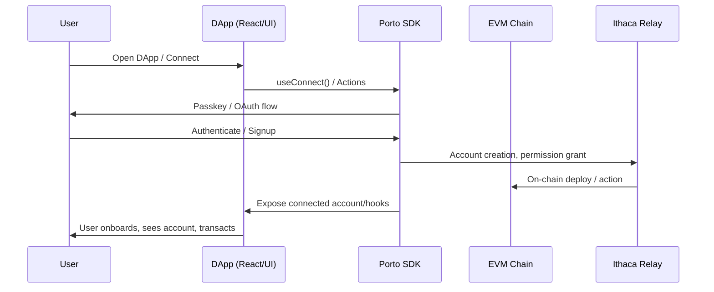

# Porto: Developer-First Toolkit for Passwordless Blockchain Access

## Table of Contents
- [What is Porto?](#what-is-porto)
  - [Tech Stack & Architecture](#tech-stack-architecture)
  - [Key Features of Porto](#key-features-of-porto)
- [How Does Porto Work?](#how-does-porto-work)
  - [Quick Integration Example](#quick-integration-example)
- [Performance and Adoption](#performance-and-adoption)
- [Open Source Announcement](#open-source-announcement)
- [FAQs](#faqs)

---

## What is Porto?

**[Porto](https://porto.sh)** aims to enable secure and programmable web-native crypto payments & finance—without passwords or browser extensions. Porto gives developers a powerful SDK and account abstraction stack for better user onboarding, wallet management, and flexible payment workflows.

> Porto’s north star is to make crypto as simple as any modern fintech app: no browser plugins, no secret keys, no clunky account recovery.

Already integrated by projects like [Uniswap](https://uniswap.org), [Relay.Link](https://relay.link), [Bungee](https://bungee.exchange), and [Eco](https://portal.eco.com), Porto is live across Ethereum, OP Mainnet, Base, Arbitrum, BNB Chain, Celo, and Polygon.

---

## Tech Stack & Architecture

Porto is built on a modern, modular open-source stack:
- **Language:** Pure TypeScript/React for modern DX and safety.
- **Core SDK:** Distributed as the `porto` NPM package ([see npm](https://www.npmjs.com/package/porto)), installable with `npm i porto`.
- **Wagmi Integration:** Deep integration with [`wagmi`](https://wagmi.sh) for plug-and-play connectivity. Porto provides a direct Wagmi connector (`porto()`), exposing all Wagmi hooks for onboarding, account, and permissions management.
- **Viem:** Uses [`viem`](https://viem.sh) underneath for Ethereum RPC, transaction, and serialization. Ensures low-level performance and compatibility with 100+ EVM chains.
- **Headless & UI Agnostic:** Works with React, Vanilla JS, and headless flows. Use React hooks or direct actions for any frontend framework.
- **Account Abstraction:** Implements a reconsumed EIP-7702-based programmable account system. Fully compatible with passkeys, OAuth (Privy), or custom key management.
- **Authentication:** Passkeys (WebAuthn) as first-class auth. Now with optional email recovery and OAuth support (Privy, Turnkey).
- **Backend:** Ships with a production-grade relay and execution backend ([Ithaca Relay, Rust](https://github.com/ithacaxyz/relay)).

### Developer Principles
- **Developer-first:** Seamless with Wagmi/Viem, requires minimal or zero code changes for existing dApps—just use the Porto connector or `Actions` API.
- **Performance:** ~50–71% more gas and latency efficient vs alternatives, thanks to headless batching, sponsorship & better key handling.
- **Modularity:** Use only what you need—activate passkeys, subscriptions, fiat onramp, batching, interop individually or together.

---

## Key Features of Porto
- **Passwordless (Passkeys):** Ultra-secure, cross-device sign-in. Lose your device? Recovery coming soon via email (see feedback [Telegram](https://t.me/porto_devs)).
- **Programmable Accounts:** Ship advanced dApps—batching, subscriptions, gasless transactions, on-ramping, and more.
- **Gas Sponsorship:** Pay user’s gas in any asset, typically USDC/USDT ([docs](https://porto.sh/sdk/guides/sponsoring)).
- **Fiat Onramp:** Apple Pay-powered, KYC-less onramp (up to local limits). One-click onboarding for the next billion.
- **Cross-Chain Interop:** Instantly move and interact across chains, no bridges required ([docs](https://porto.sh/contracts/interop#interoperability)).
- **First-Class Integration:** Works with WAGMI, Privy, and major wallets-as-a-service providers.
- **Simple, Fast React SDK:** Integrate in minutes. Type-safe. Modern. Built by the team behind Reth, Foundry, Wagmi, and Viem.
- **Performance:** Up to 71% faster than ERC-4337 alternatives. Unique features like stablecoin fee sponsorship.

---

## How Does Porto Work?

Developers install Porto via NPM as a Wagmi connector and/or standalone SDK. It manages onboarding, permissions, and programmable account flows behind a modern API.

### Quick Integration Example

```js
import { porto } from 'porto/wagmi'
import { http, createConfig, createStorage } from 'wagmi'
import { base } from 'wagmi/chains'

export const wagmiConfig = createConfig({
  chains: [base],
  connectors: [porto()],
  storage: createStorage({ storage: localStorage }),
  transports: {
    [base.id]: http(),
  },
})
```

#### Onboarding Flow with Porto [See full getting started docs](https://porto.sh/sdk)




## Performance and Adoption

Porto outperforms similar solutions by up to **71%**, while providing exclusive features such as:
- Sponsoring gas fees in USDC/USDT
- No browser plugins or extensions
- Multi-call batching and parallel, idempotent requests
- Full programmable accounts for DeFi, payments, subscriptions, and more

[Tweet with chart "ERC20 / Stablecoin Gas Costs of Porto vs 4337 implementations."](https://x.com/gakonst/status/1964027592232649066)

Porto is already powering large scale projects ([see users](https://porto.sh/customers)) and ships with a production-grade relay backend (the [Ithaca Relay](https://github.com/ithacaxyz/relay))—built in Rust and now open source!

---

## Open Source Announcement

Porto SDK and its high-performance relay backend are **completely open source** (MIT). Explore:
- [Porto SDK on GitHub](https://github.com/ithacaxyz/porto)
- [Ithaca Relay (Rust)](https://github.com/ithacaxyz/relay)

Built by the creators of Foundry, Reth, Wagmi, and Viem, Porto makes ambitious payments and DeFi applications 10x easier to build and grow: scale onboarding, automate UX, support multi-chain out-of-the-box.

---

## FAQs

### What do Passkeys do?
Passkeys are a safer, simpler login method adopted by Apple, Google, and PayPal. Porto passkeys are cross-device and cross-app. Lost your device? Recovery options (via email) are on the way—feedback welcome at [Telegram](https://t.me/porto_devs).

### Does Porto work with OAuth-based providers like Privy or Turnkey?
Yes. Upgrade users’ EOAs with EIP-7702 or use your own key management (see [docs](https://porto.sh/sdk/rpc/wallet_prepareUpgradeAccount)). Full-featured, UI-agnostic access to Porto’s power.

### Can I change the theme of the Porto UI?
Absolutely. [Guide here](https://porto.sh/sdk/guides/theming).

### Can applications execute multiple actions in 1-click?
Yes—batch multiple calls with the standard [Wagmi sendCalls hook](https://wagmi.sh/core/api/actions/sendCalls).

### Can applications sponsor their users’ gas fees?
Yes. [See guide](https://porto.sh/sdk/guides/sponsoring). Fund with stablecoins; no volatile inventory required.

### Can users pay fees in stablecoins, without owning native assets?
Porto will auto-detect insufficient native tokens (ETH, etc.) and use stablecoins. Developers can override this logic. Supported: USDC, USDT.

### Can I use Porto to implement Sign In With Ethereum?
Yes. [See guide](https://porto.sh/sdk/guides/authentication). Already works with Better Auth, RainbowKit, and more.

### Can I implement subscriptions or account automation features?
Yes! Automated, recurring onchain actions are powered by session keys ([demo](https://ithaca.xyz/updates/exp-0003)).

### Does Porto let users move funds across chains?
Yes. [Native interop, no bridges](https://porto.sh/contracts/interop#interoperability).

### Do you provide a fiat onramp?
Yes. Apple Pay-powered, KYC-less onramps available for most users ([Telegram preview access](https://t.me/porto_devs)).

### Is Porto open source?
Yes! SDK ([TypeScript](https://github.com/ithacaxyz/porto)) and high-throughput relay ([Rust](https://github.com/ithacaxyz/relay)) are fully open source under MIT.

### Why build a new account abstraction stack?
Porto is simpler, faster, and more flexible than ERC-4337—offering more opinionated, production-ready smart accounts, paymasters, and bundler logic. Built with future EIPs in mind (ERC5792, ERC8010).

### Is Porto secure?
Audited and proactively patched via industry security experts ([details](https://porto.sh/contracts/security-and-bug-bounty)). Ongoing bug bounty (5 ETH)—report critical issues to [georgios@ithaca.xyz](mailto:georgios@ithaca.xyz).

---

## Resources and Links
- [Porto Docs](https://porto.sh/sdk)
- [GitHub – Porto](https://github.com/ithacaxyz/porto)
- [GitHub – Ithaca Relay](https://github.com/ithacaxyz/relay)
- [Telegram Dev Chat](https://t.me/porto_devs)
- [Ithaca.xyz](https://ithaca.xyz)

---

This article was last updated: 2025-10-09.
