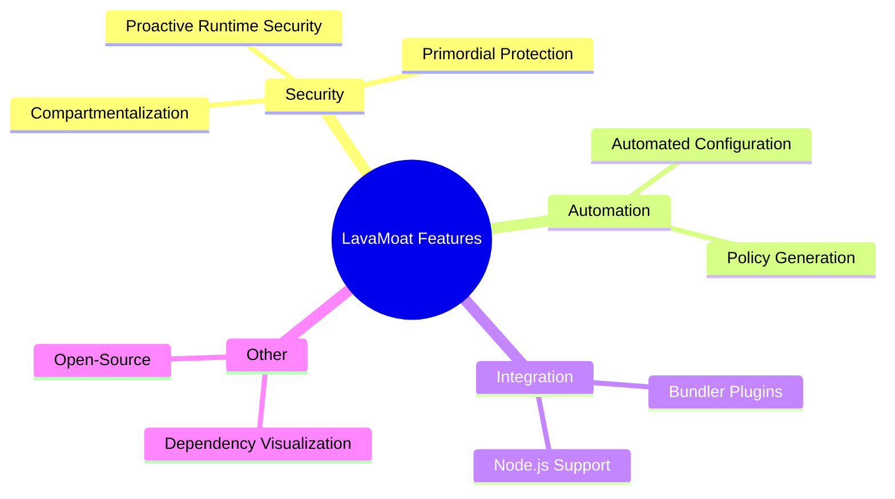
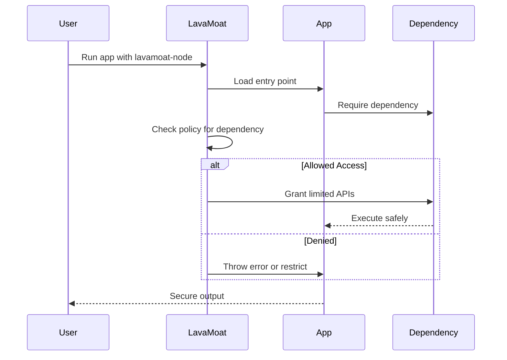
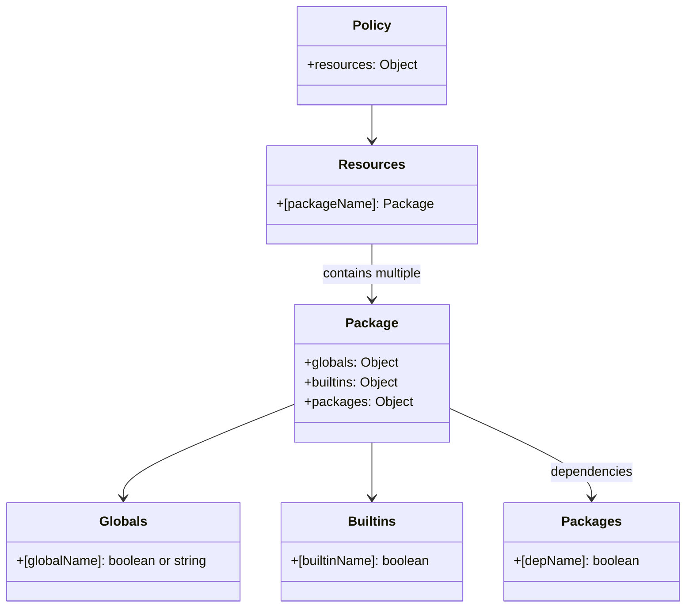

# LavaMoat: Protecting JavaScript from Supply Chain Attacks

## Table of Contents

- [Introduction](#introduction)
- [What is LavaMoat?](#what-is-lavamoat)
- [How LavaMoat Works](#how-lavamoat-works)
- [Key Features](#key-features)
- [Installation and Setup](#installation-and-setup)
- [Using @lavamoat/allow-scripts for Installation Security](#using-lavamoat-allow-scripts-for-installation-security)
- [Runtime Protection with lavamoat-node](#runtime-protection-with-lavamoat-node)
- [Browser Bundling with LavaMoat Plugins](#browser-bundling-with-lavamoat-plugins)
- [Policy Files and Configuration](#policy-files-and-configuration)
- [Benefits and Use Cases](#benefits-and-use-cases)
- [Conclusion](#conclusion)

## Introduction

In the modern JavaScript ecosystem, supply chain attacks pose a significant threat. Malicious dependencies can compromise applications, stealing sensitive data or introducing vulnerabilities. LavaMoat, developed by the team behind MetaMask and supported by organizations like ConsenSys and Agoric, offers a robust solution to mitigate these risks. This article delves into LavaMoat's capabilities, providing practical guidance on its implementation to enhance your project's security.

## What is LavaMoat?

LavaMoat is a suite of open-source tools designed to secure JavaScript projects against supply chain attacks. It protects applications at multiple stages: dependency installation, build time, and runtime. By sandboxing dependencies and enforcing strict access controls, LavaMoat prevents malicious code from accessing sensitive APIs or modifying core JavaScript primitives.

The tool leverages Secure EcmaScript (SES) to create isolated compartments for each package, ensuring that dependencies operate with only the permissions they require. LavaMoat is particularly valuable for frontend and backend JavaScript applications, including those in the blockchain and cryptocurrency spaces, where security is paramount.

## How LavaMoat Works

LavaMoat operates through a combination of preventive measures:

1. **Installation Protection**: Using `@lavamoat/allow-scripts`, it disables automatic execution of lifecycle scripts (e.g., postinstall) by default and requires an explicit allowlist in `package.json`.

2. **Build and Runtime Sandboxing**: Tools like `lavamoat-node` and bundler plugins (e.g., for Browserify or Webpack) wrap dependencies in SES compartments. This limits access to powerful APIs like `process.env` or network requests.

3. **Policy Enforcement**: A generated policy file defines per-package permissions. LavaMoat uses static analysis to create an initial policy, which can be customized via overrides.

4. **Primordial Protection**: It prevents prototype pollution on JavaScript intrinsics (e.g., Object, Array) using lockdown mechanisms.

This compartmentalization ensures that even if a dependency is compromised, its impact is contained.

## Key Features

- **Proactive Runtime Security**: Restricts API access to minimize damage from malicious packages.
- **Automated Configuration**: Generates allowlists and policies with minimal manual intervention.
- **Bundler Integration**: Supports Browserify, Webpack, and others for browser environments.
- **Dependency Visualization**: (Currently unmaintained) Tools like `lavamoat-viz` to assess risk in dependency graphs.
- **Optional Advanced Security**: Features like scuttling for enhanced protections.
- **Free and Open-Source**: Backed by real-world usage in projects like MetaMask, serving millions of users.

Outline the key features and their categories:




## Installation and Setup

To get started with LavaMoat, install the relevant packages via npm or Yarn. Begin with the installation security tool:

```bash
npm install --save-dev @lavamoat/allow-scripts
```

Or with Yarn:

```bash
yarn add -D @lavamoat/allow-scripts
```

For runtime protection in Node.js:

```bash
npm install --save-dev lavamoat
```

Initialize the setup:

```bash
npm exec allow-scripts setup
```

This configures your project to disable automatic script execution and prepares the allowlist.

## Using @lavamoat/allow-scripts for Installation Security

`@lavamoat/allow-scripts` safeguards the dependency installation phase by controlling lifecycle scripts.

### Auto-Generate Allowlist

```bash
npm exec allow-scripts auto
```

This scans your dependencies and updates `package.json` with an initial configuration.

### Example package.json Configuration

```json
{
  "lavamoat": {
    "allowScripts": {
      "keccak": true,
      "core-js": false,
      "@lavamoat/preinstall-always-fail": true
    }
  }
}
```

Here, `keccak` is allowed to run scripts, while `core-js` is denied. The `@lavamoat/preinstall-always-fail` package ensures early failure if protections are bypassed.

### Running Allowed Scripts

```bash
npm exec allow-scripts
```

Integrate into your workflow by adding a setup script:

```json
{
  "scripts": {
    "setup": "npm install && npm exec allow-scripts && tsc -b"
  }
}
```

For Yarn Berry (v3+), import the plugin:

```bash
yarn plugin import https://raw.githubusercontent.com/LavaMoat/LavaMoat/main/packages/yarn-plugin-allow-scripts/bundles/@yarnpkg/plugin-allow-scripts.js
```

## Runtime Protection with lavamoat-node

For Node.js environments, use `lavamoat-node` to enforce policies during execution.

### Basic Usage

Run your application with LavaMoat:

```bash
lavamoat app.js
```

### Generate Policy Automatically

```bash
lavamoat app.js --autopolicy
```

This creates a `policy.json` file in `./lavamoat/node/`.

### Example Script in package.json

```json
{
  "scripts": {
    "lavamoat-policy": "lavamoat app.js --autopolicy",
    "start": "lavamoat app.js"
  }
}
```

 Runtime protection process:




## Browser Bundling with LavaMoat Plugins

For browser applications, integrate LavaMoat with bundlers like Browserify or Webpack.

### Browserify Example

Install:

```bash
npm install --save-dev lavamoat-browserify
```

Usage in build script:

```javascript
const browserify = require('browserify');
const lavamoat = require('lavamoat-browserify');

browserify('./entry.js', {
  plugin: [lavamoat, { policy: require('./lavamoat/policy.json') }]
}).bundle();
```

For Webpack, use `@lavamoat/webpack`:

```bash
npm install --save-dev @lavamoat/webpack
```

Add to webpack.config.js:

```javascript
const LavaMoatPlugin = require('@lavamoat/webpack');

module.exports = {
  plugins: [
    new LavaMoatPlugin({
      generatePolicy: true
    })
  ]
};
```

## Policy Files and Configuration

LavaMoat policies define package permissions. Generated via `--autopolicy`, the file structure includes globals, builtins, and packages.

### Example policy.json Snippet

```json
{
  "resources": {
    "keccak": {
      "globals": {
        "Buffer": true
      },
      "packages": {
        "bn.js": true
      }
    },
    "textarea-caret": {
      "globals": {
        "document": "read",
        "getComputedStyle": true
      }
    }
  }
}
```

Override defaults in `policy-override.json` to grant or restrict access. For instance, deny network access for a suspicious package.

Structure of a LavaMoat policy:




## Benefits and Use Cases

- **Mitigates Common Attacks**: Protects against lifecycle script exploits, prototype pollution, and unauthorized API calls.
- **Production-Proven**: Used in MetaMask with up to 30 million users.
- **Easy Integration**: Minimal overhead for existing projects.
- **Use Cases**: Blockchain wallets, web applications, Node.js servers where third-party dependencies are prevalent.

## Conclusion

LavaMoat empowers developers to fortify their JavaScript applications against evolving supply chain threats. By implementing its tools for installation, build, and runtime, you can significantly reduce risks without overhauling your codebase. Start with `@lavamoat/allow-scripts` for quick wins and expand to full compartmentalization. For more details, visit the [LavaMoat GitHub repository](https://github.com/LavaMoat/LavaMoat).

## Resources and Links

- [LavaMoat Docs](https://lavamoat.github.io)
- [GitHub Repo – LavaMoat](https://github.com/LavaMoat/LavaMoat)
- [Github Organisation - LavaMoat](https://github.com/LavaMoat)
