# Byzantine Fault Tolerance in Blockchain: Complete Guide to BFT for Ethereum & EVM Chains

Byzantine Fault Tolerance (BFT) stands as one of the most critical security mechanisms in modern blockchain technology, ensuring that decentralized networks can maintain consensus and security even when facing malicious actors. In this comprehensive guide, we'll explore how BFT algorithms protect Ethereum, EVM-compatible chains, and other blockchain networks from various attacks while maintaining network integrity and performance.

## Table of Contents

- [What is Byzantine Fault Tolerance (BFT)?](#what-is-byzantine-fault-tolerance-bft)
  - [Key Properties of BFT Systems](#key-properties-of-bft-systems)
- [The Byzantine Generals Problem Explained](#the-byzantine-generals-problem-explained)
  - [The Scenario](#the-scenario)
  - [Mathematical Foundation](#mathematical-foundation)
- [BFT vs Traditional Fault Tolerance](#bft-vs-traditional-fault-tolerance)
  - [Why Blockchain Needs BFT](#why-blockchain-needs-bft)
- [Bitcoin's Revolutionary Approach to Byzantine Fault Tolerance](#bitcoins-revolutionary-approach-to-byzantine-fault-tolerance)
  - [The Bitcoin PoW Solution](#the-bitcoin-pow-solution)
  - [Bitcoin vs Traditional BFT Comparison](#bitcoin-vs-traditional-bft-comparison)
  - [How Bitcoin Handles Byzantine Scenarios](#how-bitcoin-handles-byzantine-scenarios)
  - [The 51% Attack Threshold](#the-51-attack-threshold)
  - [Bitcoin's Probabilistic Finality](#bitcoins-probabilistic-finality)
  - [Bitcoin's Complete BFT Architecture](#bitcoins-complete-bft-architecture)
  - [Revolutionary Innovations](#revolutionary-innovations)
  - [Acknowledged Limitations and Trade-offs](#acknowledged-limitations-and-trade-offs)
  - [Impact on Blockchain Industry](#impact-on-blockchain-industry)
- [How BFT Works in Blockchain Networks](#how-bft-works-in-blockchain-networks)
- [Practical Byzantine Fault Tolerance (pBFT)](#practical-byzantine-fault-tolerance-pbft)
  - [pBFT Algorithm Phases](#pbft-algorithm-phases)
  - [pBFT Properties](#pbft-properties)
- [BFT in Ethereum: Casper FFG and Gasper](#bft-in-ethereum-casper-ffg-and-gasper)
  - [Casper FFG (Friendly Finality Gadget)](#casper-ffg-friendly-finality-gadget)
  - [Gasper: LMD-GHOST + Casper FFG](#gasper-lmd-ghost--casper-ffg)
- [BFT Implementations in EVM-Compatible Chains](#bft-implementations-in-evm-compatible-chains)
  - [Polygon (MATIC) - Heimdall and Bor](#polygon-matic---heimdall-and-bor)
  - [Binance Smart Chain (BSC) - Parlia](#binance-smart-chain-bsc---parlia)
  - [Avalanche - Snowman Consensus](#avalanche---snowman-consensus)
- [Types of Byzantine Faults and Attacks](#types-of-byzantine-faults-and-attacks)
  - [1. Double Spending Attack](#1-double-spending-attack)
  - [2. 51% Attack (Adapted for BFT)](#2-51-attack-adapted-for-bft)
  - [3. Nothing-at-Stake Attack](#3-nothing-at-stake-attack)
  - [4. Long Range Attack](#4-long-range-attack)
  - [5. Grinding Attack](#5-grinding-attack)
- [BFT Consensus Algorithms Comparison](#bft-consensus-algorithms-comparison)
  - [Algorithm Selection Criteria](#algorithm-selection-criteria)
- [Performance and Scalability Considerations](#performance-and-scalability-considerations)
  - [Throughput Limitations](#throughput-limitations)
  - [Optimization Strategies](#optimization-strategies)
  - [Real-World Performance](#real-world-performance)
- [Security Analysis and Attack Vectors](#security-analysis-and-attack-vectors)
  - [Attack Cost Analysis](#attack-cost-analysis)
  - [Security Assumptions](#security-assumptions)
  - [Advanced Attack Scenarios](#advanced-attack-scenarios)
- [Real-World BFT Implementations](#real-world-bft-implementations)
  - [Ethereum 2.0 Case Study](#ethereum-20-case-study)
  - [Cosmos Hub Implementation](#cosmos-hub-implementation)
- [Future of BFT in Blockchain](#future-of-bft-in-blockchain)
  - [Emerging Trends](#emerging-trends)
  - [Research Directions](#research-directions)
  - [Next-Generation Algorithms](#next-generation-algorithms)
- [Best Practices for BFT Implementation](#best-practices-for-bft-implementation)
  - [Design Principles](#design-principles)
  - [Security Best Practices](#security-best-practices)
  - [Implementation Checklist](#implementation-checklist)
  - [Operational Considerations](#operational-considerations)
- [Frequently Asked Questions](#frequently-asked-questions)

## What is Byzantine Fault Tolerance (BFT)?

**Byzantine Fault Tolerance (BFT)** is a distributed computing concept that enables a system to continue operating correctly even when some of its components fail or act maliciously. Named after the [Byzantine Generals Problem](https://en.wikipedia.org/wiki/Byzantine_fault), BFT algorithms ensure that honest nodes in a network can reach consensus despite the presence of **byzantine nodes** (malicious or faulty actors).

In blockchain networks, BFT is crucial because:

- **Decentralization**: No central authority exists to resolve conflicts
- **Adversarial Environment**: Malicious actors may attempt to exploit the system
- **Financial Stakes**: Incorrect consensus can lead to significant financial losses
- **Immutability**: Once recorded, blockchain data cannot be easily changed


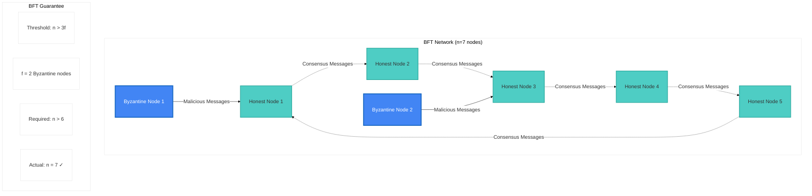
```mermaid
%%{init: {'theme':'base', 'themeVariables': {'primaryColor':'#ffffff', 'fontSize':'18px'}}}%%
graph TB
    subgraph "BFT Network (n=7 nodes)"
        N1["<br/>Honest Node 1<br/><br/>"]
        N2["<br/>Honest Node 2<br/><br/>"]
        N3["<br/>Honest Node 3<br/><br/>"]
        N4["<br/>Honest Node 4<br/><br/>"]
        N5["<br/>Honest Node 5<br/><br/>"]
        B1["<br/>Byzantine Node 1<br/><br/>"]
        B2["<br/>Byzantine Node 2<br/><br/>"]
    end
    
    subgraph "BFT Guarantee"
        TH["<br/>Threshold: n > 3f<br/><br/>"]
        EX["<br/>f = 2 Byzantine nodes<br/><br/>"]
        RQ["<br/>Required: n > 6<br/><br/>"]
        AC["<br/>Actual: n = 7 ✓<br/><br/>"]
    end
    
    N1 -.->|"Consensus Messages"| N2
    N2 -.->|"Consensus Messages"| N3
    N3 -.->|"Consensus Messages"| N4
    N4 -.->|"Consensus Messages"| N5
    N5 -.->|"Consensus Messages"| N1
    
    B1 -->|"Malicious Messages"| N1
    B2 -->|"Malicious Messages"| N3
    
    style B1 fill:#4285f4,stroke:#1565c0,stroke-width:3px,color:#ffffff
    style B2 fill:#4285f4,stroke:#1565c0,stroke-width:3px,color:#ffffff
    style N1 fill:#4ecdc4,stroke:#26a69a,stroke-width:2px
    style N2 fill:#4ecdc4,stroke:#26a69a,stroke-width:2px
    style N3 fill:#4ecdc4,stroke:#26a69a,stroke-width:2px
    style N4 fill:#4ecdc4,stroke:#26a69a,stroke-width:2px
    style N5 fill:#4ecdc4,stroke:#26a69a,stroke-width:2px
```

### Key Properties of BFT Systems

1. **Safety**: All honest nodes agree on the same value
2. **Liveness**: The system eventually produces a decision
3. **Fault Tolerance**: Can tolerate up to ⌊(n-1)/3⌋ byzantine nodes
4. **Finality**: Once decided, the decision cannot be reversed

## The Byzantine Generals Problem Explained

The **Byzantine Generals Problem**, introduced by Leslie Lamport, Robert Shostak, and Marshall Pease in 1982, illustrates the challenge of achieving consensus in distributed systems with unreliable communication and potentially malicious participants.

### The Scenario

Imagine several Byzantine army divisions surrounding an enemy city. Each division is led by a general, and they must coordinate their attack strategy:

- **Attack Together**: Victory is certain
- **Retreat Together**: Minimal losses
- **Mixed Actions**: Catastrophic defeat

The challenge: Some generals might be **traitors** who send different messages to different allies.


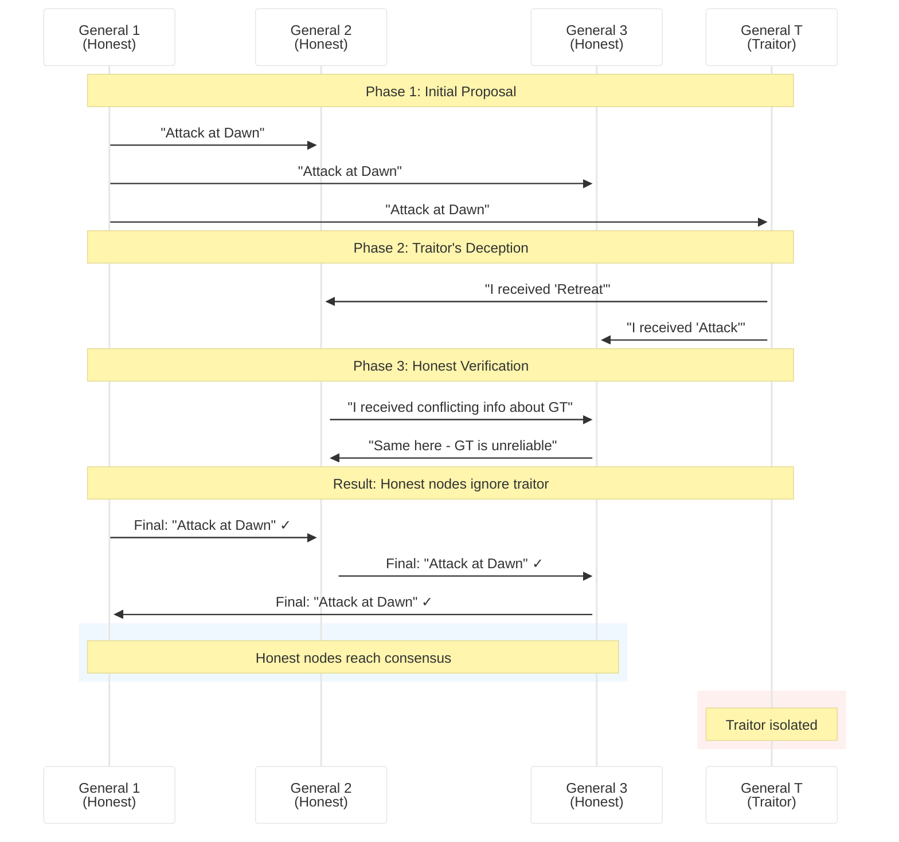
```mermaid
%%{init: {'theme':'base', 'themeVariables': {'primaryColor':'#ffffff', 'fontSize':'16px'}}}%%
sequenceDiagram
    participant G1 as General 1<br/>(Honest)
    participant G2 as General 2<br/>(Honest)
    participant G3 as General 3<br/>(Honest)
    participant GT as General T<br/>(Traitor)
    
    Note over G1,GT: Phase 1: Initial Proposal
    G1->>+G2: "Attack at Dawn"
    G1->>+G3: "Attack at Dawn"
    G1->>+GT: "Attack at Dawn"
    
    Note over G1,GT: Phase 2: Traitor's Deception
    GT->>+G2: "I received 'Retreat'"
    GT->>+G3: "I received 'Attack'"
    
    Note over G1,GT: Phase 3: Honest Verification
    G2->>+G3: "I received conflicting info about GT"
    G3->>+G2: "Same here - GT is unreliable"
    
    Note over G1,GT: Result: Honest nodes ignore traitor
    G1->>+G2: Final: "Attack at Dawn" ✓
    G2->>+G3: Final: "Attack at Dawn" ✓
    G3->>+G1: Final: "Attack at Dawn" ✓
    
    rect rgb(240, 248, 255)
        Note over G1,G3: Honest nodes reach consensus
    end
    rect rgb(255, 240, 240)
        Note over GT: Traitor isolated
    end
```

### Mathematical Foundation

For a BFT system to work with `n` total nodes and `f` byzantine nodes:

**n ≥ 3f + 1**

This means:
- With 4 nodes: Can tolerate 1 byzantine node
- With 7 nodes: Can tolerate 2 byzantine nodes  
- With 10 nodes: Can tolerate 3 byzantine nodes

## BFT vs Traditional Fault Tolerance

Understanding the difference between Byzantine and non-Byzantine fault tolerance helps clarify why BFT is essential for blockchain networks.

| Aspect | Crash Fault Tolerance | Byzantine Fault Tolerance |
|--------|----------------------|---------------------------|
| **Failure Types** | Node crashes, network partitions | Malicious behavior, arbitrary failures |
| **Trust Model** | Nodes are honest but may fail | Some nodes may be malicious |
| **Complexity** | Lower (n/2 + 1 consensus) | Higher (2n/3 + 1 consensus) |
| **Examples** | Raft, PBFT for crashes | PBFT, Tendermint, Casper |
| **Use Cases** | Internal systems | Public blockchains |

### Why Blockchain Needs BFT

1. **Open Networks**: Anyone can join, including bad actors
2. **Economic Incentives**: Financial rewards for manipulation
3. **No Central Authority**: Cannot remove bad actors easily
4. **Immutable Records**: Mistakes are permanent and costly

## Bitcoin's Revolutionary Approach to Byzantine Fault Tolerance

When Satoshi Nakamoto created Bitcoin in 2008, he achieved a major breakthrough by introducing **Proof-of-Work (PoW) as a probabilistic solution to the Byzantine Generals Problem**. This innovation allowed for the first time to achieve consensus in a completely decentralized network without requiring participants to know or trust each other.


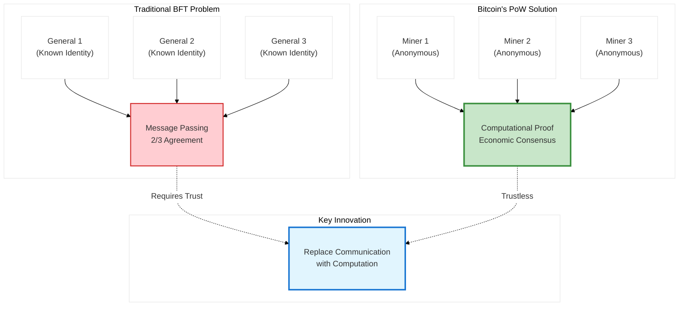
```mermaid
%%{init: {'theme':'base', 'themeVariables': {'primaryColor':'#ffffff', 'fontSize':'16px'}}}%%
flowchart TD
    subgraph "Traditional BFT Problem"
        TG1["<br/>General 1<br/>(Known Identity)<br/><br/>"]
        TG2["<br/>General 2<br/>(Known Identity)<br/><br/>"]
        TG3["<br/>General 3<br/>(Known Identity)<br/><br/>"]
        TM["<br/>Message Passing<br/>2/3 Agreement<br/><br/>"]
    end
    
    subgraph "Bitcoin's PoW Solution"
        BM1["<br/>Miner 1<br/>(Anonymous)<br/><br/>"]
        BM2["<br/>Miner 2<br/>(Anonymous)<br/><br/>"]
        BM3["<br/>Miner 3<br/>(Anonymous)<br/><br/>"]
        BP["<br/>Computational Proof<br/>Economic Consensus<br/><br/>"]
    end
    
    TG1 --> TM
    TG2 --> TM
    TG3 --> TM
    
    BM1 --> BP
    BM2 --> BP
    BM3 --> BP
    
    subgraph "Key Innovation"
        KI["<br/>Replace Communication<br/>with Computation<br/><br/>"]
    end
    
    TM -.->|"Requires Trust"| KI
    BP -.->|"Trustless"| KI
    
    style TM fill:#ffcdd2,stroke:#d32f2f,stroke-width:2px
    style BP fill:#c8e6c9,stroke:#388e3c,stroke-width:3px
    style KI fill:#e1f5fe,stroke:#1976d2,stroke-width:3px
```

### The Bitcoin PoW Solution

Unlike traditional BFT algorithms that require known participants and complex message-passing protocols, Bitcoin's approach transforms the consensus problem entirely:

#### 1. **From Communication to Computation**

Traditional BFT systems rely on **message passing** between known participants. Bitcoin replaces this with **computational work** that can be verified by anyone:


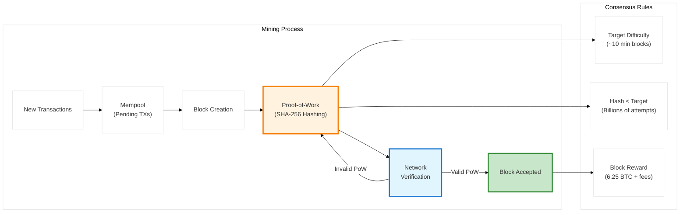
```mermaid
%%{init: {'theme':'base', 'themeVariables': {'primaryColor':'#ffffff', 'fontSize':'16px'}}}%%
flowchart LR
    subgraph "Mining Process"
        TX["<br/>New Transactions<br/><br/>"]
        MEM["<br/>Mempool<br/>(Pending TXs)<br/><br/>"]
        BLK["<br/>Block Creation<br/><br/>"]
        POW["<br/>Proof-of-Work<br/>(SHA-256 Hashing)<br/><br/>"]
        VER["<br/>Network<br/>Verification<br/><br/>"]
        ACC["<br/>Block Accepted<br/><br/>"]
    end
    
    TX --> MEM
    MEM --> BLK
    BLK --> POW
    POW --> VER
    VER -->|"Valid PoW"| ACC
    VER -->|"Invalid PoW"| POW
    
    subgraph "Consensus Rules"
        DIFF["<br/>Target Difficulty<br/>(~10 min blocks)<br/><br/>"]
        HASH["<br/>Hash < Target<br/>(Billions of attempts)<br/><br/>"]
        REW["<br/>Block Reward<br/>(6.25 BTC + fees)<br/><br/>"]
    end
    
    POW --> DIFF
    POW --> HASH
    ACC --> REW
    
    style POW fill:#fff3e0,stroke:#f57c00,stroke-width:3px
    style VER fill:#e1f5fe,stroke:#1976d2,stroke-width:3px
    style ACC fill:#c8e6c9,stroke:#388e3c,stroke-width:3px
```

**Key Innovation**: Instead of asking "Who can we trust?", Bitcoin asks "Who did the most work?"

**Core Requirements for Attackers**:
- **Outcompute** the honest network majority
- **Expend more energy** than all honest miners combined  
- **Maintain the attack** continuously to be effective
- **Sustain massive ongoing costs** without guaranteed returns

#### 2. **Economic Security Model**

Bitcoin's security is rooted in economic game theory. The cost of attacking the network must exceed the potential benefit:

**Honest Mining Incentives**:
- **Block rewards**: Currently 6.25 BTC per block (~$250,000)
- **Transaction fees**: Additional 0.5-2 BTC per block
- **Long-term appreciation**: Bitcoin holdings increase in value
- **Predictable income**: Steady revenue stream for honest miners

**Attack Requirements**:
- **Hardware costs**: $15-20 billion for 51% hashrate
- **Electricity costs**: $10+ million daily to maintain attack
- **Opportunity cost**: Forgo legitimate mining profits
- **Market damage**: Attack destroys Bitcoin's value (and attacker's investment)


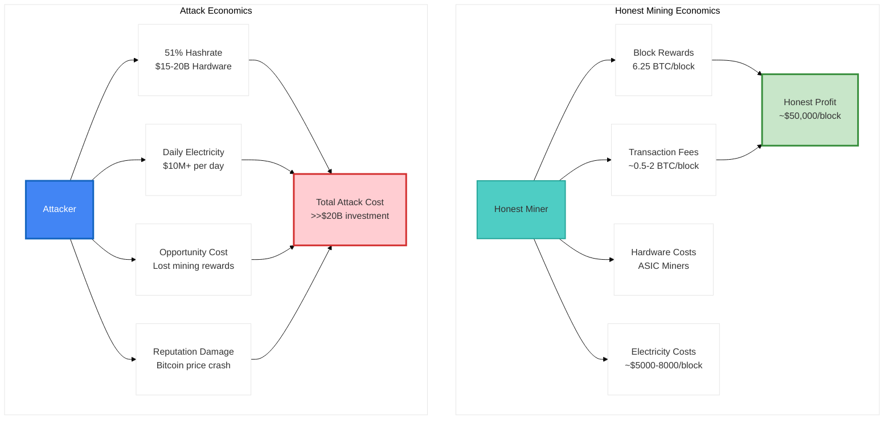
```mermaid
%%{init: {'theme':'base', 'themeVariables': {'primaryColor':'#ffffff', 'fontSize':'16px'}}}%%
graph TD
    subgraph "Honest Mining Economics"
        HM["<br/>Honest Miner<br/><br/>"]
        HR["<br/>Block Rewards<br/>6.25 BTC/block<br/><br/>"]
        HF["<br/>Transaction Fees<br/>~0.5-2 BTC/block<br/><br/>"]
        HC["<br/>Hardware Costs<br/>ASIC Miners<br/><br/>"]
        HE["<br/>Electricity Costs<br/>~$5000-8000/block<br/><br/>"]
        HP["<br/>Honest Profit<br/>~$50,000/block<br/><br/>"]
    end
    
    subgraph "Attack Economics"
        AM["<br/>Attacker<br/><br/>"]
        AH["<br/>51% Hashrate<br/>$15-20B Hardware<br/><br/>"]
        AE["<br/>Daily Electricity<br/>$10M+ per day<br/><br/>"]
        AO["<br/>Opportunity Cost<br/>Lost mining rewards<br/><br/>"]
        AR["<br/>Reputation Damage<br/>Bitcoin price crash<br/><br/>"]
        AL["<br/>Total Attack Cost<br/>>>$20B investment<br/><br/>"]
    end
    
    HM --> HR
    HM --> HF  
    HM --> HC
    HM --> HE
    HR --> HP
    HF --> HP
    
    AM --> AH
    AM --> AE
    AM --> AO
    AM --> AR
    AH --> AL
    AE --> AL
    AO --> AL
    AR --> AL
    
    style HP fill:#c8e6c9,stroke:#388e3c,stroke-width:3px
    style AL fill:#ffcdd2,stroke:#d32f2f,stroke-width:3px
    style HM fill:#4ecdc4,stroke:#26a69a,stroke-width:2px
    style AM fill:#4285f4,stroke:#1565c0,stroke-width:3px,color:#ffffff
```


#### 3. **The Longest Chain Rule**

Bitcoin's elegant solution to conflicting histories: **always follow the chain with the most accumulated proof-of-work**:


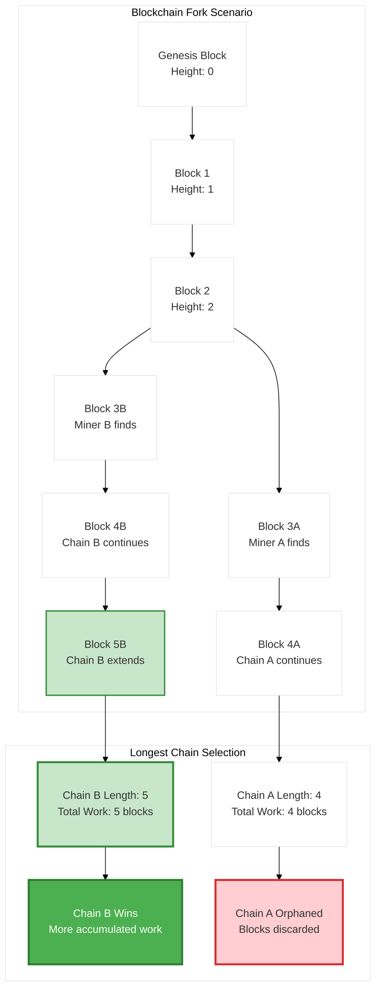
```mermaid
%%{init: {'theme':'base', 'themeVariables': {'primaryColor':'#ffffff', 'fontSize':'16px'}}}%%
flowchart TD
    subgraph "Blockchain Fork Scenario"
        G["<br/>Genesis Block<br/>Height: 0<br/><br/>"]
        B1["<br/>Block 1<br/>Height: 1<br/><br/>"]
        B2["<br/>Block 2<br/>Height: 2<br/><br/>"]
        
        B2 --> B3A["<br/>Block 3A<br/>Miner A finds<br/><br/>"]
        B2 --> B3B["<br/>Block 3B<br/>Miner B finds<br/><br/>"]
        
        B3A --> B4A["<br/>Block 4A<br/>Chain A continues<br/><br/>"]
        B3B --> B4B["<br/>Block 4B<br/>Chain B continues<br/><br/>"]
        B4B --> B5B["<br/>Block 5B<br/>Chain B extends<br/><br/>"]
    end
    
    subgraph "Longest Chain Selection"
        CA["<br/>Chain A Length: 4<br/>Total Work: 4 blocks<br/><br/>"]
        CB["<br/>Chain B Length: 5<br/>Total Work: 5 blocks<br/><br/>"]
        WIN["<br/>Chain B Wins<br/>More accumulated work<br/><br/>"]
        ORF["<br/>Chain A Orphaned<br/>Blocks discarded<br/><br/>"]
    end
    
    G --> B1 --> B2
    
    B4A --> CA
    B5B --> CB
    CB --> WIN
    CA --> ORF
    
    style CB fill:#c8e6c9,stroke:#388e3c,stroke-width:3px
    style WIN fill:#4caf50,stroke:#2e7d32,stroke-width:3px,color:#ffffff
    style ORF fill:#ffcdd2,stroke:#d32f2f,stroke-width:3px
    style B5B fill:#c8e6c9,stroke:#388e3c,stroke-width:2px
```

**Critical Insight**: The longest chain represents the **majority of computational power**, which in Bitcoin's economic model represents the **honest majority**.

### Bitcoin vs Traditional BFT Comparison

| Aspect | Traditional BFT | Bitcoin PoW |
|--------|----------------|-------------|
| **Participant Model** | Known, permissioned validators | Anonymous, open participation |
| **Fault Tolerance** | n ≥ 3f + 1 (messaging-based) | Economic majority (hash-based) |
| **Consensus Finality** | Immediate finality | Probabilistic finality |
| **Attack Threshold** | 33% Byzantine nodes | 51% of network hashrate |
| **Consensus Speed** | Seconds to minutes | ~10 minutes per block |
| **Scalability** | Limited by message complexity | Limited by block size/time |

### How Bitcoin Handles Byzantine Scenarios

Bitcoin's Proof-of-Work mechanism elegantly handles the classic Byzantine failure modes through economic incentives and computational proof:

#### **Double Spending Prevention**

The most common Byzantine attack in digital currencies - attempting to spend the same coins twice:


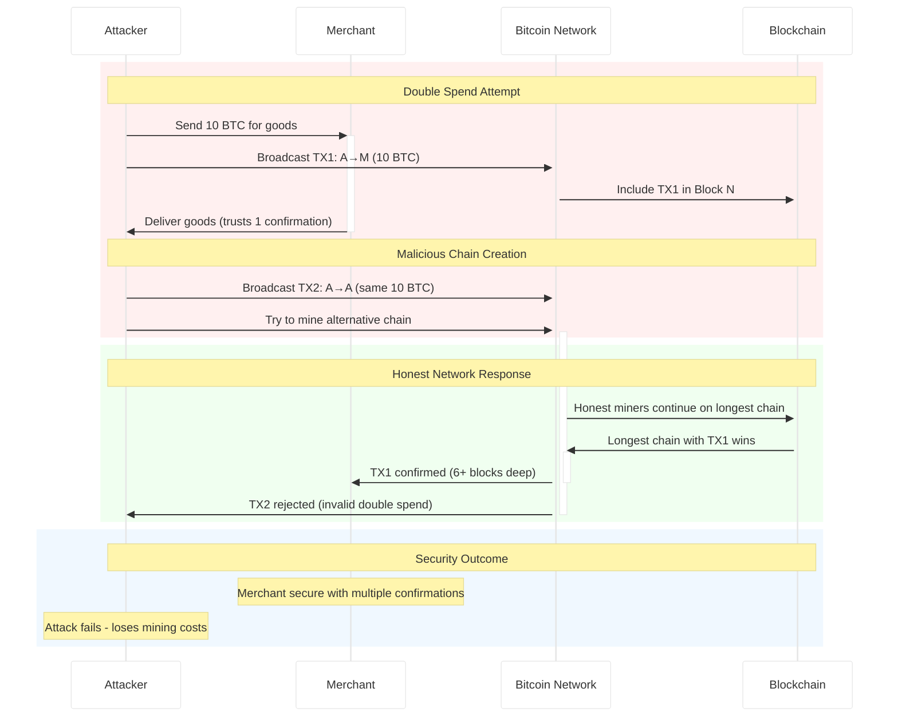
```mermaid
%%{init: {'theme':'base', 'themeVariables': {'primaryColor':'#ffffff', 'fontSize':'16px'}}}%%
sequenceDiagram
    participant A as Attacker
    participant M as Merchant
    participant N as Bitcoin Network
    participant B as Blockchain
    
    rect rgb(255, 240, 240)
        Note over A,B: Double Spend Attempt
        A->>+M: Send 10 BTC for goods
        A->>+N: Broadcast TX1: A→M (10 BTC)
        N->>+B: Include TX1 in Block N
        M->>-A: Deliver goods (trusts 1 confirmation)
        
        Note over A,B: Malicious Chain Creation
        A->>+N: Broadcast TX2: A→A (same 10 BTC)
        A->>+N: Try to mine alternative chain
    end
    
    rect rgb(240, 255, 240)
        Note over A,B: Honest Network Response
        N->>+B: Honest miners continue on longest chain
        B->>+N: Longest chain with TX1 wins
        N->>-M: TX1 confirmed (6+ blocks deep)
        N->>-A: TX2 rejected (invalid double spend)
    end
    
    rect rgb(240, 248, 255)
        Note over A,B: Security Outcome
        Note over M: Merchant secure with multiple confirmations
        Note over A: Attack fails - loses mining costs
    end
```

**Bitcoin's Defense Mechanism**:
1. **Immutable Ordering**: Only one transaction can exist in the valid blockchain
2. **Longest Chain Rule**: Honest majority chain always wins
3. **Exponential Security**: Each confirmation makes reversal exponentially harder
4. **Economic Deterrent**: Attack costs far exceed potential gains

**Merchant Protection**:
- **1 confirmation**: Suitable for small purchases (~$100)
- **3 confirmations**: Standard for retail (~$1,000-10,000)  
- **6+ confirmations**: Required for large amounts (>$10,000)

#### **Minority Attack Resistance**

When less than 50% of miners attempt to rewrite history:


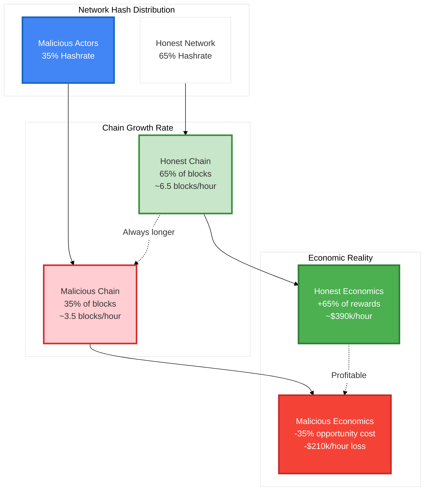
```mermaid
%%{init: {'theme':'base', 'themeVariables': {'primaryColor':'#ffffff', 'fontSize':'16px'}}}%%
graph TD
    subgraph "Network Hash Distribution"
        HN["<br/>Honest Network<br/>65% Hashrate<br/><br/>"]
        MA["<br/>Malicious Actors<br/>35% Hashrate<br/><br/>"]
    end
    
    subgraph "Chain Growth Rate"
        HC["<br/>Honest Chain<br/>65% of blocks<br/>~6.5 blocks/hour<br/><br/>"]
        MC["<br/>Malicious Chain<br/>35% of blocks<br/>~3.5 blocks/hour<br/><br/>"]
    end
    
    subgraph "Economic Reality"
        HE["<br/>Honest Economics<br/>+65% of rewards<br/>~$390k/hour<br/><br/>"]
        ME["<br/>Malicious Economics<br/>-35% opportunity cost<br/>-$210k/hour loss<br/><br/>"]
    end
    
    HN --> HC
    MA --> MC
    
    HC --> HE
    MC --> ME
    
    HC -.->|"Always longer"| MC
    HE -.->|"Profitable"| ME
    
    style HC fill:#c8e6c9,stroke:#388e3c,stroke-width:3px
    style MC fill:#ffcdd2,stroke:#d32f2f,stroke-width:3px
    style HE fill:#4caf50,stroke:#2e7d32,stroke-width:3px,color:#ffffff
    style ME fill:#f44336,stroke:#c62828,stroke-width:3px,color:#ffffff
    style MA fill:#4285f4,stroke:#1565c0,stroke-width:3px,color:#ffffff
```

**Economic Reality**: 
- **Minority attackers** lose money continuously (electricity + opportunity costs)
- **Honest miners** profit from block rewards and fees
- **Attack failure** is economically guaranteed with <50% hashrate
- **Network auto-heals** as miners switch to profitable honest mining

#### **Network Partition Handling**

When the Bitcoin network splits due to connectivity issues:


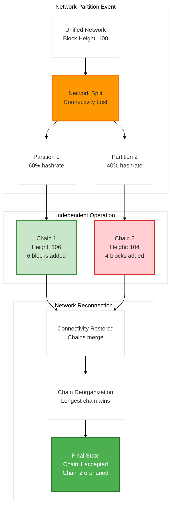
```mermaid
%%{init: {'theme':'base', 'themeVariables': {'primaryColor':'#ffffff', 'fontSize':'16px'}}}%%
flowchart TD
    subgraph "Network Partition Event"
        NET["<br/>Unified Network<br/>Block Height: 100<br/><br/>"]
        
        SPLIT["<br/>Network Split<br/>Connectivity Lost<br/><br/>"]
        
        P1["<br/>Partition 1<br/>60% hashrate<br/><br/>"]
        P2["<br/>Partition 2<br/>40% hashrate<br/><br/>"]
    end
    
    subgraph "Independent Operation"
        C1["<br/>Chain 1<br/>Height: 106<br/>6 blocks added<br/><br/>"]
        C2["<br/>Chain 2<br/>Height: 104<br/>4 blocks added<br/><br/>"]
    end
    
    subgraph "Network Reconnection"
        MERGE["<br/>Connectivity Restored<br/>Chains merge<br/><br/>"]
        
        REORG["<br/>Chain Reorganization<br/>Longest chain wins<br/><br/>"]
        
        FINAL["<br/>Final State<br/>Chain 1 accepted<br/>Chain 2 orphaned<br/><br/>"]
    end
    
    NET --> SPLIT
    SPLIT --> P1
    SPLIT --> P2
    
    P1 --> C1
    P2 --> C2
    
    C1 --> MERGE
    C2 --> MERGE
    MERGE --> REORG
    REORG --> FINAL
    
    style C1 fill:#c8e6c9,stroke:#388e3c,stroke-width:3px
    style C2 fill:#ffcdd2,stroke:#d32f2f,stroke-width:3px
    style FINAL fill:#4caf50,stroke:#2e7d32,stroke-width:3px,color:#ffffff
    style SPLIT fill:#ff9800,stroke:#f57c00,stroke-width:3px
```

**Automatic Recovery Process**:
1. **Independent operation**: Each partition continues mining separately
2. **Chain convergence**: When reconnected, all nodes see both chains
3. **Longest chain wins**: Network automatically adopts the longer chain
4. **Orphaned blocks**: Shorter chain blocks are discarded
5. **Zero manual intervention**: Process is fully automatic and deterministic

**Key Benefit**: No human coordination needed - the network heals itself through mathematical rules.

### The 51% Attack Threshold

Bitcoin's security model breaks down when attackers control **more than 50% of network hashrate**. This represents Bitcoin's Byzantine threshold:


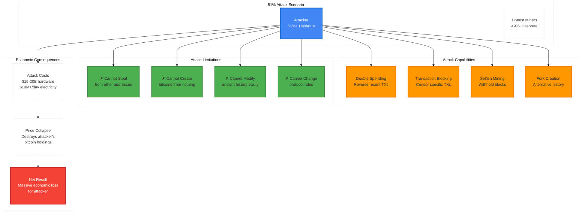
```mermaid
%%{init: {'theme':'base', 'themeVariables': {'primaryColor':'#ffffff', 'fontSize':'16px'}}}%%
flowchart TD
    subgraph "51% Attack Scenario"
        ATT["<br/>Attacker<br/>51%+ Hashrate<br/><br/>"]
        HON["<br/>Honest Miners<br/>49%- Hashrate<br/><br/>"]
    end
    
    subgraph "Attack Capabilities"
        DS["<br/>Double Spending<br/>Reverse recent TXs<br/><br/>"]
        BL["<br/>Transaction Blocking<br/>Censor specific TXs<br/><br/>"]
        SM["<br/>Selfish Mining<br/>Withhold blocks<br/><br/>"]
        FC["<br/>Fork Creation<br/>Alternative history<br/><br/>"]
    end
    
    subgraph "Attack Limitations"
        NST["<br/>✗ Cannot Steal<br/>from other addresses<br/><br/>"]
        NCR["<br/>✗ Cannot Create<br/>bitcoins from nothing<br/><br/>"]
        NMH["<br/>✗ Cannot Modify<br/>ancient history easily<br/><br/>"]
        NCH["<br/>✗ Cannot Change<br/>protocol rules<br/><br/>"]
    end
    
    subgraph "Economic Consequences"
        COST["<br/>Attack Costs<br/>$15-20B hardware<br/>$10M+/day electricity<br/><br/>"]
        DAMAGE["<br/>Price Collapse<br/>Destroys attacker's<br/>bitcoin holdings<br/><br/>"]
        LOSS["<br/>Net Result<br/>Massive economic loss<br/>for attacker<br/><br/>"]
    end
    
    ATT --> DS
    ATT --> BL
    ATT --> SM
    ATT --> FC
    
    ATT --> NST
    ATT --> NCR
    ATT --> NMH
    ATT --> NCH
    
    ATT --> COST
    COST --> DAMAGE
    DAMAGE --> LOSS
    
    style ATT fill:#4285f4,stroke:#1565c0,stroke-width:3px,color:#ffffff
    style DS fill:#ff9800,stroke:#f57c00,stroke-width:3px
    style BL fill:#ff9800,stroke:#f57c00,stroke-width:3px
    style SM fill:#ff9800,stroke:#f57c00,stroke-width:3px
    style FC fill:#ff9800,stroke:#f57c00,stroke-width:3px
    style NST fill:#4caf50,stroke:#2e7d32,stroke-width:2px
    style NCR fill:#4caf50,stroke:#2e7d32,stroke-width:2px
    style NMH fill:#4caf50,stroke:#2e7d32,stroke-width:2px
    style NCH fill:#4caf50,stroke:#2e7d32,stroke-width:2px
    style LOSS fill:#f44336,stroke:#c62828,stroke-width:3px,color:#ffffff
```

**Key Understanding**: Even with 51% control, attackers face **severe economic constraints** and **limited capabilities**.

#### **Attack Economics Analysis**

The economic reality makes 51% attacks practically impossible:



```mermaid
%%{init: {'theme':'base', 'themeVariables': {'primaryColor':'#ffffff', 'fontSize':'16px'}}}%%
graph LR
    subgraph "Required Resources"
        HR["<br/>51% Hashrate<br/>~160 EH/s<br/><br/>"]
        HW["<br/>Hardware Cost<br/>~2M ASIC miners<br/>$15-20 Billion<br/><br/>"]
        EC["<br/>Electricity Cost<br/>~15 GW power<br/>$10M+ daily<br/><br/>"]
        TIME["<br/>Setup Time<br/>6-12 months<br/>Market detection<br/><br/>"]
    end
    
    subgraph "Economic Consequences"
        PD["<br/>Price Decline<br/>-50% to -90%<br/>Market panic<br/><br/>"]
        REV["<br/>Revenue Loss<br/>Bitcoin holdings<br/>worthless<br/><br/>"]
        OC["<br/>Opportunity Cost<br/>Lost mining rewards<br/>$600M+/month<br/><br/>"]
        LEG["<br/>Legal Risk<br/>Government action<br/>Criminal charges<br/><br/>"]
    end
    
    subgraph "Final Outcome"
        LOSS["<br/>Net Economic Loss<br/>>$20B investment<br/>>$300M/month losses<br/><br/>"]
    end
    
    HR --> HW
    HW --> EC
    EC --> TIME
    TIME --> PD
    PD --> REV
    REV --> OC
    OC --> LEG
    LEG --> LOSS
    
    style HR fill:#ff9800,stroke:#f57c00,stroke-width:3px
    style LOSS fill:#f44336,stroke:#c62828,stroke-width:3px,color:#ffffff
    style PD fill:#ffcdd2,stroke:#d32f2f,stroke-width:2px
    style REV fill:#ffcdd2,stroke:#d32f2f,stroke-width:2px
    style OC fill:#ffcdd2,stroke:#d32f2f,stroke-width:2px
```

**Economic Principle**: The cost of attacking Bitcoin **exceeds any possible benefit**, making it economically irrational.

### Bitcoin's Probabilistic Finality

Unlike traditional BFT systems with immediate finality, Bitcoin provides **probabilistic finality** that increases exponentially with confirmations:


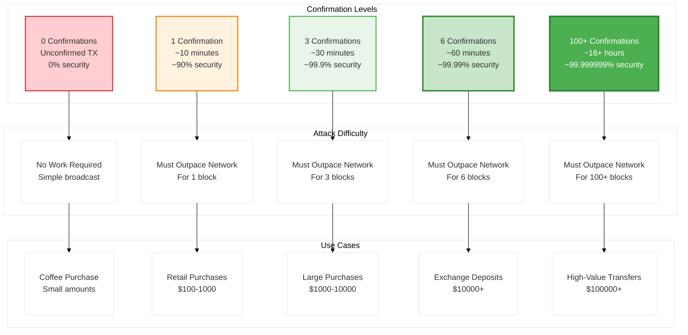
```mermaid
%%{init: {'theme':'base', 'themeVariables': {'primaryColor':'#ffffff', 'fontSize':'16px'}}}%%
graph TD
    subgraph "Confirmation Levels"
        C0["<br/>0 Confirmations<br/>Unconfirmed TX<br/>0% security<br/><br/>"]
        C1["<br/>1 Confirmation<br/>~10 minutes<br/>~90% security<br/><br/>"]
        C3["<br/>3 Confirmations<br/>~30 minutes<br/>~99.9% security<br/><br/>"]
        C6["<br/>6 Confirmations<br/>~60 minutes<br/>~99.99% security<br/><br/>"]
        C100["<br/>100+ Confirmations<br/>~16+ hours<br/>~99.999999% security<br/><br/>"]
    end
    
    subgraph "Attack Difficulty"
        A0["<br/>No Work Required<br/>Simple broadcast<br/><br/>"]
        A1["<br/>Must Outpace Network<br/>For 1 block<br/><br/>"]
        A3["<br/>Must Outpace Network<br/>For 3 blocks<br/><br/>"]
        A6["<br/>Must Outpace Network<br/>For 6 blocks<br/><br/>"]
        A100["<br/>Must Outpace Network<br/>For 100+ blocks<br/><br/>"]
    end
    
    subgraph "Use Cases"
        U0["<br/>Coffee Purchase<br/>Small amounts<br/><br/>"]
        U1["<br/>Retail Purchases<br/>$100-1000<br/><br/>"]
        U3["<br/>Large Purchases<br/>$1000-10000<br/><br/>"]
        U6["<br/>Exchange Deposits<br/>$10000+<br/><br/>"]
        U100["<br/>High-Value Transfers<br/>$100000+<br/><br/>"]
    end
    
    C0 --> A0
    C1 --> A1
    C3 --> A3
    C6 --> A6
    C100 --> A100
    
    A0 --> U0
    A1 --> U1
    A3 --> U3
    A6 --> U6
    A100 --> U100
    
    style C0 fill:#ffcdd2,stroke:#d32f2f,stroke-width:2px
    style C1 fill:#fff3e0,stroke:#f57c00,stroke-width:2px
    style C3 fill:#e8f5e8,stroke:#4caf50,stroke-width:2px
    style C6 fill:#c8e6c9,stroke:#388e3c,stroke-width:3px
    style C100 fill:#4caf50,stroke:#2e7d32,stroke-width:3px,color:#ffffff
```

#### **Mathematical Foundation of Security**

The probability of successfully reversing a transaction decreases exponentially:

```markdown
**Reversal Probability Formula:**
P(success) = (q/p)^n

Where:
- q = attacker's hash rate proportion
- p = honest network hash rate proportion  
- n = number of confirmations

**Example with 25% attacker:**
- 1 confirmation: 25% chance
- 3 confirmations: 1.56% chance  
- 6 confirmations: 0.024% chance
- 10 confirmations: 0.00006% chance
```

**Trade-off Principle**: Bitcoin **sacrifices speed for security**, allowing operation in a completely trustless, permissionless environment while maintaining mathematical security guarantees.

### Bitcoin's Complete BFT Architecture

Bitcoin's solution to Byzantine Fault Tolerance represents a fundamental paradigm shift in distributed consensus:


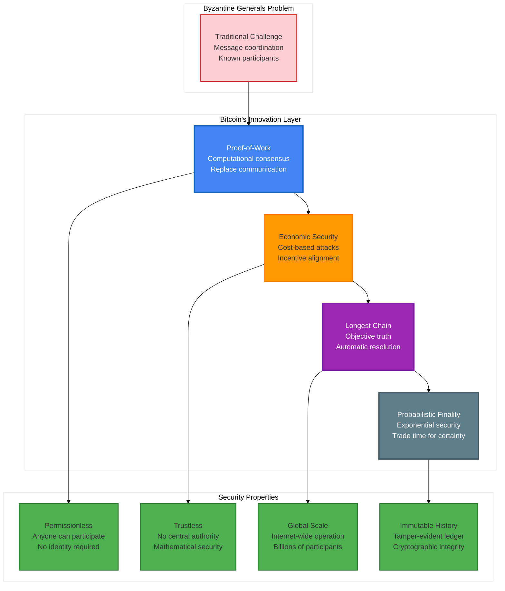
```mermaid
%%{init: {'theme':'base', 'themeVariables': {'primaryColor':'#ffffff', 'fontSize':'16px'}}}%%
graph TB
    subgraph "Byzantine Generals Problem"
        BGP["<br/>Traditional Challenge<br/>Message coordination<br/>Known participants<br/><br/>"]
    end
    
    subgraph "Bitcoin's Innovation Layer"
        POW["<br/>Proof-of-Work<br/>Computational consensus<br/>Replace communication<br/><br/>"]
        ECON["<br/>Economic Security<br/>Cost-based attacks<br/>Incentive alignment<br/><br/>"]
        LONG["<br/>Longest Chain<br/>Objective truth<br/>Automatic resolution<br/><br/>"]
        PROB["<br/>Probabilistic Finality<br/>Exponential security<br/>Trade time for certainty<br/><br/>"]
    end
    
    subgraph "Security Properties"
        PERM["<br/>Permissionless<br/>Anyone can participate<br/>No identity required<br/><br/>"]
        TRUST["<br/>Trustless<br/>No central authority<br/>Mathematical security<br/><br/>"]
        GLOB["<br/>Global Scale<br/>Internet-wide operation<br/>Billions of participants<br/><br/>"]
        IMMUT["<br/>Immutable History<br/>Tamper-evident ledger<br/>Cryptographic integrity<br/><br/>"]
    end
    
    BGP --> POW
    POW --> ECON
    ECON --> LONG
    LONG --> PROB
    
    POW --> PERM
    ECON --> TRUST
    LONG --> GLOB
    PROB --> IMMUT
    
    style BGP fill:#ffcdd2,stroke:#d32f2f,stroke-width:2px
    style POW fill:#4285f4,stroke:#1565c0,stroke-width:3px,color:#ffffff
    style ECON fill:#ff9800,stroke:#f57c00,stroke-width:3px
    style LONG fill:#9c27b0,stroke:#7b1fa2,stroke-width:3px,color:#ffffff
    style PROB fill:#607d8b,stroke:#455a64,stroke-width:3px,color:#ffffff
    style PERM fill:#4caf50,stroke:#2e7d32,stroke-width:2px
    style TRUST fill:#4caf50,stroke:#2e7d32,stroke-width:2px
    style GLOB fill:#4caf50,stroke:#2e7d32,stroke-width:2px
    style IMMUT fill:#4caf50,stroke:#2e7d32,stroke-width:2px
```

### Revolutionary Innovations

#### **1. Permissionless Consensus**
- **No Identity Requirements**: Anyone can participate without registration
- **Open Competition**: Mining is accessible to all participants
- **Censorship Resistance**: No central authority can exclude participants
- **Global Accessibility**: Works across all jurisdictions and networks

#### **2. Economic Security Model**
- **Skin in the Game**: Miners invest capital in specialized hardware
- **Continuous Costs**: Ongoing electricity expenses align incentives
- **Market-Based Security**: Security scales with network value
- **Self-Reinforcing**: More value attracts more security

#### **3. Objective Consensus**
- **Mathematical Truth**: Longest chain is objectively verifiable
- **No Subjective Decisions**: Eliminates human judgment from consensus
- **Automatic Resolution**: Network converges without coordination
- **Deterministic Outcomes**: Same rules produce same results globally

#### **4. Scalable Byzantine Tolerance**
- **Internet-Scale Operation**: Proven across global networks
- **Unlimited Participants**: No theoretical limit on node count
- **Asynchronous Operation**: Works despite network delays and partitions
- **Robust Failure Handling**: Graceful degradation under attacks

### Acknowledged Limitations and Trade-offs

#### **Energy Consumption**
- **Current Usage**: ~150 TWh annually (comparable to Argentina)
- **Economic Justification**: Security cost scales with secured value
- **Efficiency Improvements**: Hardware efficiency increases ~30% annually
- **Renewable Trend**: 50%+ of mining uses renewable energy sources

#### **Transaction Throughput**
- **Base Layer**: ~7 transactions per second maximum
- **Design Choice**: Prioritizes decentralization over speed
- **Layer 2 Solutions**: Lightning Network enables millions of TPS
- **Optimization Potential**: SegWit and Taproot improve efficiency

#### **Confirmation Time**
- **10-minute Blocks**: Designed for global synchronization
- **Probabilistic Security**: Trade-off between speed and finality
- **Use Case Matching**: Appropriate for store of value, not micropayments
- **Lightning Network**: Instant settlement for frequent transactions

### Impact on Blockchain Industry

Bitcoin's breakthrough has catalyzed an entire industry of blockchain innovations:

#### **Direct Influence**
- **1000+ Cryptocurrencies**: Most use variants of Bitcoin's model
- **$2+ Trillion Market**: Created an entirely new asset class
- **Central Bank Interest**: CBDCs inspired by Bitcoin's technology
- **Enterprise Adoption**: Major corporations hold Bitcoin as treasury asset

#### **Consensus Evolution**
- **Proof-of-Stake**: Ethereum 2.0 builds on Bitcoin's insights
- **Hybrid Models**: Combine PoW security with PoS efficiency
- **Layer 2 Innovation**: Lightning, sidechains, rollups
- **Cross-Chain Protocols**: Enable interaction between different blockchains

#### **Academic Recognition**
According to [research by Georgios Konstantopoulos](https://medium.com/loom-network/understanding-blockchain-fundamentals-part-1-byzantine-fault-tolerance-245f46fe8419), "The big breakthrough when Bitcoin was invented, was the use of Proof-of-Work as a probabilistic solution to the Byzantine Generals' Problem."

This innovation transformed Byzantine Fault Tolerance from a theoretical computer science problem into a practical foundation for:
- **Decentralized Finance (DeFi)**: $100+ billion ecosystem
- **Non-Fungible Tokens (NFTs)**: Digital ownership and scarcity
- **Smart Contracts**: Programmable money and automation
- **Web3 Infrastructure**: Decentralized internet protocols

**Historical Significance**: Bitcoin didn't just solve the double-spending problem; it **proved that decentralized consensus was possible** at global scale, fundamentally changing how we think about trust, money, and coordination in digital systems.

## How BFT Works in Blockchain Networks

BFT algorithms in blockchain networks typically follow a **multi-phase consensus process** where nodes communicate to agree on the next block or state transition.


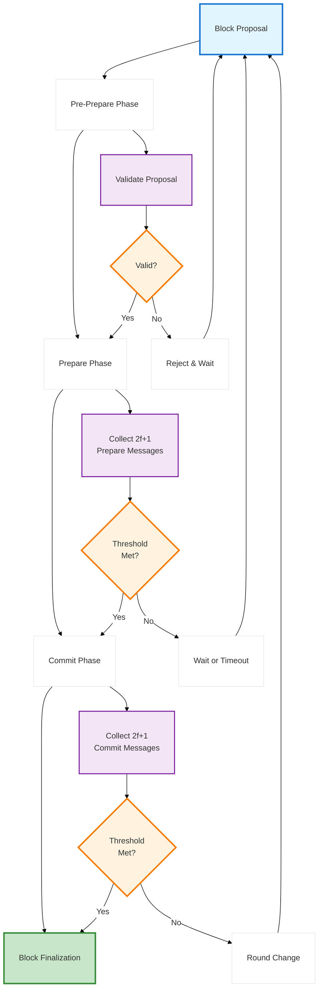
```mermaid
%%{init: {'theme':'base', 'themeVariables': {'primaryColor':'#ffffff', 'fontSize':'16px'}}}%%
flowchart TD
    A["<br/>Block Proposal<br/><br/>"] --> B["<br/>Pre-Prepare Phase<br/><br/>"]
    B --> C["<br/>Prepare Phase<br/><br/>"]
    C --> D["<br/>Commit Phase<br/><br/>"]
    D --> E["<br/>Block Finalization<br/><br/>"]
    
    B --> F["<br/>Validate Proposal<br/><br/>"]
    F --> G{"<br/>Valid?<br/><br/>"}
    G -->|"Yes"| C
    G -->|"No"| H["<br/>Reject & Wait<br/><br/>"]
    
    C --> I["<br/>Collect 2f+1<br/>Prepare Messages<br/><br/>"]
    I --> J{"<br/>Threshold<br/>Met?<br/><br/>"}
    J -->|"Yes"| D
    J -->|"No"| K["<br/>Wait or Timeout<br/><br/>"]
    
    D --> L["<br/>Collect 2f+1<br/>Commit Messages<br/><br/>"]
    L --> M{"<br/>Threshold<br/>Met?<br/><br/>"}
    M -->|"Yes"| E
    M -->|"No"| N["<br/>Round Change<br/><br/>"]
    
    N --> A
    H --> A
    K --> A
    
    style A fill:#e1f5fe,stroke:#1976d2,stroke-width:3px
    style E fill:#c8e6c9,stroke:#388e3c,stroke-width:3px
    style G fill:#fff3e0,stroke:#f57c00,stroke-width:3px
    style J fill:#fff3e0,stroke:#f57c00,stroke-width:3px
    style M fill:#fff3e0,stroke:#f57c00,stroke-width:3px
    style F fill:#f3e5f5,stroke:#7b1fa2,stroke-width:2px
    style I fill:#f3e5f5,stroke:#7b1fa2,stroke-width:2px
    style L fill:#f3e5f5,stroke:#7b1fa2,stroke-width:2px
```

### Core BFT Components

1. **Leader Selection**: Determines which node proposes the next block
2. **Proposal Validation**: Ensures proposed blocks meet network rules
3. **Multi-Round Voting**: Collects signatures from validator nodes
4. **Threshold Cryptography**: Requires sufficient signatures for consensus
5. **View Change**: Handles leader failures or timeouts

## Practical Byzantine Fault Tolerance (pBFT)

**Practical Byzantine Fault Tolerance (pBFT)**, introduced by Castro and Liskov in 1999, was the first efficient BFT algorithm suitable for real-world applications. Many modern blockchain consensus mechanisms are based on pBFT principles.

### pBFT Algorithm Phases

#### Phase 1: Pre-Prepare
- **Primary node** proposes a block with sequence number
- Broadcasts `⟨PRE-PREPARE, v, n, m⟩` message
- Includes block hash and ordering information

#### Phase 2: Prepare  
- **Backup nodes** validate the proposal
- Broadcast `⟨PREPARE, v, n, m, i⟩` if valid
- Collect `2f + 1` prepare messages (including own)

#### Phase 3: Commit
- Broadcast `⟨COMMIT, v, n, m, i⟩` message
- Collect `2f + 1` commit messages
- Execute the request and respond


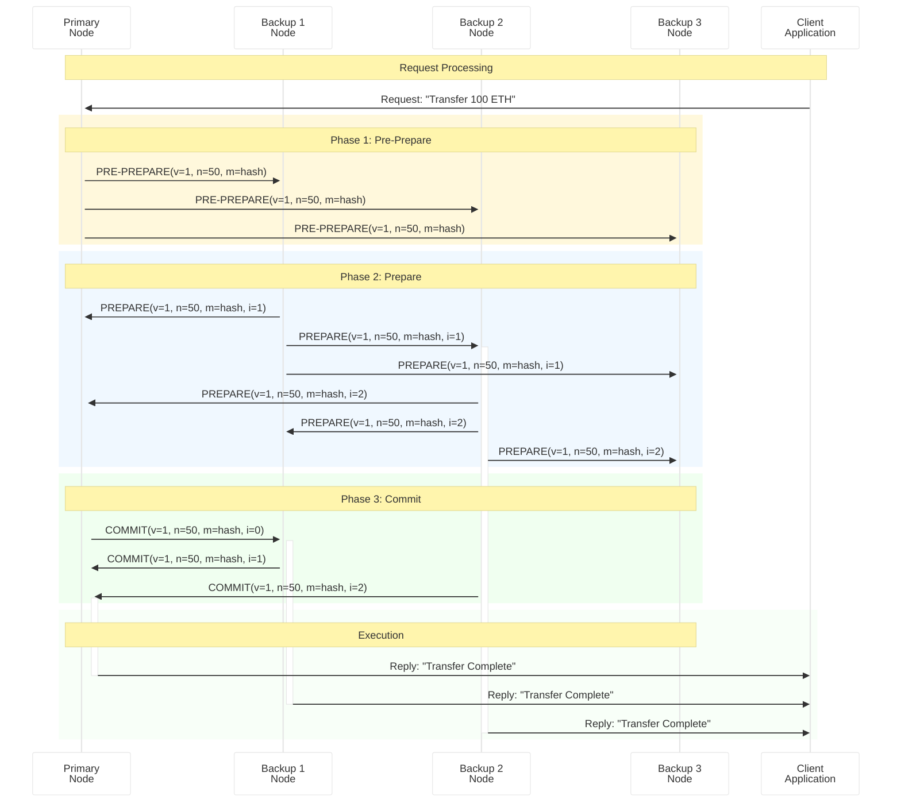
```mermaid
%%{init: {'theme':'base', 'themeVariables': {'primaryColor':'#ffffff', 'fontSize':'16px'}}}%%
sequenceDiagram
    participant P as Primary<br/>Node
    participant B1 as Backup 1<br/>Node
    participant B2 as Backup 2<br/>Node
    participant B3 as Backup 3<br/>Node
    participant C as Client<br/>Application
    
    Note over P,C: Request Processing
    C->>+P: Request: "Transfer 100 ETH"
    
    rect rgb(255, 248, 220)
        Note over P,B3: Phase 1: Pre-Prepare
        P->>+B1: PRE-PREPARE(v=1, n=50, m=hash)
        P->>+B2: PRE-PREPARE(v=1, n=50, m=hash)
        P->>+B3: PRE-PREPARE(v=1, n=50, m=hash)
    end
    
    rect rgb(240, 248, 255)
        Note over P,B3: Phase 2: Prepare
        B1->>+P: PREPARE(v=1, n=50, m=hash, i=1)
        B1->>+B2: PREPARE(v=1, n=50, m=hash, i=1)
        B1->>+B3: PREPARE(v=1, n=50, m=hash, i=1)
        
        B2->>+P: PREPARE(v=1, n=50, m=hash, i=2)
        B2->>+B1: PREPARE(v=1, n=50, m=hash, i=2)
        B2->>+B3: PREPARE(v=1, n=50, m=hash, i=2)
    end
    
    rect rgb(240, 255, 240)
        Note over P,B3: Phase 3: Commit
        P->>+B1: COMMIT(v=1, n=50, m=hash, i=0)
        B1->>+P: COMMIT(v=1, n=50, m=hash, i=1)
        B2->>+P: COMMIT(v=1, n=50, m=hash, i=2)
    end
    
    rect rgb(248, 255, 248)
        Note over P,B3: Execution
        P->>-C: Reply: "Transfer Complete"
        B1->>-C: Reply: "Transfer Complete"
        B2->>-C: Reply: "Transfer Complete"
    end
```

### pBFT Properties

- **Communication Complexity**: O(n²) messages per consensus round
- **Latency**: 3 message delays in the best case
- **Throughput**: Limited by network bandwidth and node processing
- **Scalability**: Practical for networks with < 100 nodes

## BFT in Ethereum: Casper FFG and Gasper

Ethereum's transition from Proof of Work to Proof of Stake introduced sophisticated BFT mechanisms to secure the network while maintaining decentralization and performance.

### Casper FFG (Friendly Finality Gadget)

**Casper FFG** provides **economic finality** to Ethereum blocks through a BFT-inspired voting mechanism:


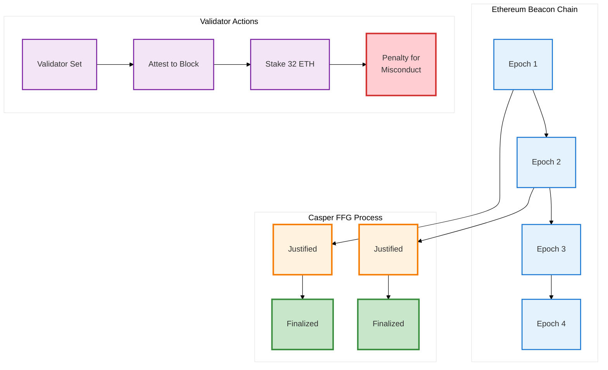
```mermaid
%%{init: {'theme':'base', 'themeVariables': {'primaryColor':'#ffffff', 'fontSize':'16px'}}}%%
graph TD
    subgraph "Ethereum Beacon Chain"
        E1["<br/>Epoch 1<br/><br/>"] --> E2["<br/>Epoch 2<br/><br/>"]
        E2 --> E3["<br/>Epoch 3<br/><br/>"]
        E3 --> E4["<br/>Epoch 4<br/><br/>"]
    end
    
    subgraph "Casper FFG Process"
        E1 --> J1["<br/>Justified<br/><br/>"]
        E2 --> J2["<br/>Justified<br/><br/>"]
        J1 --> F1["<br/>Finalized<br/><br/>"]
        J2 --> F2["<br/>Finalized<br/><br/>"]
    end
    
    subgraph "Validator Actions"
        V1["<br/>Validator Set<br/><br/>"]
        V1 --> A1["<br/>Attest to Block<br/><br/>"]
        A1 --> S1["<br/>Stake 32 ETH<br/><br/>"]
        S1 --> P1["<br/>Penalty for<br/>Misconduct<br/><br/>"]
    end
    
    style E1 fill:#e3f2fd,stroke:#1976d2,stroke-width:2px
    style E2 fill:#e3f2fd,stroke:#1976d2,stroke-width:2px
    style E3 fill:#e3f2fd,stroke:#1976d2,stroke-width:2px
    style E4 fill:#e3f2fd,stroke:#1976d2,stroke-width:2px
    style J1 fill:#fff3e0,stroke:#f57c00,stroke-width:3px
    style J2 fill:#fff3e0,stroke:#f57c00,stroke-width:3px
    style F1 fill:#c8e6c9,stroke:#388e3c,stroke-width:3px
    style F2 fill:#c8e6c9,stroke:#388e3c,stroke-width:3px
    style P1 fill:#ffcdd2,stroke:#d32f2f,stroke-width:3px
    style V1 fill:#f3e5f5,stroke:#7b1fa2,stroke-width:2px
    style A1 fill:#f3e5f5,stroke:#7b1fa2,stroke-width:2px
    style S1 fill:#f3e5f5,stroke:#7b1fa2,stroke-width:2px
```

#### Key Features

1. **Checkpoint System**: Uses epoch boundaries as checkpoints
2. **Two-Phase Finality**: Justification followed by finalization
3. **Economic Incentives**: Validators stake ETH and face slashing penalties
4. **Supermajority Requirement**: Needs 2/3 of validators for finality

### Gasper: LMD-GHOST + Casper FFG

**Gasper** combines the **Latest Message Driven Greedy Heaviest Observed SubTree (LMD-GHOST)** fork choice rule with Casper FFG finality:


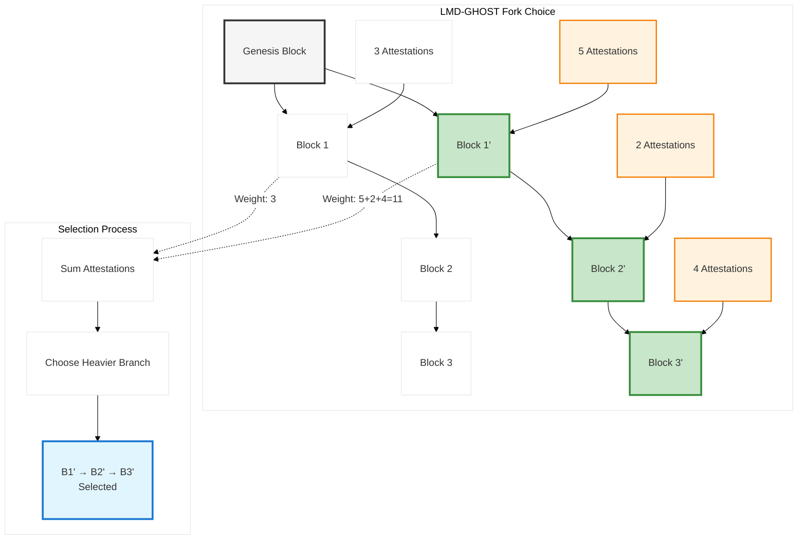
```mermaid
%%{init: {'theme':'base', 'themeVariables': {'primaryColor':'#ffffff', 'fontSize':'16px'}}}%%
flowchart TD
    subgraph "LMD-GHOST Fork Choice"
        G["<br/>Genesis Block<br/><br/>"]
        G --> B1["<br/>Block 1<br/><br/>"]
        G --> B1'["<br/>Block 1'<br/><br/>"]
        
        B1 --> B2["<br/>Block 2<br/><br/>"]
        B1' --> B2'["<br/>Block 2'<br/><br/>"]
        
        B2 --> B3["<br/>Block 3<br/><br/>"]
        B2' --> B3'["<br/>Block 3'<br/><br/>"]
        
        A1["<br/>3 Attestations<br/><br/>"] --> B1
        A2["<br/>5 Attestations<br/><br/>"] --> B1'
        A3["<br/>2 Attestations<br/><br/>"] --> B2'
        A4["<br/>4 Attestations<br/><br/>"] --> B3'
    end
    
    subgraph "Selection Process"
        S1["<br/>Sum Attestations<br/><br/>"]
        S2["<br/>Choose Heavier Branch<br/><br/>"]
        S3["<br/>B1' → B2' → B3'<br/>Selected<br/><br/>"]
    end
    
    B1 -.->|"Weight: 3"| S1
    B1' -.->|"Weight: 5+2+4=11"| S1
    S1 --> S2
    S2 --> S3
    
    style G fill:#f5f5f5,stroke:#333,stroke-width:3px
    style B1' fill:#c8e6c9,stroke:#388e3c,stroke-width:3px
    style B2' fill:#c8e6c9,stroke:#388e3c,stroke-width:3px
    style B3' fill:#c8e6c9,stroke:#388e3c,stroke-width:3px
    style S3 fill:#e1f5fe,stroke:#1976d2,stroke-width:3px
    style A2 fill:#fff3e0,stroke:#f57c00,stroke-width:2px
    style A3 fill:#fff3e0,stroke:#f57c00,stroke-width:2px
    style A4 fill:#fff3e0,stroke:#f57c00,stroke-width:2px
```

## BFT Implementations in EVM-Compatible Chains

Different EVM-compatible chains have implemented various BFT consensus mechanisms to achieve security, performance, and decentralization.

### Polygon (MATIC) - Heimdall and Bor

Polygon uses a **dual-chain architecture** with BFT consensus:

- **Heimdall**: Tendermint-based BFT chain for checkpointing
- **Bor**: Block production layer with PBFT elements

### Binance Smart Chain (BSC) - Parlia

BSC implements **Proof of Staked Authority (PoSA)** with BFT characteristics:

- **21 validators** selected through staking
- **Byzantine fault tolerance** with immediate finality
- **Slashing conditions** for malicious behavior

### Avalanche - Snowman Consensus

Avalanche uses the **Snowman consensus protocol** with unique BFT properties:


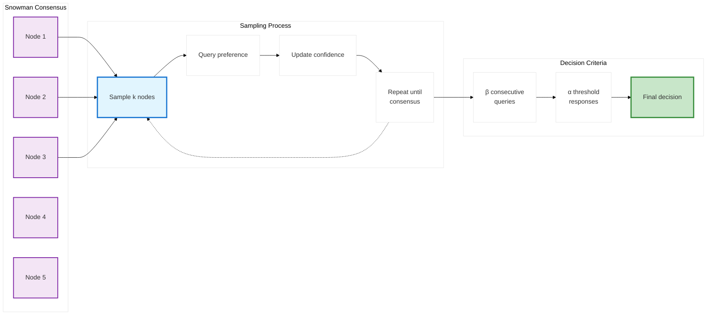
```mermaid
%%{init: {'theme':'base', 'themeVariables': {'primaryColor':'#ffffff', 'fontSize':'16px'}}}%%
graph LR
    subgraph "Snowman Consensus"
        N1["<br/>Node 1<br/><br/>"] 
        N2["<br/>Node 2<br/><br/>"]
        N3["<br/>Node 3<br/><br/>"]
        N4["<br/>Node 4<br/><br/>"]
        N5["<br/>Node 5<br/><br/>"]
    end
    
    subgraph "Sampling Process"
        S1["<br/>Sample k nodes<br/><br/>"]
        S2["<br/>Query preference<br/><br/>"] 
        S3["<br/>Update confidence<br/><br/>"]
        S4["<br/>Repeat until<br/>consensus<br/><br/>"]
    end
    
    N1 --> S1
    N2 --> S1
    N3 --> S1
    S1 --> S2
    S2 --> S3
    S3 --> S4
    S4 -.-> S1
    
    subgraph "Decision Criteria"
        D1["<br/>β consecutive<br/>queries<br/><br/>"]
        D2["<br/>α threshold<br/>responses<br/><br/>"]
        D3["<br/>Final decision<br/><br/>"]
    end
    
    S4 --> D1
    D1 --> D2
    D2 --> D3
    
    style S1 fill:#e1f5fe,stroke:#1976d2,stroke-width:3px
    style D3 fill:#c8e6c9,stroke:#388e3c,stroke-width:3px
    style N1 fill:#f3e5f5,stroke:#7b1fa2,stroke-width:2px
    style N2 fill:#f3e5f5,stroke:#7b1fa2,stroke-width:2px
    style N3 fill:#f3e5f5,stroke:#7b1fa2,stroke-width:2px
    style N4 fill:#f3e5f5,stroke:#7b1fa2,stroke-width:2px
    style N5 fill:#f3e5f5,stroke:#7b1fa2,stroke-width:2px
```

## Types of Byzantine Faults and Attacks

Understanding various attack vectors helps in designing robust BFT systems and evaluating their security guarantees.

### 1. Double Spending Attack

**Attack**: Malicious validators attempt to spend the same funds twice by creating conflicting transactions.

**BFT Defense**: 
- Requires 2/3+ majority for transaction confirmation
- Conflicting transactions cannot both achieve consensus
- Immediate detection of double-spending attempts

### 2. 51% Attack (Adapted for BFT)

**Attack**: Controlling majority of network to manipulate consensus.

**BFT Defense**:
- Requires 67%+ control to break BFT (vs 51% in PoW)
- Higher threshold makes attacks more expensive
- Economic penalties through slashing

### 3. Nothing-at-Stake Attack

**Attack**: Validators vote for multiple competing chains without penalty.

**BFT Defense**:
- **Slashing conditions** penalize conflicting votes
- Economic stake at risk for malicious behavior
- Clear incentive structure for honest participation


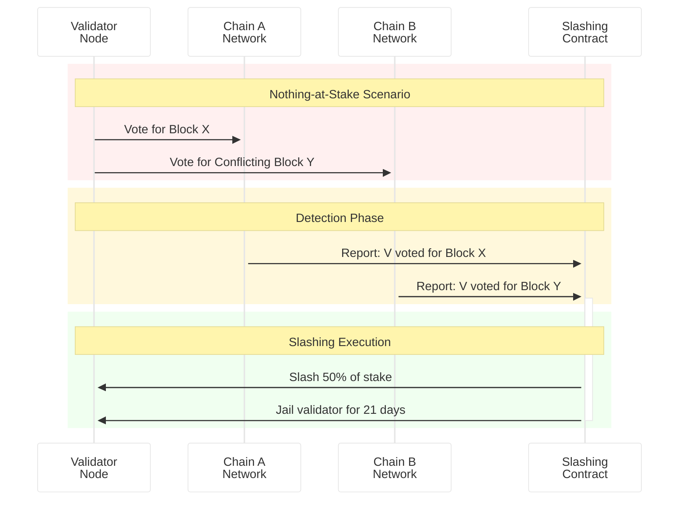
```mermaid
%%{init: {'theme':'base', 'themeVariables': {'primaryColor':'#ffffff', 'fontSize':'16px'}}}%%
sequenceDiagram
    participant V as Validator<br/>Node
    participant C1 as Chain A<br/>Network
    participant C2 as Chain B<br/>Network
    participant S as Slashing<br/>Contract
    
    rect rgb(255, 240, 240)
        Note over V,S: Nothing-at-Stake Scenario
        
        V->>+C1: Vote for Block X
        V->>+C2: Vote for Conflicting Block Y
    end
    
    rect rgb(255, 248, 220)
        Note over V,S: Detection Phase
        C1->>+S: Report: V voted for Block X
        C2->>+S: Report: V voted for Block Y
    end
    
    rect rgb(240, 255, 240)
        Note over V,S: Slashing Execution
        S->>+V: Slash 50% of stake
        S->>-V: Jail validator for 21 days
    end
```

### 4. Long Range Attack

**Attack**: Rewriting blockchain history from an early point.

**BFT Defense**:
- **Checkpointing** makes old blocks immutable
- **Weak subjectivity** requires recent state knowledge
- **Social consensus** for chain authenticity

### 5. Grinding Attack

**Attack**: Manipulating randomness in leader selection or other protocol elements.

**BFT Defense**:
- **Verifiable Random Functions (VRF)** for unpredictable randomness
- **Commit-reveal schemes** prevent manipulation
- **Historical randomness** based on previous blocks

## BFT Consensus Algorithms Comparison

Different BFT algorithms offer various trade-offs between security, performance, and complexity:

| Algorithm | Communication Complexity | Latency | Throughput | Fault Tolerance | Use Cases |
|-----------|-------------------------|---------|------------|-----------------|-----------|
| **pBFT** | O(n²) | 3 rounds | Medium | n ≥ 3f + 1 | Permissioned networks |
| **Tendermint** | O(n²) | 3+ rounds | Medium-High | n ≥ 3f + 1 | Cosmos ecosystem |
| **HotStuff** | O(n) | 4 rounds | High | n ≥ 3f + 1 | Libra/Diem (Meta) |
| **Casper FFG** | O(n) | 2 epochs | High | n ≥ 3f + 1 | Ethereum 2.0 |
| **IBFT** | O(n²) | 3 rounds | Medium | n ≥ 3f + 1 | Enterprise blockchains |

### Algorithm Selection Criteria

1. **Network Size**: O(n) algorithms scale better for large networks
2. **Latency Requirements**: Fewer rounds mean faster finality
3. **Throughput Needs**: Parallel processing capabilities
4. **Security Model**: Synchrony assumptions and failure handling
5. **Implementation Complexity**: Development and maintenance costs

## Performance and Scalability Considerations

BFT algorithms face inherent performance limitations due to their security requirements. Understanding these trade-offs is crucial for system design.

### Throughput Limitations


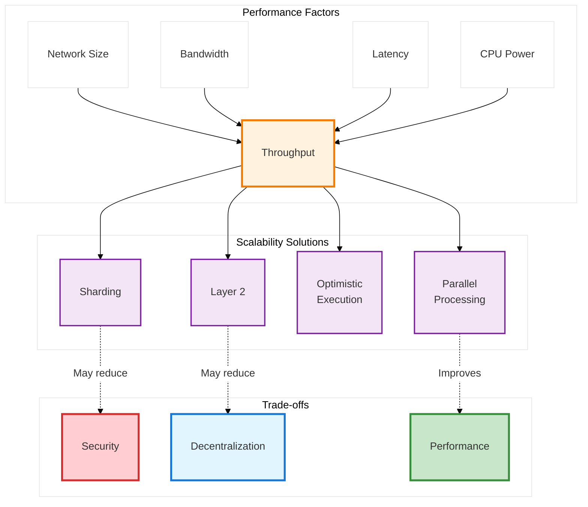
```mermaid
%%{init: {'theme':'base', 'themeVariables': {'primaryColor':'#ffffff', 'fontSize':'16px'}}}%%
graph TD
    subgraph "Performance Factors"
        N["<br/>Network Size<br/><br/>"] --> TH["<br/>Throughput<br/><br/>"]
        BW["<br/>Bandwidth<br/><br/>"] --> TH
        LAT["<br/>Latency<br/><br/>"] --> TH
        CPU["<br/>CPU Power<br/><br/>"] --> TH
    end
    
    subgraph "Scalability Solutions"
        SH["<br/>Sharding<br/><br/>"]
        LR["<br/>Layer 2<br/><br/>"]
        OPT["<br/>Optimistic<br/>Execution<br/><br/>"]
        PAR["<br/>Parallel<br/>Processing<br/><br/>"]
    end
    
    TH --> SH
    TH --> LR
    TH --> OPT
    TH --> PAR
    
    subgraph "Trade-offs"
        SEC["<br/>Security<br/><br/>"] 
        DEC["<br/>Decentralization<br/><br/>"]
        PERF["<br/>Performance<br/><br/>"]
    end
    
    SH -.->|"May reduce"| SEC
    LR -.->|"May reduce"| DEC
    PAR -.->|"Improves"| PERF
    
    style TH fill:#fff3e0,stroke:#f57c00,stroke-width:3px
    style SEC fill:#ffcdd2,stroke:#d32f2f,stroke-width:3px
    style DEC fill:#e1f5fe,stroke:#1976d2,stroke-width:3px
    style PERF fill:#c8e6c9,stroke:#388e3c,stroke-width:3px
    style SH fill:#f3e5f5,stroke:#7b1fa2,stroke-width:2px
    style LR fill:#f3e5f5,stroke:#7b1fa2,stroke-width:2px
    style OPT fill:#f3e5f5,stroke:#7b1fa2,stroke-width:2px
    style PAR fill:#f3e5f5,stroke:#7b1fa2,stroke-width:2px
```

### Optimization Strategies

1. **Message Aggregation**: Combine multiple signatures into one
2. **Parallel Validation**: Process multiple proposals simultaneously
3. **Pipelining**: Overlap consensus rounds
4. **Threshold Signatures**: Reduce communication overhead
5. **State Channels**: Move computation off-chain

### Real-World Performance

| Network | TPS | Finality | Validator Count | BFT Algorithm |
|---------|-----|----------|-----------------|---------------|
| **Ethereum 2.0** | ~100,000 | 2 epochs (12.8 min) | ~1,000,000 | Gasper |
| **Solana** | ~65,000 | 400ms | ~3,000 | Tower BFT |
| **Polygon** | ~7,000 | 2-3 sec | 100+ | Heimdall BFT |
| **BSC** | ~160 | 3 sec | 21 | Parlia BFT |
| **Avalanche** | ~4,500 | 1-2 sec | 2,000+ | Snowman |

## Security Analysis and Attack Vectors

Comprehensive security analysis reveals both strengths and potential vulnerabilities in BFT systems.

### Attack Cost Analysis

The economic security of BFT systems depends on the cost of mounting attacks:


```mermaid
%%{init: {'theme':'base', 'themeVariables': {'primaryColor':'#ffffff', 'fontSize':'18px', 'pie1':'#4285f4', 'pie2':'#34a853', 'pie3':'#fbbc04', 'pie4':'#ea4335'}}}%%
pie title Attack Cost Distribution (Larger View)
    "Honest Stake (67%)" : 67
    "Attack Threshold (33%)" : 33
    "Economic Buffer (15%)" : 15
    "Slashing Penalty (18%)" : 18
```

### Security Assumptions

1. **Synchrony**: Network messages deliver within known time bounds
2. **Cryptography**: Hash functions and digital signatures remain secure
3. **Rationality**: Participants act in their economic self-interest
4. **Stake Distribution**: No single entity controls excessive stake

### Advanced Attack Scenarios

#### Coordinated Attack with Multiple Vectors


```mermaid
%%{init: {'theme':'base', 'themeVariables': {'primaryColor':'#ffffff', 'fontSize':'16px'}}}%%
flowchart TD
    A["<br/>Attacker<br/><br/>"] --> B["<br/>Eclipse Attack<br/><br/>"]
    A --> C["<br/>Stake<br/>Accumulation<br/><br/>"]
    A --> D["<br/>Validator<br/>Corruption<br/><br/>"]
    
    B --> E["<br/>Network<br/>Isolation<br/><br/>"]
    C --> F["<br/>Voting Power<br/><br/>"]
    D --> G["<br/>Insider<br/>Information<br/><br/>"]
    
    E --> H["<br/>Create Alternative<br/>Chain<br/><br/>"]
    F --> H
    G --> H
    
    H --> I{"<br/>Attack<br/>Success?<br/><br/>"}
    I -->|"Yes"| J["<br/>Double Spend<br/><br/>"]
    I -->|"No"| K["<br/>Slashing Penalty<br/><br/>"]
    
    style A fill:#4285f4,stroke:#1565c0,stroke-width:3px,color:#ffffff
    style J fill:#ff5722,stroke:#d84315,stroke-width:3px,color:#ffffff
    style K fill:#4caf50,stroke:#2e7d32,stroke-width:3px,color:#ffffff
    style H fill:#ff9800,stroke:#f57c00,stroke-width:2px
    style I fill:#9c27b0,stroke:#7b1fa2,stroke-width:2px,color:#ffffff
```

## Real-World BFT Implementations

Examining successful BFT deployments provides insights into practical considerations and lessons learned.

### Ethereum 2.0 Case Study

**Challenge**: Secure transition from PoW to PoS for the world's largest smart contract platform.

**Solution**: Gasper consensus combining LMD-GHOST and Casper FFG.

**Results**:
- Successfully secured over $100 billion in staked ETH
- Achieved 99.9%+ uptime since launch
- Reduced energy consumption by 99.9%

### Cosmos Hub Implementation

**Challenge**: Enable interoperability between independent blockchains.

**Solution**: Tendermint BFT with Application Blockchain Interface (ABCI).

**Results**:
- Powers 200+ interconnected blockchains
- Processes millions of transactions daily
- Maintains sub-second finality

## Future of BFT in Blockchain

The evolution of BFT algorithms continues to address scalability, security, and usability challenges.

### Emerging Trends

1. **Post-Quantum BFT**: Resistance to quantum computing attacks
2. **Sharded BFT**: Parallel consensus across multiple shards
3. **Optimal BFT**: Theoretical improvements in message complexity
4. **Cross-Chain BFT**: Consensus across different blockchain networks

### Research Directions


```mermaid
%%{init: {'theme':'base', 'themeVariables': {'primaryColor':'#ffffff', 'fontSize':'16px'}}}%%
mindmap
  root)BFT Research Directions(
    Scalability
      Sharding
        Cross-Shard Communication
        State Partitioning
      Layer 2
        Rollups
        State Channels
      Parallel Consensus
        Multi-Threading
        Pipelined Execution
    Security
      Post-Quantum
        Quantum-Resistant Signatures
        Lattice-Based Cryptography
      Formal Verification
        Mathematical Proofs
        Automated Testing
      Attack Modeling
        Adversarial Scenarios
        Economic Analysis
    Usability
      Developer Tools
        SDK Integration
        Testing Frameworks
      User Experience
        Wallet Integration
        Transaction Speed
      Integration APIs
        Cross-Chain Protocols
        Standard Interfaces
    Interoperability
      Cross-Chain
        Bridge Security
        Asset Transfer
      Multi-Protocol
        Consensus Abstraction
        Universal Standards
      Bridge Security
        Validator Sets
        Economic Guarantees
```

### Next-Generation Algorithms

1. **HotStuff Variants**: Linear communication complexity improvements
2. **DAG-Based BFT**: Directed Acyclic Graph consensus structures
3. **Asynchronous BFT**: No timing assumptions required
4. **Accountable BFT**: Cryptographic proof of misbehavior

## Best Practices for BFT Implementation

Implementing robust BFT systems requires careful attention to design, security, and operational considerations.

### Design Principles

1. **Simplicity**: Keep the protocol as simple as possible
2. **Modularity**: Separate consensus from application logic
3. **Testability**: Enable comprehensive testing scenarios
4. **Observability**: Provide detailed monitoring and debugging

### Security Best Practices


```mermaid
%%{init: {'theme':'base', 'themeVariables': {'primaryColor':'#ffffff', 'fontSize':'16px'}}}%%
flowchart LR
    subgraph "Development Phase"
        A["<br/>Formal<br/>Specification<br/><br/>"]
        B["<br/>Security<br/>Analysis<br/><br/>"]
        C["<br/>Peer Review<br/><br/>"]
    end
    
    subgraph "Testing Phase"
        D["<br/>Unit Tests<br/><br/>"]
        E["<br/>Integration<br/>Tests<br/><br/>"]
        F["<br/>Adversarial<br/>Testing<br/><br/>"]
    end
    
    subgraph "Deployment Phase"
        G["<br/>Gradual<br/>Rollout<br/><br/>"]
        H["<br/>Monitoring<br/>Systems<br/><br/>"]
        I["<br/>Emergency<br/>Procedures<br/><br/>"]
    end
    
    A --> B --> C
    C --> D --> E --> F
    F --> G --> H --> I
    
    style A fill:#e1f5fe,stroke:#1976d2,stroke-width:3px
    style F fill:#fff3e0,stroke:#f57c00,stroke-width:3px
    style I fill:#ffcdd2,stroke:#d32f2f,stroke-width:3px
    style B fill:#f3e5f5,stroke:#7b1fa2,stroke-width:2px
    style E fill:#f3e5f5,stroke:#7b1fa2,stroke-width:2px
    style H fill:#f3e5f5,stroke:#7b1fa2,stroke-width:2px
```

### Implementation Checklist

- [ ] **Threat Model**: Define attacker capabilities and goals
- [ ] **Safety Proofs**: Verify algorithm correctness
- [ ] **Liveness Analysis**: Ensure progress under all conditions
- [ ] **Performance Testing**: Measure throughput and latency
- [ ] **Failure Simulation**: Test various fault scenarios
- [ ] **Security Audit**: Independent code review
- [ ] **Monitoring Setup**: Real-time system health tracking
- [ ] **Incident Response**: Procedures for handling attacks

### Operational Considerations

1. **Validator Management**: Selection, rotation, and penalties
2. **Network Monitoring**: Health checks and performance metrics
3. **Upgrade Procedures**: Safe protocol evolution
4. **Community Governance**: Decentralized decision making

## Frequently Asked Questions

### What is the difference between BFT and CFT?

**Byzantine Fault Tolerance (BFT)** handles arbitrary failures including malicious behavior, while **Crash Fault Tolerance (CFT)** only handles nodes that stop working entirely. BFT requires n ≥ 3f + 1 nodes to tolerate f faults, while CFT only needs n ≥ 2f + 1.

### How does BFT prevent double spending?

BFT prevents double spending by requiring **2/3+ consensus** before confirming any transaction. Since conflicting transactions cannot both achieve this threshold simultaneously, double spending becomes mathematically impossible unless attackers control 67%+ of the network.

### Why can't BFT tolerate 50% Byzantine nodes?

The **67% threshold** comes from the need to distinguish between honest and malicious responses. With 50% Byzantine nodes, honest nodes cannot determine which messages represent the true network state, making consensus impossible.

### What happens if the BFT threshold is exceeded?

If more than 1/3 of nodes become Byzantine, the network may:
- **Halt** (safety preserved but no progress)
- **Fork** (different nodes see different states)
- **Recovery procedures** may restore consensus if Byzantine nodes are identified and removed

### How do BFT algorithms handle network partitions?

BFT algorithms typically **prioritize safety over liveness** during network partitions. The partition with 2/3+ of nodes can continue making progress, while smaller partitions halt until connectivity is restored.

### Can BFT algorithms work in asynchronous networks?

Pure asynchronous BFT is possible but challenging. Most practical implementations assume **partial synchrony** - periods where messages are delivered within known time bounds, even if timing isn't always guaranteed.

### What is the energy consumption of BFT vs PoW?

BFT consensus mechanisms are significantly more energy-efficient than Proof of Work. Ethereum's transition to PoS (using BFT) reduced energy consumption by **over 99.9%** while maintaining security.

### How do you optimize BFT performance?

Key optimization strategies include:
- **Message aggregation** to reduce communication overhead
- **Parallel processing** of independent operations
- **Pipelining** to overlap consensus rounds
- **Efficient cryptography** for faster signature verification

---

Byzantine Fault Tolerance represents a cornerstone of modern blockchain security, enabling trustless consensus in adversarial environments. As blockchain technology continues to mature, BFT algorithms evolve to address scalability challenges while maintaining the security guarantees that make decentralized systems possible. Understanding BFT principles is essential for anyone working with blockchain technology, from developers building dApps to researchers advancing the field.

Whether you're implementing a new blockchain network, optimizing consensus performance, or simply seeking to understand how these systems achieve security without central authority, the principles and practices outlined in this guide provide a comprehensive foundation for working with Byzantine Fault Tolerance in the blockchain ecosystem.
