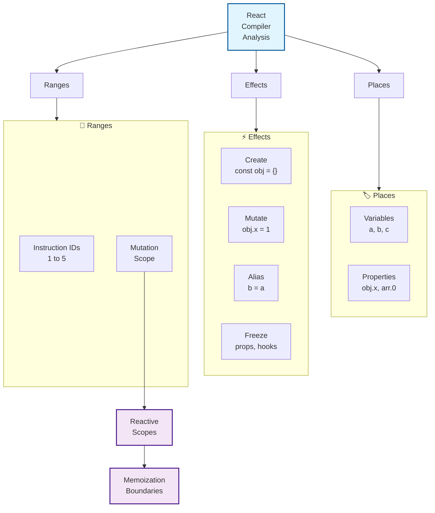

# Drop React Manual Memoization

- [Introduction](#introduction)
- [Quick Summary](#quick-summary)
- [Why does React need a mutation model?](#why-does-react-need-a-mutation-model)
- [Building Blocks: Places, Effects & Ranges](#building-blocks-places-effects-ranges)
- [Effects Reference](#effects-reference)
- [Key Inference Rules (Mental Model)](#key-inference-rules-mental-model)
- [Writing Compiler-Friendly Code](#writing-compiler-friendly-code)
- [Frequently Asked Questions](#frequently-asked-questions)
- [Conclusion](#conclusion)

## Note
- Check [memoization article](/articles/memoization/).
- And [React document](https://github.com/facebook/react/blob/156b7a96f5669470182ad226306184576d6f150f/compiler/packages/babel-plugin-react-compiler/src/Inference/MUTABILITY_ALIASING_MODEL.md).

## Introduction

React Compiler just got a lot smarter. It now understands *where*, *when*, and *how* your data mutates and it uses that **knowledge to memoize components** and hooks automatically.

For years, React developers have reached for memoization patterns to squeeze extra performance out of their applications. With the **Mutability & Aliasing Model** introduced in **June 2025**, most of that manual work disappears. React Compiler now performs a whole-program analysis that can:

1. Detect every value that *might* mutate.
2. Track *exactly* which instructions cause the mutation.
3. Slice the program into *reactive scopes* that React can memoize safely.

The result? _Cleaner code, fewer bugs, and mental bandwidth back for features._

---

## Quick Summary

**When creation and mutation are split across multiple instructions:** Compiler skips memoization (unsafe)

**When mutation is scoped in a helper function or block:** Compiler memoizes automatically

Just keep your mutations local and explicit React Compiler does the rest.

---

## Why does React need a mutation model?

Traditional virtual-DOM diffing is great at spotting *value replacement* (new arrays, new objects). It is **terrible** at spotting *in-place mutation* (`array.push`, `obj.x = 3`).

The Mutability & Aliasing Model fixes that by describing *how references flow* and *where state changes*. Once React knows a mutation is **confined** to a scope, it can confidently reuse previously rendered output outside that scope.

---

## Building Blocks: Places, Effects & Ranges

React's analysis operates on three core concepts:

1. **Place** – a single variable or property reference (`a`, `obj.x`).
2. **Effect** – a record describing what a single instruction does (create, alias, mutate…).
3. **Range** – a pair of instruction IDs `[start, end]` over which a value may mutate.




The passes that produce these artefacts run in the following order:

1. `InferMutationAliasingEffects` – emit a *set of effects* for each instruction.
2. `InferMutationAliasingRanges` – collapse effects into per-value *mutable ranges*.
3. `InferReactiveScopeVariables` – group Places that mutate together into *reactive scopes* (future memoization boundaries).

```mermaid
flowchart TD
    subgraph Passes
        A[InferMutationAliasingEffects] --> B[InferMutationAliasingRanges] --> C[InferReactiveScopeVariables]
    end
    subgraph Output
        R[Reactive Scope &#x25B8; memoization block]
    end
    C --> R
```




---

## Effects Reference

Below is a condensed reference of the effects you will encounter in compiler traces. The full formal spec lives inside React repo, but this covers 99% of day-to-day cases.

**Creation Effects:**
- `Create` - Basic value creation like `const obj = {}`
- `CreateFunction` - Arrow functions and function expressions capturing locals
- `Apply` - Function calls, method calls, and constructor calls like `new Foo()`, `fn(arg)`

**Aliasing and Data-flow Effects:**
- `Assign` - Direct assignment that overwrites like `x = y`
- `Alias` - Non-exclusive assignment like `return cond ? a : b`
- `Capture` - Storing references like `array.push(item)` or `obj.key = value`
- `CreateFrom` - Extracting parts like `slice = arr[i]` or `obj.key`

**State Change Effects:**
- `Mutate` - Direct mutation of a value
- `Freeze` - Passing reference to React boundary (props, hooks, etc.)

### A Minimal Example

```jsx
function Sample() {
  // a is created and immediately mutated → same reactive scope
  const a = {count: 0};
  a.count++;

  // b & c are created together; mutate(c) may mutate b transitively
  const b = {};
  const c = {b};
  mutate(c);

  return <Display a={a} c={c} />;
}
```

The compiler produces (simplified):

```text
1  Create  a
2  Mutate  a          <-- still inside a's range
3  Create  b
4  Create  c
5  Apply   mutate(c)  <-- MutateTransitive b because c captures b
6  Freeze  a,c        <-- passed to JSX
```

Resulting *reactive scopes*:

* **Scope 1** – `{a}` spanning instructions 1-2
* **Scope 2** – `{b,c}` spanning instructions 3-5

JSX receive occurs *after* both scopes close, so React can safely memoize each `<Display />` render.

---

## Key Inference Rules (Mental Model)

The full formalism is lengthy; here are the 5 rules you actually need to reason about:

1. **Mutating an alias mutates the source**  
   `Alias a ← b` *then* `Mutate a` ⇒ `Mutate b`
2. **Mutating an assignment mutates the source**  
   `Assign a ← b` *then* `Mutate a` ⇒ `Mutate b`
3. **Mutating a view (`CreateFrom`) mutates container transitively**  
   `CreateFrom part ← whole` *then* `Mutate part` ⇒ `MutateTransitive whole`
4. **Mutation of a capture *does NOT* mutate the captured value**  
   `Capture obj ← value` *then* `Mutate obj` ⇒ `// value untouched`
5. **Freeze forbids further mutation *through that reference* – not globally**  
   You may still mutate the underlying object via another alias.

A handy mnemonic: **A.A.C.F** – *Aliases*, *Assignments*, *CreateFrom* propagate; *Freeze* restricts reference.

---

## Writing Compiler-Friendly Code

The new compiler is *extremely* good at inferring scopes, but a few patterns still trip it up.

### Do – Localise Mutation

```jsx
function increment() {
  const counter = {value: 0};
  counter.value += 1; // Local + obvious
  return counter.value;
}
```

### Don't – Split Creation & Mutation Far Apart

```jsx
const data = {};
// … 50 lines later …
data.x = 1; // Compiler must keep huge range open, skips memoization
```

### Do – Use Helper Functions To Scope Mutation

```jsx
function initUser(raw) {
  const user = { ...raw };
  normalise(user); // compiler sees mutation lives inside helper
  return user;
}
```

### Don't – Mutate After Freezing

```jsx
function Item({config}) {
  useEffect(() => {
    config.enabled = true; // Mutating a frozen reference
  }, []);
}
```

The compiler will surface a **MutateFrozen** error and bail out of optimisation.

---

## Frequently Asked Questions

### "Does this replace `useMemo` entirely?"
*In most cases, yes.* Manual memoization becomes necessary only when your code relies on dynamic *identity* checks outside React's reach (e.g. caching in a global Map).

### "What about mutable refs (`useRef`)?"
Refs are tracked like any other value. The compiler keeps their mutation range open until the final render-commit.

### "How do I debug scopes?"
Run `REACT_DEBUG_COMPILER=1 npm start`. Instruction ranges and reactive scopes are printed next to your source lines.

---

## Conclusion

The Mutability & Aliasing Model is the biggest leap in React performance ergonomics since hooks. By modelling how your data *really* flows, React Compiler can:

* Generate optimal memoization boundaries automatically.
* Warn you when a sneaky mutation would break reactivity.
* Unlock future optimisations like partial hydration and server components that depend on precise side-effect tracking.

In practice, you only need to remember one rule:

> **Structure your mutation logic clearly and locally.** React will take it from there.
