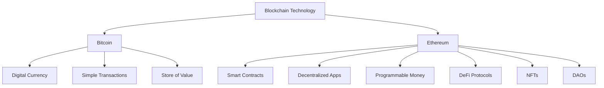
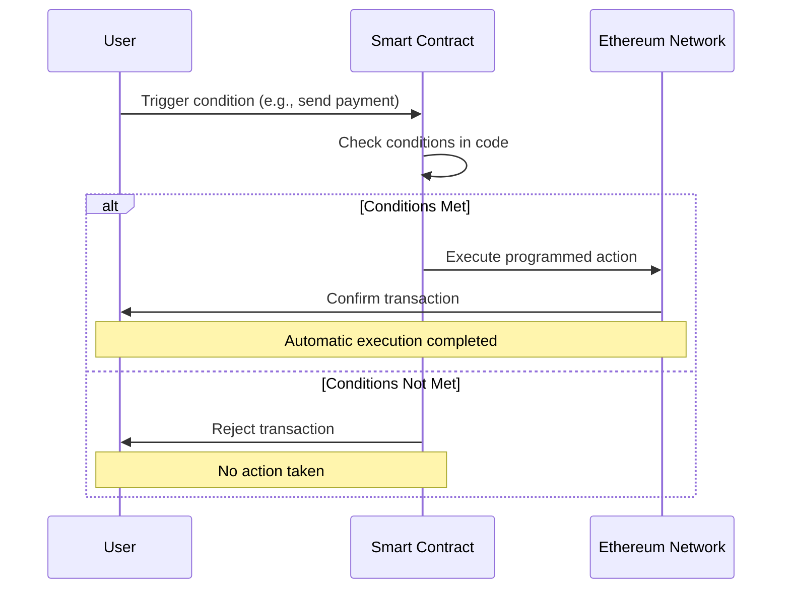

# Ethereum Whitepaper Explanation: A Simple Guide to Understanding Ethereum's Revolutionary Vision

## Table of Contents

1. [What is the Ethereum Whitepaper?](#what-is-the-ethereum-whitepaper)
2. [Understanding Bitcoin First: The Foundation](#understanding-bitcoin-first-the-foundation)
3. [What Makes Ethereum Different from Bitcoin?](#what-makes-ethereum-different-from-bitcoin)
4. [Smart Contracts: The Game Changer](#smart-contracts-the-game-changer)
5. [How Ethereum Works: The Technical Basics](#how-ethereum-works-the-technical-basics)
6. [Real-World Applications of Ethereum](#real-world-applications-of-ethereum)
7. [Ethereum's Challenges and Solutions](#ethereums-challenges-and-solutions)
8. [Why Ethereum Matters: The Future Impact](#why-ethereum-matters-the-future-impact)
9. [Key Takeaways](#key-takeaways)
10. [Frequently Asked Questions](#frequently-asked-questions)

---

## What is the Ethereum Whitepaper?

The **Ethereum Whitepaper** is a foundational document written by Vitalik Buterin in 2014 that introduced the world to Ethereum - a revolutionary blockchain platform that goes far beyond digital currency.

### Quick Facts:
- **Published**: 2014 by Vitalik Buterin
- **Purpose**: Introduce a "world computer" concept
- **Key Innovation**: Smart contracts on blockchain
- **Impact**: Enabled decentralized applications (dApps)

**Simple Definition**: Think of the Ethereum Whitepaper as the blueprint for building a global, decentralized computer that anyone can use to create applications without needing permission from any central authority.

---

## Understanding Bitcoin First: The Foundation

Before diving into Ethereum, the whitepaper explains Bitcoin as the starting point:

### What Bitcoin Solved:
1. **Digital Money Without Banks**: Created the first working digital currency that doesn't need banks
2. **Double-Spending Problem**: Prevented people from spending the same digital coin twice
3. **Decentralized Consensus**: Allowed a network to agree on transactions without a central authority

### Bitcoin's Limitations:
- **Limited Programming**: Can only handle simple transactions
- **Single Purpose**: Designed specifically for money transfers
- **No Complex Logic**: Cannot execute complicated rules or conditions

**Analogy**: If Bitcoin is like a calculator that can only add and subtract money, Ethereum is like a full computer that can run any program.

---

## What Makes Ethereum Different from Bitcoin?

### The Key Difference: Turing Completeness

**Bitcoin**: A simple state machine for transferring value
**Ethereum**: A complete programming platform that can run any computation




### Ethereum's Revolutionary Features:

#### 1. **Smart Contracts**
- Self-executing contracts with terms directly written into code
- Automatically enforce agreements without intermediaries
- **Example**: A rental agreement that automatically transfers keys when payment is received

#### 2. **Ethereum Virtual Machine (EVM)**
- A global computer that runs on thousands of nodes
- Executes smart contract code consistently across all nodes
- **Think of it as**: A shared computer that everyone can use but no one controls

#### 3. **Programmable Money**
- Create custom tokens and currencies
- Build complex financial instruments
- **Example**: Tokens that pay interest or change value based on conditions

---

## Smart Contracts: The Game Changer

### What are Smart Contracts?

**Simple Definition**: Smart contracts are like vending machines - you put in what's required (money, data, etc.), and if conditions are met, you automatically get what was promised.

### How Smart Contracts Work:

1. **Code is Law**: Rules are written in computer code
2. **Automatic Execution**: No human intervention needed
3. **Immutable**: Once deployed, contracts can't be changed easily
4. **Transparent**: Everyone can see the code and verify it works
5. **Check about ABI**: [Application Binary Interface](/articles/ethereum-abi) article




### Real-World Example:
```
Traditional Contract: "Pay $1000 rent by the 1st, or face eviction"
Smart Contract: "IF payment received by date THEN unlock apartment door, 
                ELSE revoke access automatically"
```

---

## How Ethereum Works: The Technical Basics

### Ethereum Accounts: Two Types

#### 1. **Externally Owned Accounts (EOAs)**
- Controlled by private keys (like your wallet)
- Can send transactions and ETH
- **Think of it as**: Your personal bank account

#### 2. **Contract Accounts**
- Controlled by smart contract code
- Execute automatically when triggered
- **Think of it as**: A robotic bank account that follows programmed rules

### State Transition Function

Ethereum processes transactions through state changes:

```
Current State + Transaction = New State
```

**Example**:
- Current State: Alice has 10 ETH, Bob has 5 ETH
- Transaction: Alice sends 3 ETH to Bob
- New State: Alice has 7 ETH, Bob has 8 ETH

### Gas: Ethereum's Fuel System

**What is Gas?**
- Payment for computational work
- Prevents infinite loops and spam
- **Analogy**: Like paying for gasoline to drive your car

**Why Gas Matters**:
- More complex operations cost more gas
- Ensures network security and efficiency
- Incentivizes miners/validators to process transactions

---

## Real-World Applications of Ethereum

### 1. **Decentralized Finance (DeFi)**
**What it is**: Traditional financial services without banks
**Examples**:
- Lending and borrowing platforms
- Decentralized exchanges (DEXs)
- Yield farming protocols

**Real Impact**: Over $200 billion in value locked in DeFi protocols

### 2. **Non-Fungible Tokens (NFTs)**
**What it is**: Unique digital assets that can't be replicated
**Examples**:
- Digital art and collectibles
- Gaming items
- Digital identity certificates

### 3. **Decentralized Autonomous Organizations (DAOs)**
**What it is**: Organizations run by smart contracts and community voting
**Examples**:
- Investment funds managed by token holders
- Protocol governance systems
- Decentralized social networks

### 4. **Supply Chain Management**
**What it is**: Tracking products from creation to consumer
**Benefits**:
- Transparency and authenticity
- Reduced fraud
- Better quality control

### 5. **Identity and Reputation Systems**
**What it is**: Decentralized systems for managing digital identity
**Benefits**:
- User-controlled data
- Reduced identity theft
- Interoperable credentials

---

## Ethereum's Challenges and Solutions

### 1. **Scalability Challenge**
**Problem**: Ethereum can only process ~15 transactions per second
**Solutions**:
- **Layer 2 Solutions**: Polygon, Arbitrum, Optimism
- **Ethereum 2.0**: Proof-of-Stake and sharding
- **State Channels**: Off-chain transaction processing

### 2. **High Gas Fees**
**Problem**: Popular dApps cause network congestion and expensive fees
**Solutions**:
- **Optimistic Rollups**: Bundle multiple transactions
- **ZK-Rollups**: Zero-knowledge proofs for scaling
- **Alternative Networks**: Binance Smart Chain, Avalanche

### 3. **Energy Consumption**
**Problem**: Proof-of-Work mining consumes significant energy
**Solution**: **The Merge (2022)**: Transition to Proof-of-Stake, reducing energy usage by 99.95%

### 4. **Security Concerns**
**Problem**: Smart contract bugs can lead to lost funds
**Solutions**:
- **Formal Verification**: Mathematical proof of contract correctness
- **Audit Processes**: Professional security reviews
- **Gradual Rollouts**: Testing with small amounts first

---

## Why Ethereum Matters: The Future Impact

### 1. **Democratizing Access to Financial Services**
- Banking for the unbanked
- Global financial inclusion
- Reduced reliance on traditional intermediaries

### 2. **Enabling New Business Models**
- Programmable organizations (DAOs)
- Creator economy platforms
- Decentralized marketplaces

### 3. **Digital Ownership Revolution**
- True ownership of digital assets
- Interoperable virtual goods
- User-controlled data and identity

### 4. **Web3 Infrastructure**
- Decentralized internet protocols
- Censorship-resistant applications
- User-owned social networks

---

## Key Takeaways

### 🎯 **Essential Points to Remember**:

1. **Ethereum = World Computer**: A global, decentralized platform for running applications
2. **Smart Contracts = Automated Agreements**: Self-executing contracts that don't need intermediaries
3. **Beyond Currency**: Ethereum enables any type of decentralized application
4. **Innovation Platform**: Thousands of projects built on Ethereum's foundation
5. **Ongoing Evolution**: Continuous improvements addressing scalability and efficiency

### 🚀 **Ethereum's Vision**:
"A platform that enables developers to build any application they can imagine, without permission, censorship, or single points of failure."

---

## Frequently Asked Questions

### Q: Is Ethereum better than Bitcoin?
**A**: They serve different purposes. Bitcoin is digital gold (store of value), while Ethereum is a platform for building applications. Both have value in the ecosystem.

### Q: How much does it cost to use Ethereum?
**A**: Costs vary based on network congestion. Gas fees can range from $1 to $100+ during peak times. Layer 2 solutions offer much lower costs.

### Q: Is Ethereum secure?
**A**: The Ethereum network itself is very secure, but individual smart contracts can have bugs. Always use audited and well-tested applications.

### Q: Can anyone build on Ethereum?
**A**: Yes! Ethereum is permissionless, meaning anyone can deploy smart contracts and build applications without asking for permission.

### Q: What programming languages work with Ethereum?
**A**: Solidity is the most popular, but you can also use Vyper, and interact with Ethereum using JavaScript, Python, and other languages.

### Q: How is Ethereum governed?
**A**: Through Ethereum Improvement Proposals (EIPs) and community consensus. No single entity controls Ethereum.

---

*This explanation covers the core concepts from Vitalik Buterin's original Ethereum Whitepaper in accessible terms. For the complete technical details, visit the [official Ethereum Whitepaper](https://ethereum.org/en/whitepaper/).*

**Sources**: 
- [Ethereum.org Official Whitepaper](https://ethereum.org/en/whitepaper/)
- Ethereum Foundation Documentation
- DeFi Pulse Analytics
- Ethereum Gas Tracker Data

---

**Tags**: #Ethereum #Blockchain #SmartContracts #DeFi #Web3 #Cryptocurrency #Decentralization #EthereumWhitepaper 
