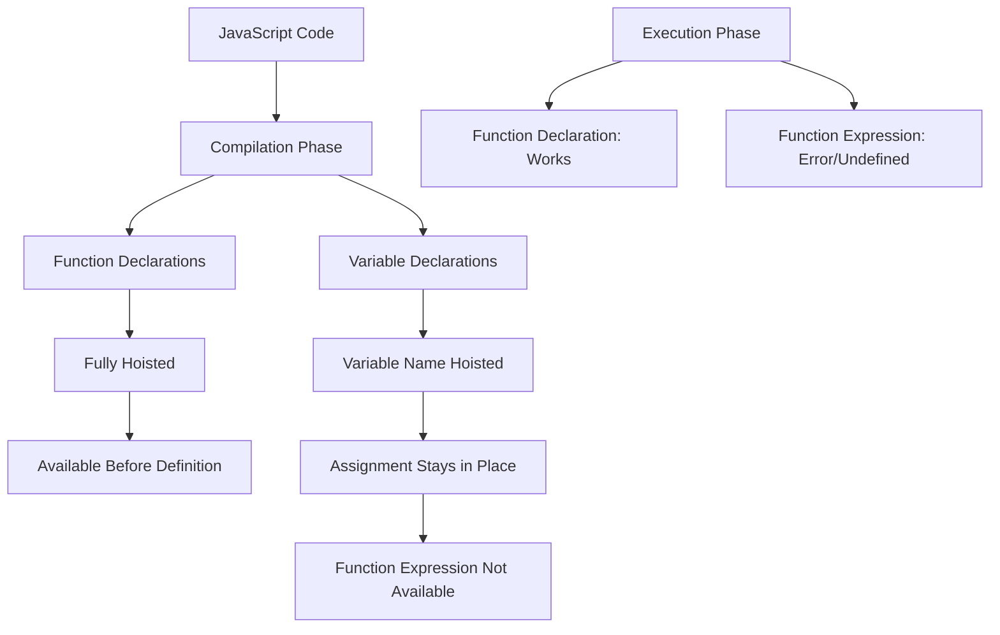

## Table of Contents
- [JavaScript Function Declarations vs Expressions: Key Differences Explained](#javascript-function-declarations-vs-expressions-key-differences-explained)
  - [Key Differences: Why They Matter](#key-differences-why-they-matter)
    - [1. Hoisting Behavior](#1-hoisting-behavior)
    - [2. Use in Conditional Blocks](#2-use-in-conditional-blocks)
    - [3. Immediately Invoked Function Expressions (IIFE)](#3-immediately-invoked-function-expressions-iife)
    - [4. Function as Callback Arguments](#4-function-as-callback-arguments)
  - [Function Declaration: The Classic Approach](#function-declaration-the-classic-approach)
  - [Function Expression: The Flexible Alternative](#function-expression-the-flexible-alternative)
    - [Named Function Expression](#named-function-expression)
    - [Anonymous Function Expression](#anonymous-function-expression)
    - [Arrow Function Expression (ES6+)](#arrow-function-expression-es6)
  - [When to Use Each Approach](#when-to-use-each-approach)
    - [Use Function Declarations When:](#use-function-declarations-when)
    - [Use Function Expressions When:](#use-function-expressions-when)
  - [Best Practices](#best-practices)
  - [Conclusion](#conclusion)

# JavaScript Function Declarations vs Expressions: Key Differences Explained

When working with JavaScript, you'll frequently create functions using one of two primary approaches: **function declarations** or **function expressions**. While they might seem similar at first glance, understanding their differences is crucial for writing predictable, maintainable code.

## Key Differences: Why They Matter

### 1. Hoisting Behavior

The most significant difference between these approaches is how JavaScript's hoisting mechanism treats them:




```javascript
// Example 1: Calling a function declaration before it's defined
sayHello(); // Output: "Hello from a declared function!"

function sayHello() {
  console.log("Hello from a declared function!");
}

// Example 2: Using a function before its declaration works fine
console.log(add(2, 3)); // 5

// Function declaration - gets fully hoisted
function add(a, b) {
  return a + b;
}

// This would fail with a function expression
console.log(subtract(5, 2)); // Error: Cannot access 'subtract' before initialization

// Function expression - the variable is hoisted, but not its assignment
const subtract = function(a, b) {
  return a - b;
};
```

Function declarations are completely hoisted to the top of their scope during the compilation phase. This means you can use them before they appear in your code. When the JavaScript engine compiles the code, it moves all function declarations (and variable declarations) to the top of their containing scope. This is why `sayHello()` can be called before its actual lines of code appear; the engine already knows about it.

Function expressions are not hoisted in the same way. The variable name is hoisted, but the function assignment happens at runtime.

### 2. Use in Conditional Blocks

Function declarations in conditional blocks can behave differently across browsers and may lead to unexpected results:

```javascript
// Avoid this pattern - behavior is inconsistent
if (userLoggedIn) {
  function getMessage() {
    return "Welcome back!";
  }
} else {
  function getMessage() {
    return "Please log in";
  }
}

// Better approach using function expressions
let getMessage;

if (userLoggedIn) {
  getMessage = function() {
    return "Welcome back!";
  };
} else {
  getMessage = function() {
    return "Please log in";
  };
}
```

### 3. Immediately Invoked Function Expressions (IIFE)

Function expressions can be immediately invoked, creating a private scope:

```javascript
// IIFE using a function expression
(function() {
  const privateVar = "I'm private!";
  console.log(privateVar);
})(); // "I'm private!"

// Attempting to access the variable fails
// console.log(privateVar); // ReferenceError
```

This pattern is invaluable for data encapsulation and avoiding global scope pollution.

### 4. Function as Callback Arguments

Function expressions are often preferred when passing functions as arguments:

```javascript
// Using a function expression as a callback
document.getElementById("button").addEventListener("click", function(event) {
  console.log("Button clicked!", event);
});

// Using an arrow function expression (even cleaner)
[1, 2, 3].map(num => num * 2); // [2, 4, 6]
```

## Function Declaration: The Classic Approach

A function declaration (also called a function statement) uses the `function` keyword followed by a mandatory function name:

```javascript
function calculateArea(width, height) {
  return width * height;
}

// Using the function
const area = calculateArea(5, 3);
console.log(area); // 15
```

Key characteristics:
- Begins with the `function` keyword
- Requires a name (identifier)
- Doesn't need to be terminated with a semicolon
- Gets hoisted to the top of their scope

## Function Expression: The Flexible Alternative

A function expression defines a function as part of an expression, typically by assigning it to a variable:

```javascript
const calculateArea = function(width, height) {
  return width * height;
};

// Using the function
const area = calculateArea(5, 3);
console.log(area); // 15
```

Function expressions come in multiple forms:

### Named Function Expression

```javascript
const factorial = function calculateFactorial(n) {
  if (n <= 1) return 1;
  return n * calculateFactorial(n - 1);
};

console.log(factorial(5)); // 120
// Note: calculateFactorial is not accessible outside the function
// console.log(calculateFactorial(5)); // ReferenceError
```

### Anonymous Function Expression

```javascript
const greet = function(name) {
  return `Hello, ${name}!`;
};

console.log(greet("Alice")); // "Hello, Alice!"
```
### Arrow Function Expression (ES6+)

```javascript
const multiply = (a, b) => a * b;

console.log(multiply(4, 6)); // 24
```

## When to Use Each Approach

### Use Function Declarations When:

- You need a function that's accessible throughout its scope
- You want to clearly distinguish standalone functions
- The function needs to be used before its actual definition
- You're writing top-level functions in a module or script

```javascript
// Good use case for function declaration
function validateUserData(userData) {
  // Validation logic
  return isValid;
}
```

### Use Function Expressions When:

- You're assigning a function to a variable or property
- You need to pass a function as an argument to another function
- You're creating a closure
- You want to limit a function's scope or create a one-time use function
- You're working with arrow functions for concise syntax

```javascript
// Good use case for function expression
const userService = {
  getUser: function(id) {
    return this.users.find(user => user.id === id);
  },
  users: []
};
```

## Best Practices

1. **Be Consistent:** Choose a style and apply it consistently throughout your codebase
2. **Consider Hoisting:** Be aware of hoisting behavior, especially in larger functions
3. **Use Arrow Functions:** For short callbacks and when preserving `this` context is important
4. **Named Function Expressions:** Use them for recursion or to aid debugging
5. **Avoid Function Declarations in Blocks:** They are not part of the specification and can lead to inconsistent behavior

```javascript
// Good: Named function expression for recursion and stack traces
const factorial = function calculateFactorial(n) {
  if (n <= 1) return 1;
  return n * calculateFactorial(n - 1);
};

// Good: Arrow function for short callbacks
const numbers = [1, 2, 3, 4, 5];
const squared = numbers.map(n => n * n);
```

## Conclusion

Understanding the subtle differences between function declarations and expressions is essential for writing clean, predictable JavaScript code. Each approach has its place in your toolkit:

- **Function declarations** offer simplicity and hoisting benefits
- **Function expressions** provide flexibility, especially for callbacks, closures, and method definitions

By choosing the right approach for each situation, you'll write more maintainable, readable code that avoids common JavaScript pitfalls. 

