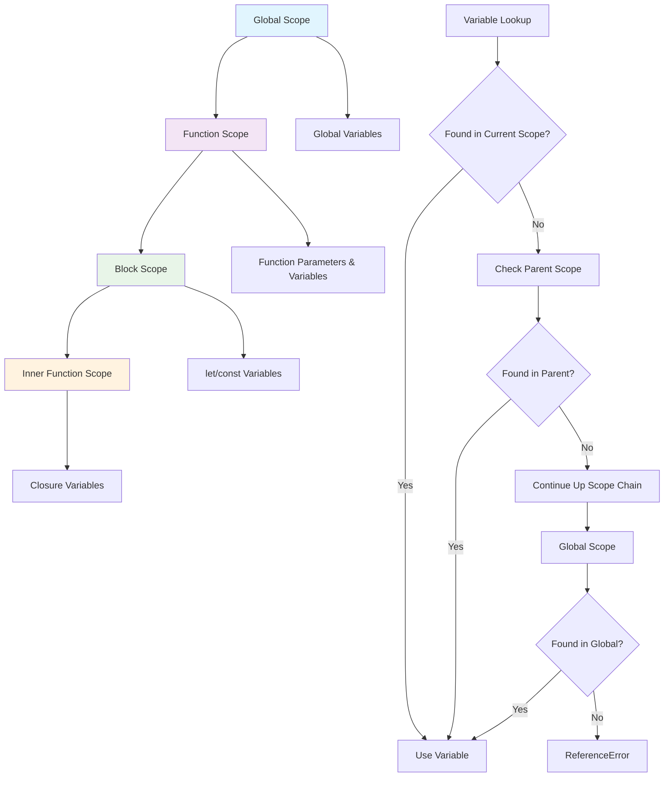
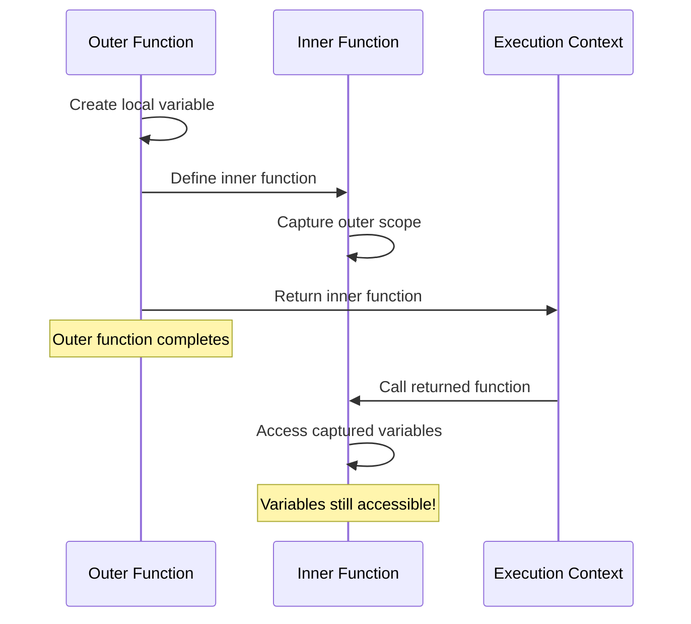

# Understanding JavaScript Lexical Scope

## Table of Contents

- [What is Lexical Scope?](#what-is-lexical-scope)
- [Scope Chain](#scope-chain)
- [Block Scope vs. Function Scope](#block-scope-vs-function-scope)
  - [Understanding `let`, `const`, and `var`](#understanding-let-const-and-var)
- [Closures: The Power of Lexical Scope](#closures-the-power-of-lexical-scope)
  - [Closure Practical Examples](#closure-practical-examples)
  - [Closure Memory Considerations](#closure-memory-considerations)
- [The Temporal Dead Zone](#the-temporal-dead-zone)
- [Hoisting and Lexical Scope](#hoisting-and-lexical-scope)
  - [How Hoisting Works](#how-hoisting-works)
  - [Class Hoisting](#class-hoisting)
  - [Hoisting with Arrow Functions](#hoisting-with-arrow-functions)
  - [Practical Implications of Hoisting](#practical-implications-of-hoisting)
- [The `bind` Method and Lexical Scope](#the-bind-method-and-lexical-scope)
  - [`bind` vs. Arrow Functions](#bind-vs-arrow-functions)
  - [When to Use `bind`](#when-to-use-bind)
- [Practical Applications](#practical-applications)
  - [Module Pattern](#module-pattern)
  - [Data Encapsulation](#data-encapsulation)
- [Common Pitfalls and Solutions](#common-pitfalls-and-solutions)
  - [Loop Variables in Closures](#loop-variables-in-closures)
  - [`this` Context vs. Lexical Scope](#this-context-vs-lexical-scope)
  - [Tricky Examples and Common Mistakes](#tricky-examples-and-common-mistakes)
- [Best Practices](#best-practices)
- [Conclusion](#conclusion)

Lexical scope is one of the most fundamental concepts in JavaScript that every developer should master. It determines how variable names are resolved in nested functions and is the foundation for powerful JavaScript features like closures.

## What is Lexical Scope?

Lexical scope (also called static scope) refers to how variable access is determined based on the physical location of variables in the source code. In JavaScript, the scope of a variable is defined by its location within the code structure.



The term "lexical" comes from the fact that scope is determined during the lexing phase of compilation, when the code is parsed and analyzed before execution.

```javascript
function outer() {
  const outerVar = 'I am from outer scope';
  
  function inner() {
    console.log(outerVar); // Can access outerVar
  }
  
  inner();
}

outer(); // Output: "I am from outer scope"
```

In this example, `inner()` has access to `outerVar` because of lexical scoping - it can "see" the variables defined in its parent scope.

## Scope Chain

JavaScript uses a scope chain to resolve variable references. When a variable is used, JavaScript looks for it in the current scope. If not found, it looks in the parent scope, then the parent's parent scope, and so on until it reaches the global scope.

```javascript
const global = 'I am global';

function first() {
  const firstVar = 'I am from first';
  
  function second() {
    const secondVar = 'I am from second';
    
    function third() {
      const thirdVar = 'I am from third';
      console.log(thirdVar);  // Local scope
      console.log(secondVar); // Parent scope
      console.log(firstVar);  // Grandparent scope
      console.log(global);    // Global scope
    }
    
    third();
  }
  
  second();
}

first();
/* Output:
   "I am from third"
   "I am from second"
   "I am from first"
   "I am global"
*/
```

The scope chain is created lexically, based on where functions are defined in the code, not where they are called.

## Block Scope vs. Function Scope

Prior to ES6, JavaScript only had function-level scope. Variables declared using `var` are scoped to the nearest function, regardless of block boundaries.

```javascript
function functionScope() {
  if (true) {
    var functionScopedVar = 'I am function scoped';
  }
  console.log(functionScopedVar); // Works! "I am function scoped"
}
```

ES6 introduced `let` and `const`, which are block-scoped:

```javascript
function blockScope() {
  if (true) {
    let blockScopedLet = 'I am block scoped with let';
    const blockScopedConst = 'I am block scoped with const';
  }
  
  // Error: blockScopedLet is not defined
  console.log(blockScopedLet);
  
  // Error: blockScopedConst is not defined
  console.log(blockScopedConst);
}
```

### Understanding `let`, `const`, and `var`

Let's explore each variable declaration type in more detail:

1. **`var` - Function Scoped**
   - Hoisted to the top of its function scope (or global scope)
   - Initialized with `undefined` during hoisting
   - Can be redeclared without error
   - No block scoping

   ```javascript
   function varExample() {
     console.log(x); // undefined (not an error)
     var x = 5;
     var x = 10; // Valid redeclaration
     
     if (true) {
       var x = 20; // Same variable as outside
     }
     
     console.log(x); // 20
   }
   ```

2. **`let` - Block Scoped**
   - Hoisted to the top of its block scope but enters TDZ
   - Not initialized during hoisting
   - Cannot be redeclared in the same scope
   - Creates new variable instances in each block

   ```javascript
   function letExample() {
     // console.log(x); // ReferenceError: Cannot access 'x' before initialization
     let x = 5;
     // let x = 10; // SyntaxError: Identifier 'x' has already been declared
     
     if (true) {
       let x = 20; // Different variable than outside
       console.log(x); // 20
     }
     
     console.log(x); // 5
   }
   ```

3. **`const` - Block Scoped & Immutable Binding**
   - Behaves like `let` regarding scope
   - Must be initialized at declaration
   - Cannot be reassigned (the binding is immutable)
   - Object properties can still be modified

   ```javascript
   function constExample() {
     const x = 5;
     // x = 10; // TypeError: Assignment to constant variable
     
     const obj = { prop: 'value' };
     obj.prop = 'new value'; // This works! Only the binding is constant
     console.log(obj.prop); // "new value"
     
     if (true) {
       const x = 20; // Different variable than outside
       console.log(x); // 20
     }
     
     console.log(x); // 5
   }
   ```

## Closures: The Power of Lexical Scope

Closures are a direct result of lexical scoping. A closure is created when a function retains access to its lexical scope even when executed outside that scope.



```javascript
function createCounter() {
  let count = 0; // Private variable
  
  return function() {
    count++; // Accessing the variable from the outer scope
    return count;
  };
}

const counter = createCounter();
console.log(counter()); // 1
console.log(counter()); // 2
console.log(counter()); // 3
```

In this example, the inner function maintains access to the `count` variable even after `createCounter()` has finished executing. This is a closure.

### Closure Practical Examples

Closures are incredibly useful in real-world JavaScript programming. Here are some practical examples:

1. **Data Privacy**
   
   Closures enable true private variables in JavaScript:

   ```javascript
   function createBankAccount(initialBalance) {
     let balance = initialBalance; // Private variable
     
     return {
       deposit: function(amount) {
         balance += amount;
         return `Deposited ${amount}. New balance: ${balance}`;
       },
       withdraw: function(amount) {
         if (amount > balance) {
           return 'Insufficient funds';
         }
         balance -= amount;
         return `Withdrew ${amount}. New balance: ${balance}`;
       },
       getBalance: function() {
         return `Current balance: ${balance}`;
       }
     };
   }
   
   const account = createBankAccount(100);
   console.log(account.getBalance()); // "Current balance: 100"
   console.log(account.deposit(50));  // "Deposited 50. New balance: 150"
   console.log(account.withdraw(25)); // "Withdrew 25. New balance: 125"
   console.log(account.balance);      // undefined - can't access private variable
   ```

2. **Function Factories**
   
   Create specialized functions with pre-configured behavior:

   ```javascript
   function createGreeter(greeting) {
     return function(name) {
       return `${greeting}, ${name}!`;
     };
   }
   
   const sayHello = createGreeter('Hello');
   const sayHowdy = createGreeter('Howdy');
   
   console.log(sayHello('Alice')); // "Hello, Alice!"
   console.log(sayHowdy('Bob'));   // "Howdy, Bob!"
   ```

3. **Partial Application & Currying**
   
   Pre-apply some arguments to a function using closures:

   ```javascript
   function multiply(a, b) {
     return a * b;
   }
   
   function partial(fn, ...fixedArgs) {
     return function(...remainingArgs) {
       return fn(...fixedArgs, ...remainingArgs);
     };
   }
   
   const multiplyByTwo = partial(multiply, 2);
   const multiplyByTen = partial(multiply, 10);
   
   console.log(multiplyByTwo(4));  // 8
   console.log(multiplyByTen(5));  // 50
   ```

4. **Preserving State in Async Operations**
   
   Closures help maintain state between async calls:

   ```javascript
   function fetchData(userId) {
     const user = { id: userId, name: 'Processing...' };
     
     // Update UI immediately with placeholder
     updateUI(user);
     
     // Fetch data - closure captures 'user' variable
     setTimeout(function() {
       // This function maintains access to 'user' object
       user.name = `User ${userId}`;
       updateUI(user);
     }, 1000);
     
     function updateUI(data) {
       console.log(`User data: ID = ${data.id}, Name = ${data.name}`);
     }
   }
   
   fetchData(123);
   // Output: "User data: ID = 123, Name = Processing..."
   // After 1 second: "User data: ID = 123, Name = User 123"
   ```

5. **Event Handlers with Memory**

   ```javascript
   function setupButton() {
     let clickCount = 0;
     
     document.querySelector('#myButton').addEventListener('click', function() {
       clickCount++; // Closure accessing the clickCount variable
       console.log(`Button clicked ${clickCount} time(s)`);
     });
   }
   
   // Every click remembers and increments the count
   ```

### Closure Memory Considerations

One important aspect of closures is their memory usage. Closures maintain references to their outer scope, which prevents the variables from being garbage collected until all references are gone.

```javascript
function potentialMemoryLeak() {
  const largeData = new Array(1000000).fill('X'); // Large data
  
  return function() {
    // This inner function holds reference to largeData
    console.log(largeData[0]);
  };
}

// This will hold largeData in memory until smallFunction is garbage collected
const smallFunction = potentialMemoryLeak();
```

To avoid memory issues with closures:

1. Be mindful of what you capture in closures
2. Set references to null when they are no longer needed
3. Avoid creating closures in loops that capture loop variables

## The Temporal Dead Zone

Variables declared with `let` and `const` exist in what's called the "Temporal Dead Zone" (TDZ) from the start of the block until the line where they are initialized.

```javascript
{
  // TDZ for x starts here
  console.log(x); // ReferenceError: Cannot access 'x' before initialization
  let x = 10;     // TDZ ends here
  console.log(x); // 10
}
```

This is a key difference from `var`, which is hoisted to the top of the function and initialized with `undefined`.

## Hoisting and Lexical Scope

Hoisting is a JavaScript behavior where variable and function declarations are moved to the top of their containing scope during the compilation phase, before code execution.

### How Hoisting Works

JavaScript "hoists" declarations in two phases:

1. **Declaration Phase**: All variable and function declarations are processed before any code is executed
2. **Execution Phase**: The actual assignments and code execution happen

Different types of declarations are hoisted differently:

1. **Function Declarations** are completely hoisted with their definitions:
   ```javascript
   // This works:
   sayHello(); // "Hello, world!"
   
   function sayHello() {
     console.log("Hello, world!");
   }
   ```

2. **Function Expressions** are not hoisted with their definitions:
   ```javascript
   // This throws an error:
   sayHi(); // TypeError: sayHi is not a function
   
   var sayHi = function() {
     console.log("Hi, world!");
   };
   ```

3. **Variable Declarations** are hoisted but not their assignments:
   - `var`: Declaration hoisted and initialized with `undefined`
   - `let` and `const`: Declaration hoisted but not initialized (TDZ)

```javascript
console.log(varVariable); // undefined
console.log(letVariable); // ReferenceError: Cannot access 'letVariable' before initialization
console.log(constVariable); // ReferenceError: Cannot access 'constVariable' before initialization

var varVariable = 'var value';
let letVariable = 'let value';
const constVariable = 'const value';
```

### Class Hoisting

Classes in JavaScript are also hoisted but remain uninitialized until the declaration:

```javascript
// ReferenceError: Cannot access 'MyClass' before initialization
const instance = new MyClass();

class MyClass {
  constructor() {
    this.property = "value";
  }
}
```

### Hoisting with Arrow Functions

Arrow functions, which are function expressions, follow the same rules as other function expressions - they are not hoisted with their definitions:

```javascript
// TypeError: arrowFunction is not a function
arrowFunction();

var arrowFunction = () => {
  console.log("I am an arrow function");
};
```

### Practical Implications of Hoisting

Hoisting can lead to unexpected behavior if not properly understood. Here are some best practices:

1. **Always declare variables at the top of their scope**
2. **Use function declarations when you want functions to be available throughout the scope**
3. **Prefer `const` and `let` over `var` to avoid unpredictable behavior**
4. **Initialize variables when declaring them**

## The `bind` Method and Lexical Scope

The `bind` method creates a new function with a specific `this` context. This relates to lexical scope in an interesting way, especially when comparing regular functions with arrow functions.

```javascript
const user = {
  name: 'Alice',
  greet: function() {
    console.log(`Hello, my name is ${this.name}`);
  }
};

user.greet(); // "Hello, my name is Alice"

const greetFunc = user.greet;
greetFunc(); // "Hello, my name is undefined" - lost this context

const boundGreet = user.greet.bind(user);
boundGreet(); // "Hello, my name is Alice" - this context preserved
```

### `bind` vs. Arrow Functions

While `bind` manually sets the `this` value for a function, arrow functions automatically capture the lexical `this` value from their surrounding scope:

```javascript
const user = {
  name: 'Alice',
  
  // Regular function uses 'this' from its caller
  regularGreet: function() {
    console.log(`Regular: Hello, my name is ${this.name}`);
  },
  
  // Arrow function captures 'this' from lexical scope
  arrowGreet: () => {
    console.log(`Arrow: Hello, my name is ${this.name}`);
  },
  
  // Method with internal functions
  delayedGreet: function() {
    // Regular function loses 'this' context
    setTimeout(function() {
      console.log(`Delayed regular: Hello, my name is ${this.name}`);
    }, 100);
    
    // Arrow function preserves lexical 'this'
    setTimeout(() => {
      console.log(`Delayed arrow: Hello, my name is ${this.name}`);
    }, 100);
    
    // Bound function preserves specific 'this'
    setTimeout(function() {
      console.log(`Delayed bound: Hello, my name is ${this.name}`);
    }.bind(this), 100);
  }
};

user.regularGreet(); // "Regular: Hello, my name is Alice"
user.arrowGreet();   // "Arrow: Hello, my name is undefined" (or window.name)

user.delayedGreet();
// After 100ms:
// "Delayed regular: Hello, my name is undefined" (or window.name)
// "Delayed arrow: Hello, my name is Alice"
// "Delayed bound: Hello, my name is Alice"
```

### When to Use `bind`

1. **For event handlers that need the component's context**
2. **To partially apply arguments to functions (partial application)**
3. **When passing methods as callbacks and the method needs its original context**

```javascript
// Partial application with bind
function multiply(a, b) {
  return a * b;
}

const double = multiply.bind(null, 2);  // First arg is 'this', second is fixed parameter
console.log(double(5)); // 10

// Event handler with context
class ClickCounter {
  constructor() {
    this.count = 0;
    this.button = document.querySelector('#button');
    // Use bind to preserve 'this'
    this.button.addEventListener('click', this.handleClick.bind(this));
  }
  
  handleClick() {
    this.count++;
    console.log(`Clicked ${this.count} times`);
  }
}
```

## Practical Applications

### Module Pattern

Lexical scope enables the module pattern, a way to create private state in JavaScript:

```javascript
const calculator = (function() {
  // Private variables
  let result = 0;
  
  // Public interface
  return {
    add: function(x) {
      result += x;
      return this;
    },
    subtract: function(x) {
      result -= x;
      return this;
    },
    getResult: function() {
      return result;
    }
  };
})();

calculator.add(5).subtract(2);
console.log(calculator.getResult()); // 3
console.log(calculator.result); // undefined - private variable
```

### Data Encapsulation

Lexical scope allows for data encapsulation, keeping implementation details hidden:

```javascript
function createUser(name, age) {
  // Private data
  const privateData = { name, age };
  
  // Public interface
  return {
    getName: function() {
      return privateData.name;
    },
    getAge: function() {
      return privateData.age;
    },
    setName: function(newName) {
      privateData.name = newName;
    }
  };
}

const user = createUser('John', 30);
console.log(user.getName()); // "John"
user.setName('Jane');
console.log(user.getName()); // "Jane"
console.log(user.privateData); // undefined - can't access private data
```

## Common Pitfalls and Solutions

### Loop Variables in Closures

A common mistake is using closures with loop variables:

```javascript
// Problematic code
function createFunctions() {
  var funcs = [];
  
  for (var i = 0; i < 3; i++) {
    funcs.push(function() {
      console.log(i);
    });
  }
  
  return funcs;
}

const functions = createFunctions();
functions[0](); // 3 (not 0)
functions[1](); // 3 (not 1)
functions[2](); // 3 (not 2)
```

Solutions:

1. Use an IIFE (Immediately Invoked Function Expression):

```javascript
function createFunctionsFixed1() {
  var funcs = [];
  
  for (var i = 0; i < 3; i++) {
    funcs.push(
      (function(index) {
        return function() {
          console.log(index);
        };
      })(i)
    );
  }
  
  return funcs;
}

const functionsFixed1 = createFunctionsFixed1();
functionsFixed1[0](); // 0
functionsFixed1[1](); // 1
functionsFixed1[2](); // 2
```

2. Use `let` instead of `var` (recommended):

```javascript
function createFunctionsFixed2() {
  const funcs = [];
  
  for (let i = 0; i < 3; i++) {
    funcs.push(function() {
      console.log(i);
    });
  }
  
  return funcs;
}

const functionsFixed2 = createFunctionsFixed2();
functionsFixed2[0](); // 0
functionsFixed2[1](); // 1
functionsFixed2[2](); // 2
```

### `this` Context vs. Lexical Scope

It's important to understand that lexical scope and `this` binding are separate concepts:

```javascript
const obj = {
  name: 'Object',
  regularFunc: function() {
    console.log(this.name); // 'Object' - 'this' refers to obj
  },
  arrowFunc: () => {
    console.log(this.name); // undefined (or global/window name) - 'this' is lexically bound
  }
};

obj.regularFunc();
obj.arrowFunc();
```

Arrow functions do not have their own `this` binding but use the `this` value from the enclosing lexical scope.

### Tricky Examples and Common Mistakes

Understanding lexical scope, closures, and hoisting is crucial, but some scenarios can be particularly tricky. Here are common mistakes and surprising behaviors:

**1. Hoisting Surprises**

While function declarations are fully hoisted, function expressions (assigned to `var`, `let`, or `const`) are not. This can lead to unexpected errors.

```javascript
// Example 1: Hoisting Differences
hoistedFunction(); // Works: "Called hoistedFunction!"

try {
  expressionVar(); // TypeError: expressionVar is not a function
} catch (e) {
  console.error(e.message);
}

try {
  expressionLet(); // ReferenceError: Cannot access 'expressionLet' before initialization
} catch (e) {
  console.error(e.message);
}

function hoistedFunction() {
  console.log("Called hoistedFunction!");
}

var expressionVar = function() {
  console.log("Called expressionVar!");
};

let expressionLet = function() {
  console.log("Called expressionLet!");
};
```
*Explanation*: `hoistedFunction` is a function declaration, so its entire definition is moved to the top. `expressionVar` is hoisted as a variable declaration (`var expressionVar;`) and initialized to `undefined`, so calling it as a function results in a `TypeError`. `expressionLet` is hoisted but remains in the Temporal Dead Zone (TDZ) until its declaration, causing a `ReferenceError`.

**2. `this` Context in Callbacks and Arrow Functions**

A common mistake is losing the `this` context in callbacks. Arrow functions provide an elegant solution by lexically binding `this`.

```javascript
// Example 2: 'this' in setTimeout
const myObject = {
  value: 'Object Value',
  
  // Using a regular function, 'this' is lost
  getValueRegular: function() {
    setTimeout(function() {
      // 'this' here refers to the global object (window/global) or is undefined in strict mode
      console.log('Regular function this.value:', this ? this.value : undefined); 
    }, 100);
  },
  
  // Using an arrow function, 'this' is lexically captured
  getValueArrow: function() {
    setTimeout(() => {
      // 'this' here correctly refers to myObject
      console.log('Arrow function this.value:', this.value); 
    }, 200);
  }
};

myObject.getValueRegular(); // Outputs: Regular function this.value: undefined (or global value)
myObject.getValueArrow();   // Outputs: Arrow function this.value: Object Value
```
*Explanation*: The regular function callback for `setTimeout` in `getValueRegular` has its `this` context set by how `setTimeout` calls it (typically the global object or `undefined`). The arrow function in `getValueArrow` does not have its own `this`; it inherits `this` from `getValueArrow`'s lexical scope, which is `myObject`.

**3. Variable Shadowing in Closures**

If an inner scope declares a variable with the same name as an outer scope variable, the inner variable "shadows" the outer one. Closures will capture the shadowed variable.

```javascript
// Example 3: Variable Shadowing
let item = "Global Item";

function outerScope() {
  let item = "Outer Item"; // Shadows the global 'item'
  
  return function innerScope() {
    let item = "Inner Item"; // Shadows 'Outer Item'
    // This closure accesses the 'item' from its own scope.
    console.log("Inside innerScope:", item); // "Inner Item"
    
    // To access 'Outer Item', you would need to avoid shadowing
    // or use a different variable name in innerScope.
  };
}

const myClosure = outerScope();
myClosure(); // Outputs: Inside innerScope: Inner Item

function createShadowClosure() {
  let shadowedVar = 10;
  return function() {
    // If we declare 'let shadowedVar = 20;' here, it logs 20.
    // Without it, it logs 10 from the outer scope.
    console.log(shadowedVar);
  }
}
const shadowTest = createShadowClosure();
shadowTest(); // 10
```
*Explanation*: The innermost scope's `item` is used. If `item` was not declared in `innerScope`, it would look up to `outerScope`'s `item`. If not there, then to the global `item`. This follows the lexical scope chain. [Cleverzone - Lexical Scope in JavaScript](https://cleverzone.medium.com/lexical-scope-in-javascript-929789101dab) notes the importance of understanding where variables are defined.

**4. Implicit Globals (Non-Strict Mode)**

Forgetting to declare a variable (e.g., using `var`, `let`, or `const`) in non-strict mode can accidentally create a global variable, leading to potential bugs and global scope pollution.

```javascript
// Example 4: Implicit Global (Run in non-strict mode)
function createImplicitGlobal() {
  // Mistake: 'message' is not declared with var, let, or const
  // In non-strict mode, this creates a global variable 'message'.
  // In strict mode, this would throw a ReferenceError.
  message = "I am an implicit global!"; 
}

createImplicitGlobal();
// console.log(message); // "I am an implicit global!" (if in non-strict mode)

// To avoid this, always declare variables:
function createLocalVariable() {
  let localMessage = "I am local.";
  console.log(localMessage);
}
createLocalVariable(); // "I am local."
// console.log(localMessage); // ReferenceError: localMessage is not defined
```
*Explanation*: This is a common mistake highlighted in resources like the [Cleverzone article](https://cleverzone.medium.com/lexical-scope-in-javascript-929789101dab). Strict mode (`'use strict';` at the top of your script or function) helps prevent this by throwing an error.

**5. Closures Capturing Loop Variables (The Classic Pitfall Revisited)**

This is a well-known issue, especially with `var`. While covered in "Common Pitfalls," it's worth reiterating as a tricky example because it demonstrates a fundamental misunderstanding of when the closure's scope is fixed.

```javascript
// Example 5: Loop variable capture with var
function createDelayedLoggersVar() {
  for (var i = 0; i < 3; i++) {
    setTimeout(function() {
      // All three functions log '3' because they share the same 'i'
      // from the function scope, which is 3 when the timeouts execute.
      console.log('var loop:', i); 
    }, i * 100);
  }
}
// createDelayedLoggersVar(); // Outputs: var loop: 3 (three times)

// Corrected with 'let' which creates a new binding for each iteration
function createDelayedLoggersLet() {
  for (let i = 0; i < 3; i++) { // 'let' creates a block-scoped 'i' for each iteration
    setTimeout(function() {
      console.log('let loop:', i);
    }, i * 100);
  }
}
// createDelayedLoggersLet(); // Outputs: let loop: 0, let loop: 1, let loop: 2
```
*Explanation*: As detailed in the [MDN Web Docs on Closures](https://developer.mozilla.org/en-US/docs/Web/JavaScript/Closures), using `let` in a loop creates a new binding for `i` in each iteration, which the closure then captures correctly. With `var`, all closures capture the same function-scoped `i`.

These examples highlight how a solid grasp of lexical scope, closures, `this` binding, and hoisting is essential for writing predictable and bug-free JavaScript.

## Best Practices

1. **Prefer `const` and `let` over `var`**:
   ```javascript
   // Good
   const PI = 3.14159;
   let count = 0;
   
   // Avoid
   var PI = 3.14159;
   var count = 0;
   ```

2. **Keep functions small and focused**:
   ```javascript
   // Good
   function validateUser(user) {
     return validateName(user) && validateAge(user);
   }
   
   function validateName(user) {
     return user.name && user.name.length > 0;
   }
   
   function validateAge(user) {
     return user.age && user.age > 0;
   }
   ```

3. **Minimize the use of global variables**:
   ```javascript
   // Bad
   let count = 0;
   
   function increment() {
     count++;
   }
   
   // Good
   function createCounter() {
     let count = 0;
     
     return {
       increment: function() {
         count++;
         return count;
       }
     };
   }
   
   const counter = createCounter();
   ```

4. **Use IIFE to create isolated scopes**:
   ```javascript
   (function() {
     // Variables here won't pollute the global scope
     const localVar = 'I am local';
   })();
   ```

## Conclusion

Lexical scope is the foundation of JavaScript's variable resolution mechanism. Understanding it enables you to write cleaner, more maintainable code and leverage powerful patterns like closures and modules. By respecting scope boundaries and using modern JavaScript features like `let` and `const`, you can avoid common pitfalls and build more robust applications.

Remember that scope is determined by where variables and functions are defined in your code, not where they are executed. This static nature of lexical scope makes your code more predictable and easier to reason about. 