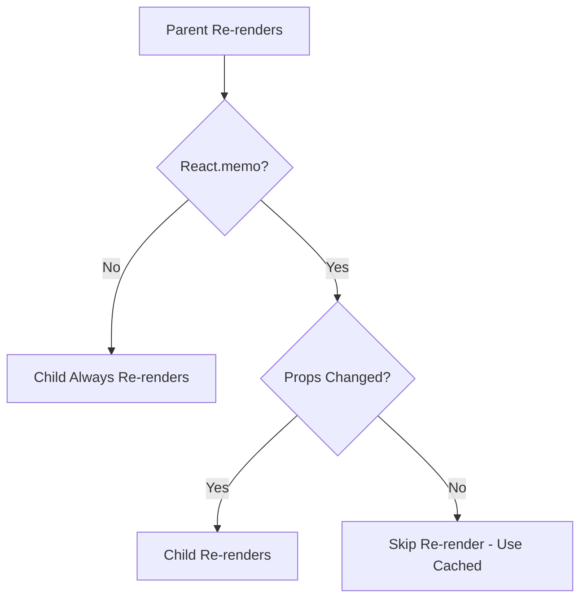
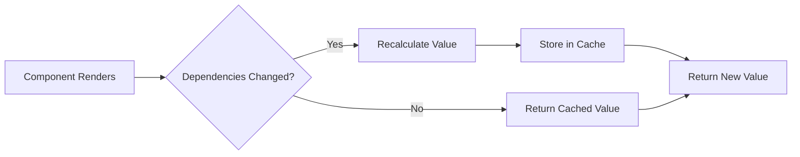

# React Memoization: memo, useMemo, and useCallback

## Table of Contents
- [Introduction: Performance Optimization with memo, useMemo, and useCallback](#introduction-performance-optimization-with-memo-usememo-and-usecallback)
- [`React.memo` for Component Memoization](#reactmemo-for-component-memoization)
- [`useMemo` for Expensive Calculations](#usememo-for-expensive-calculations)
- [`useCallback` for Stable Function References](#usecallback-for-stable-function-references)
- [Using These Hooks Judiciously](#using-these-hooks-judiciously)
- [Best Practices and Common Pitfalls](#best-practices-and-common-pitfalls)
- [Advanced Scenarios](#advanced-scenarios)
- [Conclusion](#conclusion)

## Notes:
- UPDs: [react.dev "use-memo"](https://react.dev/reference/react-compiler/directives/use-memo)
- UPDs: [react.dev "preserve-manual-memoization"](https://react.dev/reference/eslint-plugin-react-hooks/lints/preserve-manual-memoization)
- Check [state Optimization Guide Article](/articles/state-optimization-guide/).
- It can use a lot of resources. It's not needed if input values change often.
- Check article about [new babel-plugin-react-compiler improvements](/articles/drop-react-manual-memoization/).

## Introduction: Performance Optimization with memo, useMemo, and useCallback
React's performance optimization features align perfectly with the principle of "Make It Easy to Change, Not Just Fast." These tools—`React.memo`, `useMemo`, and `useCallback`—help you optimize rendering performance strategically, without sacrificing code clarity and maintainability. Understanding when and how to use them is key to building high-performing and scalable React applications.

### React.memo for Component Memoization

React.memo prevents unnecessary re-renders by memoizing components, similar to how Pure Components work in class-based React:




```jsx
// Before: Component re-renders on every parent render
function ProductItem({ product, onAddToCart }) {
  console.log(`Rendering ProductItem: ${product.name}`);
  
  return (
    <div className="product-item">
      
      <h3>{product.name}</h3>
      <p>${product.price}</p>
      <button onClick={() => onAddToCart(product.id)}>
        Add to Cart
      </button>
    </div>
  );
}

// After: Component only re-renders when props change
const MemoizedProductItem = React.memo(function ProductItem({ product, onAddToCart }) {
  console.log(`Rendering ProductItem: ${product.name}`);
  
  return (
    <div className="product-item">
      
      <h3>{product.name}</h3>
      <p>${product.price}</p>
      <button onClick={() => onAddToCart(product.id)}>
        Add to Cart
      </button>
    </div>
  );
});

// For more complex comparison logic, use a custom comparator
const CustomComparedProductItem = React.memo(
  function ProductItem({ product, onAddToCart }) {
    // Component implementation
  },
  (prevProps, nextProps) => {
    // Return true if props are equal (skip re-render)
    // Return false if props are different (do re-render)
    return prevProps.product.id === nextProps.product.id &&
           prevProps.onAddToCart === nextProps.onAddToCart;
  }
);
```

### useMemo for Expensive Calculations

Use `useMemo` to cache the result of expensive calculations between renders:




```jsx
// Before: Expensive calculation runs on every render
function ProductFilters({ products, onFilterChange }) {
  // This might be expensive with many products
  const categories = products.reduce((acc, product) => {
    if (!acc.includes(product.category)) {
      acc.push(product.category);
    }
    return acc;
  }, []);
  
  return (
    <div className="filters">
      <h4>Categories</h4>
      {categories.map(category => (
        <label key={category}>
          <input
            type="checkbox"
            onChange={() => onFilterChange('category', category)}
          />
          {category}
        </label>
      ))}
    </div>
  );
}

// After: Calculation runs only when products change
function ProductFilters({ products, onFilterChange }) {
  // Memoized calculation
  const categories = useMemo(() => {
    console.log('Computing categories');
    return products.reduce((acc, product) => {
      if (!acc.includes(product.category)) {
        acc.push(product.category);
      }
      return acc;
    }, []);
  }, [products]); // Dependency array
  
  return (
    <div className="filters">
      <h4>Categories</h4>
      {categories.map(category => (
        <label key={category}>
          <input
            type="checkbox"
            onChange={() => onFilterChange('category', category)}
          />
          {category}
        </label>
      ))}
    </div>
  );
}
```

### useCallback for Stable Function References

`useCallback` creates stable function references, preventing downstream components from re-rendering unnecessarily:

```jsx
// Before: New function created on every render
function ProductList({ products }) {
  const [cart, setCart] = useState([]);
  
  // This function is recreated on every render
  const handleAddToCart = (productId) => {
    setCart(currentCart => [...currentCart, productId]);
  };
  
  return (
    <div className="product-list">
      {products.map(product => (
        <MemoizedProductItem 
          key={product.id}
          product={product}
          onAddToCart={handleAddToCart} // New reference on every render
        />
      ))}
    </div>
  );
}

// After: Stable function reference
function ProductList({ products }) {
  const [cart, setCart] = useState([]);
  
  // Stable function reference that only changes when dependencies change
  const handleAddToCart = useCallback((productId) => {
    setCart(currentCart => [...currentCart, productId]);
  }, []); // Empty dependency array means this function never changes
  
  return (
    <div className="product-list">
      {products.map(product => (
        <MemoizedProductItem 
          key={product.id}
          product={product}
          onAddToCart={handleAddToCart} // Same reference between renders
        />
      ))}
    </div>
  );
}
```

### Using These Hooks Judiciously

While these hooks are powerful, they should be used strategically:

```jsx
// Anti-pattern: Premature optimization
function SimpleComponent({ value }) {
  // Unnecessary for simple values or operations
  const doubledValue = useMemo(() => value * 2, [value]);
  
  // Unnecessary for simple functions
  const handleClick = useCallback(() => {
    console.log('Clicked');
  }, []);
  
  return <div onClick={handleClick}>{doubledValue}</div>;
}

// Better approach: Use optimization where it matters
function ComplexComponent({ products, filters, onSave }) {
  // Worth memoizing: expensive filtering operation
  const filteredProducts = useMemo(() => {
    return products.filter(product => {
      // Complex filtering logic
      return filters.categories.includes(product.category) &&
             product.price >= filters.minPrice &&
             product.price <= filters.maxPrice;
    });
  }, [products, filters.categories, filters.minPrice, filters.maxPrice]);
  
  // Worth stabilizing: passed to optimized child components
  const handleSave = useCallback((id, data) => {
    onSave(id, { ...data, timestamp: Date.now() });
  }, [onSave]);
  
  return (
    <div>
      {filteredProducts.map(product => (
        <MemoizedProductEditor
          key={product.id}
          product={product}
          onSave={handleSave}
        />
      ))}
    </div>
  );
}
```

These optimization hooks represent a perfect example of balancing performance and maintainability. They allow you to optimize specific parts of your application without compromising its overall design or readability. Remember that premature optimization is a pitfall—use these hooks when profiling indicates a performance issue, not by default everywhere.

These real-world examples from successful React applications demonstrate that good design is not about blindly following rules, but about applying principles pragmatically to solve specific problems. The key is finding the right balance between simplicity and abstraction, always prioritizing code that is easy to understand, test, and maintain.

### Best Practices and Common Pitfalls

Effectively using React's memoization hooks requires understanding some best practices and common pitfalls:

1.  **Profile First, Optimize Later**: Don't sprinkle `useMemo`, `useCallback`, and `React.memo` everywhere. Use React Developer Tools Profiler or other performance tools to identify components that re-render often and cause performance issues. Focus your optimization efforts there.
2.  **Understand Dependency Arrays**:
    *   `useMemo` and `useCallback` rely on their dependency arrays. If you omit a dependency, your memoized value or callback might become stale, leading to bugs.
    *   If you pass an empty array (`[]`), the memoized value/callback is created once and never updated, which is often what you want for stable functions but can be incorrect for values that depend on props or state.
    *   Ensure all variables from the outer scope that are used inside the memoized function or calculation are included in the dependency array. ESLint plugins like `eslint-plugin-react-hooks` can help enforce this (`exhaustive-deps` rule).
3.  **The Cost of Memoization**: These hooks are not free. React needs to store the memoized value and compare dependencies on each render. For very simple components or calculations, the overhead of memoization might outweigh the benefits.
4.  **Over-memoization Anti-pattern**: Applying memoization to every single component and function can make the codebase harder to read and maintain, and might not yield noticeable performance improvements if those parts were not bottlenecks.
5.  **Memoizing Props for Child Components**:
    *   When passing objects or arrays as props to a memoized child component, ensure these props are stable. If you create a new object/array literal on each parent render (e.g., `<Child data={{ foo: 'bar' }} />`), `React.memo`'s default shallow comparison will see it as a new prop, and the child will re-render.
    *   Use `useMemo` in the parent to memoize object/array props, or `useCallback` for function props passed to memoized children.
    ```jsx
    function Parent({ A, B }) {
      // BAD: new object on every render, breaks Child's memoization
      // const data = { A, B }; 

      // GOOD: object is memoized and stable as long as A & B don't change
      const data = useMemo(() => ({ A, B }), [A, B]);
      
      return <MemoizedChild data={data} />;
    }
    ```
6.  **`React.memo` with Custom Comparison**: If shallow comparison isn't sufficient for `React.memo` (e.g., props are complex objects and you need a deep comparison), you can provide a custom comparison function as the second argument. Use this cautiously as deep comparisons can be expensive.

### Advanced Scenarios

Beyond basic usage, these hooks can be applied in more complex situations:

1.  **`useMemo` for Complex Object/Array Transformations**: When you need to derive a complex data structure from props or state and this derivation is costly (e.g., transforming a large list, creating a lookup table), `useMemo` is invaluable.
    ```jsx
    function UserDashboard({ rawUserData }) {
      const processedData = useMemo(() => {
        console.log('Processing user data...');
        // Imagine complex transformations, aggregations, sorting here
        return rawUserData.map(user => ({ ...user, isActive: user.logins > 0 }))
                          .sort((a, b) => b.logins - a.logins);
      }, [rawUserData]);

      return <UserTable data={processedData} />;
    }
    ```
2.  **`useCallback` with Event Handlers and Custom Hooks**:
    *   When creating custom hooks that return functions, wrap those functions in `useCallback` to ensure consumers of the hook receive stable function references. This prevents unnecessary re-renders in components using the hook.
    *   For event handlers that depend on props or state but are passed to many children or used in `useEffect` dependencies, `useCallback` is essential.
    ```jsx
    function useDebouncedEffect(callback, delay, deps) {
      const debouncedCallback = useCallback(
        (...args) => {
          // Simplified debounce logic
          const handler = setTimeout(() => {
            callback(...args);
          }, delay);
          return () => clearTimeout(handler);
        },
        [callback, delay] // 'callback' itself should be stable or listed as a dep
      );
      // ...
    }
    ```
3.  **Interaction with React Context**:
    *   When a component consumes a context, it will re-render whenever the context value changes. If the context value is an object or array created inline in the Provider, it will be a new reference on every render, causing all consumers to re-render.
    *   Memoize the context value using `useMemo` in the Provider component to prevent unnecessary re-renders of consumer components.
    ```jsx
    const MyContext = React.createContext();

    function MyContextProvider({ children, userId }) {
      const [userData, setUserData] = useState(null);

      // Fetch user data based on userId...

      // GOOD: Memoize the context value
      const contextValue = useMemo(() => ({
        user: userData,
        updateUser: (newData) => setUserData(prev => ({ ...prev, ...newData })),
      }), [userData]); // updateUser can be further memoized with useCallback if complex

      return <MyContext.Provider value={contextValue}>{children}</MyContext.Provider>;
    }
    ```

### Conclusion

`React.memo`, `useMemo`, and `useCallback` are powerful tools in a React developer's arsenal for fine-tuning application performance. They allow for surgical optimizations by preventing unnecessary re-renders and re-computations, directly impacting the user experience, especially in complex applications.

However, their power comes with the responsibility of judicious use. The core principle remains: **profile first**. Identify actual performance bottlenecks before reaching for these hooks. Premature or indiscriminate optimization can lead to code that is harder to understand and maintain, potentially without yielding significant performance benefits.

By understanding their purpose, how their dependency arrays work, and common pitfalls like over-memoization or unstable props, you can leverage these hooks effectively. Strive for a balance where optimizations are applied thoughtfully to critical paths, ensuring your React applications are not only fast but also remain clean, maintainable, and easy to evolve. These real-world examples and best practices demonstrate that good design is not about blindly following rules, but about applying principles pragmatically to solve specific problems, always prioritizing code that is easy to understand, test, and scale.
These real-world examples from successful React applications demonstrate that good design is not about blindly following rules, but about applying principles pragmatically to solve specific problems. The key is finding the right balance between simplicity and abstraction, always prioritizing code that is easy to understand, test, and maintain.
