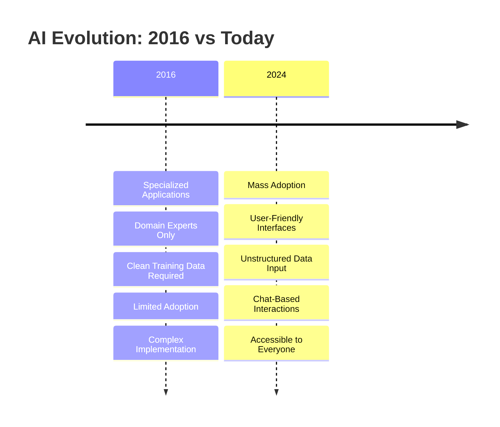

# Production AI In 2016 Year

The first time I worked on a projects that using machine learning (AI) was in 2016. Back then, the technology hadn't seen the mass adoption it has nowadays, thanks to LLMs. It was Bioinformatics projects, and a one FinTech.

That time it was on-site and I saw how colleagues discussed perceptron and even how simulated annealing can be applied to the training. We got together and talked to current bioinformaticians to figure out how to make our apps better, the apps were exclusively for domain experts.

The training data had to be extremely clean. In some implementations, this is still true for most of the model training process (work of data engineers and etc)

In past, we had ways to input unorganized data (not for training), but it wasn't like today's chat interfaces where you can attach or even search (crawl) any kind of unstructured data and get high-quality results: well-structured (in various formats, tailored to the user) and easy for everyone to understand.

It's ironic that, despite those projects yielding solid results, almost no one took the AI approach seriously, even in niche applications. Now, the tech is used everywhere, sometimes even where it's not really needed — just because of user-friendly chat interfaces and cheaper computation. Back then, it was the realm of futurists and dreamers. Now it's serious business. In my view the key driver of real progress wasn't just optimization or lower computing costs but the convenience that brought AI to the masses. LLMs changed the game.
