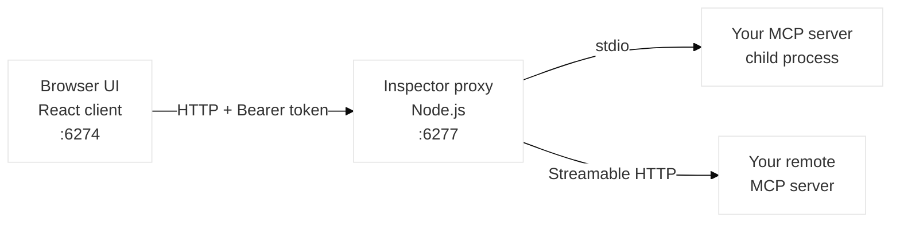
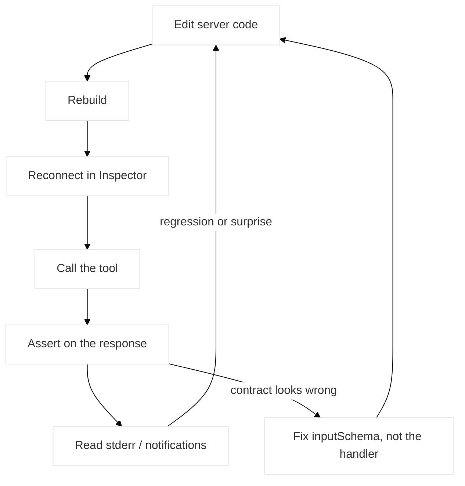

# MCP Inspector: A Complete Debugging Workflow for MCP Servers

Your MCP server starts. The tool list loads. You call the tool by hand and it returns exactly what you expect. Then you wire it into an agent and the agent calls it wrong — wrong types, missing arguments, a date string where you wanted an ISO timestamp.

Nothing is broken. The server works. What's broken is the **contract** — the `inputSchema` your server publishes, which is the only documentation the model ever reads.

The MCP Inspector is where you inspect that contract. It's the official interactive tool from the Model Context Protocol team, and the closest thing MCP has to Postman. But most guides treat it as a UI tour: here are the tabs, click them. This article treats it as a **workflow** — a loop you run dozens of times a day, with the sharp edges called out, including the ones I filed upstream myself.

## Table of Contents
- [What the MCP Inspector Actually Is](#what-the-mcp-inspector-actually-is)
- [The Debugging Loop](#the-debugging-loop)
- [The stderr Rule](#the-stderr-rule)
- [Reading the Schema Contract Your Agent Sees](#reading-the-schema-contract-your-agent-sees)
- [What the Inspector UI Hides: Three Issues I Filed Upstream](#what-the-inspector-ui-hides-three-issues-i-filed-upstream)
- [CLI Mode: The Inspector Without a Browser](#cli-mode-the-inspector-without-a-browser)
- [Configuration That Changes What You See](#configuration-that-changes-what-you-see)
- [Debugging in an Isolated Sandbox](#debugging-in-an-isolated-sandbox)
- [Security Hygiene: The Inspector Is an Attack Surface](#security-hygiene-the-inspector-is-an-attack-surface)
- [What Changes with the 2026-07-28 Spec](#what-changes-with-the-2026-07-28-spec)
- [Edge Cases Worth Scripting](#edge-cases-worth-scripting)
- [Contributing Back to the Inspector](#contributing-back-to-the-inspector)
- [Frequently Asked Questions (FAQ)](#frequently-asked-questions-faq)
- [Conclusion](#conclusion)
- [Resources and Links](#resources-and-links)

## What the MCP Inspector Actually Is

The [MCP Inspector](https://github.com/modelcontextprotocol/inspector) lives in the [modelcontextprotocol GitHub organization](https://github.com/modelcontextprotocol) alongside the specification itself, the official SDKs, the registry, and the conformance suite. As of July 2026 it has passed 10,000 stars with roughly 1.4k forks — and, more usefully as a signal, over 170 open issues and 130 open pull requests. It is a fast-moving tool, not a finished one. That matters for how you read its output.

It also matters who steers it. In December 2025 Anthropic donated MCP to the [Agentic AI Foundation](https://blog.modelcontextprotocol.io/posts/2025-12-09-mcp-joins-agentic-ai-foundation/), a directed fund under the Linux Foundation co-founded with Block and OpenAI. The protocol and its tooling are now under neutral stewardship with Technical Steering Committee oversight, which is the practical reason a well-argued issue from outside any vendor can move the roadmap.

It is not a single process. It is two:



The React client in your browser never talks to your server directly. It talks to a local Node.js **proxy** — the repo calls them MCPI and MCPP — and the proxy speaks MCP over stdio, SSE, or Streamable HTTP. The two default ports are a mnemonic: `6274` is `MCPI` on a phone keypad, `6277` is `MCPP`.

Worth being precise about the word "proxy," because it misleads people: it is **not** a network proxy intercepting traffic. It is simultaneously an MCP client (connecting to your server) and an HTTP server (serving the web UI), which is what makes browser-based interaction with a stdio server possible at all.

Keep that architecture in your head. It explains the token in your URL bar, it explains why a stdio server's stderr shows up in a browser tab, and it explains the CVE we'll get to later.

Running it requires no install. It wants **Node.js ^22.7.5** — stricter than the SDK's Node 20 floor, and a common cause of a confusing first failure:

```bash
# UI only — configure the connection from the browser
npx @modelcontextprotocol/inspector

# a local TypeScript server you're developing
npx @modelcontextprotocol/inspector node build/index.js

# a published npm package
npx -y @modelcontextprotocol/inspector npx @modelcontextprotocol/server-filesystem ~/Desktop

# a Python server via uv
npx @modelcontextprotocol/inspector uv --directory path/to/server run package-name
```

Arguments pass straight through to your server; environment variables need `-e`. When your server takes a flag the Inspector also recognizes, `--` separates them:

```bash
npx @modelcontextprotocol/inspector -e API_KEY=$API_KEY -e DEBUG=true node build/index.js
npx @modelcontextprotocol/inspector -e API_KEY=$API_KEY -- node build/index.js -e server-flag
```

There's also an official container image, which matters more than convenience — see [the sandbox section](#debugging-in-an-isolated-sandbox):

```bash
docker run --rm \
  -p 127.0.0.1:6274:6274 \
  -p 127.0.0.1:6277:6277 \
  -e HOST=0.0.0.0 \
  -e MCP_AUTO_OPEN_ENABLED=false \
  ghcr.io/modelcontextprotocol/inspector:latest
```

The proxy generates a random session token at startup, prints it, and opens your browser with it pre-filled:

```
🔑 Session token: {TOKEN}

🔗 Open inspector with token pre-filled:
   http://localhost:6274/?MCP_PROXY_AUTH_TOKEN={TOKEN}
```

If you already have a tab open, paste the token under **Configuration → Proxy Session Token** instead; it persists in local storage. Custom ports, when 6274 is already taken:

```bash
CLIENT_PORT=8080 SERVER_PORT=9000 npx @modelcontextprotocol/inspector node build/index.js
```

## The Debugging Loop

The Inspector's value is not in any single pane. It's in how fast you can go around this loop:



Two things about this loop are worth internalizing.

**Reconnect is not optional.** The proxy spawned your server as a child process at connect time. A rebuild does not restart it. If you edit, rebuild, and immediately re-call the tool, you are testing the old binary. Every "my fix didn't apply" bug report on this tool is that mistake.

**The branch on the right is the one that matters.** When a response surprises you, the reflex is to open the handler. Often the handler is fine and the *schema* is wrong — it permitted an input shape you never intended, or it failed to describe the shape you did. Fixing the handler makes the symptom go away for you and leaves it in place for the agent.

## The stderr Rule

This is the single most common way to break a working MCP server, so it gets its own section.

On the stdio transport, **`stdout` is the JSON-RPC channel**. Your server and the Inspector proxy are exchanging framed JSON-RPC messages over that pipe. Anything else you write there is injected straight into the message stream and corrupts the parser.

```javascript
// This breaks your server. Not "logs noisily" — breaks.
console.log("tool called with", args);

// This is your log channel. Inspector renders it in the server output pane.
console.error("tool called with", args);
```

The failure mode is deliberately confusing: you get JSON parse errors that appear to come from the protocol layer, pointing at fragments of your own log lines. If you inherited a server that "randomly disconnects," grep for `console.log` first. On Node, remember that anything a dependency logs to stdout counts too — a chatty ORM or HTTP client can poison the stream without a single `console.log` in your code.

If you want to understand exactly how these two streams interleave under load, the mechanics are the same ones described in [How the event loop, async, and web workers actually interact](/articles/async-event-loop-web-workers/).

## Reading the Schema Contract Your Agent Sees

Here is the shift in perspective that makes the Inspector genuinely useful rather than merely convenient.

When you fill in the tool form and hit call, you are not testing your tool. You are testing *your own understanding* of your tool. The agent has no form. It has the `inputSchema` from `tools/list` and nothing else — no source code, no README, no you.

So the question to bring to the Inspector is not "does the tool work?" It's: **could a competent stranger call this correctly from the schema alone?** (Writing schemas that survive that test is most of what [building an MCP server in TypeScript](/articles/mcp-server-typescript/) is actually about.)

That means reading the raw JSON, not just the rendered form:

```json
{
  "name": "search_orders",
  "description": "Search orders by customer and date range.",
  "inputSchema": {
    "type": "object",
    "properties": {
      "customerId": {
        "type": "string",
        "description": "Customer UUID, not the display name."
      },
      "since": {
        "type": "string",
        "format": "date-time",
        "description": "ISO 8601 timestamp. Results are inclusive of this instant."
      },
      "limit": {
        "type": "integer",
        "minimum": 1,
        "maximum": 100,
        "default": 20,
        "description": "Max results per page."
      }
    },
    "required": ["customerId"]
  }
}
```

Every constraint in there is a sentence you don't have to hope the model infers. `format: "date-time"` prevents `"last Tuesday"`. `maximum: 100` prevents a request for fifty thousand rows. The `description` on `customerId` prevents the single most common class of agent error, which is passing the human-readable thing instead of the identifier.

One behavior worth knowing before you interpret what the form sends, because it looks like a bug until you know the rule. The Inspector's documented input-handling guidelines are:

- **Optional fields with empty values are omitted** — unless the schema declares an explicit `default` that matches the current value, in which case it's sent.
- **Required fields are always included**, even when empty, so your server gets to produce its own validation error rather than the UI silently blocking the call.
- **Deep validation is deferred to the server.** The client checks field presence; your schema is expected to do the real work.

That last one is the load-bearing one. If you were relying on the Inspector to catch a malformed argument, it won't, and neither will an agent. Whatever your schema doesn't reject, your handler receives.

## What the Inspector UI Hides: Three Issues I Filed Upstream

Reading the schema through the Inspector's form is harder than it should be, and I ran into the same friction often enough to write it up. Three enhancement requests, filed against **MCP Inspector v0.21.2** in mid-2026, all pointing at the same underlying gap: the UI renders the schema as a *form*, and a form is lossy. (These sit alongside my other upstream work in [contributions to MCP, MDN, and web.dev](/articles/contributions-to-major-web-dev-repos/).)

### The form doesn't show types or validation

**[Issue #1388 — Show expected format from MCP tool inputSchema](https://github.com/modelcontextprotocol/inspector/issues/1388)**

The tool form renders one field per property, but it doesn't surface the property's data type or its validation rules. You can see that `limit` exists. You cannot see that it's an `integer` bounded to `1..100`.

That's a problem for debugging, because those constraints are exactly what you're trying to evaluate. `inputSchema` is [the main contract an LLM uses to understand how to call a tool](https://modelcontextprotocol.io/specification/draft/server/tools#protocol-messages) — if the debugging tool doesn't display the contract, you can't review the contract where you're doing the work. You end up reading raw JSON in a side panel to answer a question the form should have answered.

### Descriptions vanish the moment a field has a value

**[Issue #1401 — Keep MCP tool property descriptions visible for filled inputs](https://github.com/modelcontextprotocol/inspector/issues/1401)**

Property descriptions are rendered as input **placeholders**. Placeholders disappear when a field has content — which means the description is hidden precisely when a property has a `default` value, or as soon as you type anything.

To re-read what an argument is for, you have to clear the field. Then you've lost your test value. Then you retype it and lose the description again.

It's a small thing that compounds, because per-property descriptions are how you explain arguments to an agent. They're the part of the schema you iterate on most, and they're the part the UI shows least. (This one overlaps with [#1389](https://github.com/modelcontextprotocol/inspector/issues/1389), filed independently — a decent sign it's not just me.)

### The workaround, until both land

Don't debug schemas through the form alone. Pull the raw `tools/list` result and read it as JSON — either in the Inspector's raw message view, or by skipping the browser entirely:

```bash
npx @modelcontextprotocol/inspector --cli node build/index.js \
  --method tools/list \
  | jq '.tools[] | {name, inputSchema}'
```

That's the same Inspector, running as a CLI, printing the exact contract your agent will read. No form, no placeholders, nothing hidden.

Then review each property against a short checklist: does it have a `type`, a `description` that explains *purpose* rather than restating the name, a `format` or bounds where the domain has them, and is it in `required` if the tool genuinely can't run without it?

## CLI Mode: The Inspector Without a Browser

The Inspector is two tools sharing a name, and the second one is underused. `--cli` drops the web UI and talks to your server from the command line, which makes it scriptable — and is the piece that turns interactive poking into a repeatable check.

```bash
# List what the server publishes
npx @modelcontextprotocol/inspector --cli node build/index.js --method tools/list
npx @modelcontextprotocol/inspector --cli node build/index.js --method resources/list
npx @modelcontextprotocol/inspector --cli node build/index.js --method prompts/list

# Call a tool with scalar arguments
npx @modelcontextprotocol/inspector --cli node build/index.js \
  --method tools/call --tool-name search_orders \
  --tool-arg customerId=8f14e45f --tool-arg limit=5

# Structured arguments go in as JSON
npx @modelcontextprotocol/inspector --cli node build/index.js \
  --method tools/call --tool-name report \
  --tool-arg 'options={"format": "json", "max_tokens": 100}'
```

Remote servers work the same way. SSE is the default transport; add `--transport http` for Streamable HTTP, and `--header` for auth:

```bash
npx @modelcontextprotocol/inspector --cli https://my-server.example.com \
  --transport http --method tools/list \
  --header "X-API-Key: $API_KEY"
```

The two modes are genuinely for different jobs:

| Job | UI mode | CLI mode |
|-----|---------|----------|
| Exploring a server you didn't write | ✅ hierarchical browsing, JSON visualization | — |
| Reading the real `inputSchema` | ⚠️ lossy form (see #1388, #1401) | ✅ raw JSON |
| Reproducing one specific call | ⚠️ retype it every time | ✅ shell history |
| Watching protocol traffic and notifications | ✅ request history, live notifications | — |
| CI, pre-commit, regression checks | ❌ | ✅ |
| Feeding results back to a coding assistant | ❌ | ✅ machine-readable output |

That last row is the one the repo highlights, and it's worth taking seriously: CLI mode closes a loop where an AI coding assistant edits your server, runs a `tools/call`, reads the JSON, and iterates — without a human clicking a form each time.

Use both. UI mode when you're forming a hypothesis, CLI mode once you know what you want to assert.

## Configuration That Changes What You See

A few settings are worth knowing about because their defaults will eventually make a correct server look broken.

| Setting | Default | Why you'd change it |
|---------|---------|--------------------|
| `MCP_SERVER_REQUEST_TIMEOUT` | 300000 ms | Client-side cancel. Too low and slow tools look broken. |
| `MCP_REQUEST_TIMEOUT_RESET_ON_PROGRESS` | true | Progress notifications restart the clock |
| `MCP_REQUEST_MAX_TOTAL_TIMEOUT` | 60000 ms | The hard ceiling that survives progress resets |
| `MCP_PROXY_FULL_ADDRESS` | `""` | Proxy on a non-default host or port |
| `MCP_AUTO_OPEN_ENABLED` | true | Stop it launching a browser — env var only |

The timeout note deserves emphasis because it produces a specific wrong conclusion. **Inspector timeouts are independent of your server's.** Whichever fires first is the one you see, so a tool with a ten-minute server timeout still dies at thirty seconds if that's what the Inspector is set to — and it'll look like your server hung. Anything involving human interaction, like elicitation, needs these raised deliberately.

Note also that `MCP_REQUEST_MAX_TOTAL_TIMEOUT` defaults *lower* than `MCP_SERVER_REQUEST_TIMEOUT`. With progress notifications flowing, the total ceiling is what actually stops you.

**Config files** beat retyping connection details. Point at a file and name a server:

```bash
npx @modelcontextprotocol/inspector --config ./mcp.json --server my-server
```

```json
{
  "mcpServers": {
    "my-server": {
      "type": "stdio",
      "command": "node",
      "args": ["build/index.js", "--debug"],
      "env": { "API_KEY": "your-api-key" }
    },
    "my-http-server": {
      "type": "streamable-http",
      "url": "http://localhost:3000/mcp"
    }
  }
}
```

Transport is detected from `type` (`stdio`, `sse`, `streamable-http`). You can drop `--server` entirely if the file has exactly one server, or one named `default-server`.

You don't have to hand-write that file, either. The UI's **Server Entry** and **Servers File** buttons copy a single entry or a whole `mcp.json` to your clipboard once you've got a connection working — which is also the fastest way to move a configuration you debugged here into Claude Code, Cursor, or CLI mode.

**Query params** set the initial state, which makes a working Inspector link something you can paste into a bug report or a README:

```
http://localhost:6274/?transport=streamable-http&serverUrl=http://localhost:3000/mcp
http://localhost:6274/?MCP_SERVER_REQUEST_TIMEOUT=60000
```

Query params take precedence over whatever is in local storage — handy when a stale saved setting is the thing confusing you.

## Debugging in an Isolated Sandbox

**[Issue #1400 — Local development sandbox](https://github.com/modelcontextprotocol/inspector/issues/1400)**

The third issue is about the Inspector itself rather than its UI. Developing *on* the Inspector — or debugging an untrusted server *with* it — means running a Node proxy that spawns arbitrary child processes with your user's privileges, on your machine, with your SSH keys and cloud credentials one `~` away.

The proposal is a dedicated `compose.local.yaml` with one-way host-to-container sync, and the emphasis is worth restating: the point is **not** convenience. Plenty of projects add Docker Compose to shorten a setup README. The point is an isolated, bounded environment where the thing you're debugging can't reach the rest of your filesystem.

The shape is straightforward with Compose watch mode:

```yaml
services:
  inspector:
    build:
      context: .
      dockerfile: Dockerfile.local
    command: npm run dev
    ports:
      - "6274:6274"
      - "6277:6277"
    init: true
    develop:
      watch:
        - action: sync
          path: ./client/src
          target: /app/client/src
        - action: sync+exec
          path: ./package.json
          target: /app/package.json
          exec:
            command: npm i
```

One-way sync is the deliberate constraint. The container sees your edits; the container cannot write back into your working tree. Combined with `init: true` for correct signal handling of spawned children, you get a sandbox you can throw away.

### What exists today, and what's still missing

Two things partially cover this ground already, and it's worth being precise about which gap each one fills.

The **published container image** (`ghcr.io/modelcontextprotocol/inspector:latest`) isolates the Inspector at *runtime*. If your goal is "inspect this third-party server without giving it my filesystem," that's the answer, and note how the documented invocation binds ports to `127.0.0.1` explicitly rather than to every interface.

The repo's **development scripts** cover working *on* the Inspector: `npm run dev`, `npm run dev:windows` on Windows, and `npm run dev:sdk` for co-developing against a local checkout of the TypeScript SDK. Useful, but they run on your host.

The gap between them is the issue: an isolated environment for Inspector development itself, where a mistake in code you're actively editing can't reach `~/.ssh`. The container gives isolation without the edit loop; the dev scripts give the edit loop without isolation. Compose watch mode is how you get both.

This pattern generalizes past the Inspector. Any time you `npx` a third-party MCP server to "just have a look," you are executing unreviewed code with full user privileges — the same supply-chain argument as [LavaMoat and JavaScript supply chain attacks](/articles/LavaMoat-against-JS-supply-chain-attacks/), now with the install step promoted to documented practice.

## Security Hygiene: The Inspector Is an Attack Surface

That concern isn't hypothetical, and the Inspector has the CVE to prove it.

**[CVE-2025-49596](https://www.oligo.security/blog/critical-rce-vulnerability-in-anthropic-mcp-inspector-cve-2025-49596)** — CVSS 9.4, reported by Oligo Security, fixed in Inspector **0.14.1** on June 13, 2025. Versions below that ran the proxy with no authentication between the browser client and the proxy, which meant unauthenticated requests could launch MCP commands over stdio.

Recall the architecture. The proxy listens on localhost and spawns child processes on request. Without auth, any local process could drive it — and chained with DNS rebinding, so could a web page. An attacker's domain resolves to a public IP, the browser grants it trust, the domain re-resolves to `127.0.0.1`, and the page's scripts now reach your local proxy while the browser still considers the origin legitimate. Arbitrary code execution on a developer machine, delivered by browsing a website while your debugger was open.

The fix put a session token on the proxy and added `Host` and `Origin` validation, which is why your Inspector URL carries `MCP_PROXY_AUTH_TOKEN`.

Three defaults now do the work, and all three are overridable — which is the part to pay attention to:

| Control | Default | The override, and its cost |
|---------|---------|--------------------------|
| Proxy auth token | Required, randomly generated per start | `DANGEROUSLY_OMIT_AUTH=true` disables it |
| Bind address | `localhost` only, both services | `HOST=0.0.0.0` exposes process-spawning to the network |
| Origin validation | Client origin only (respects `CLIENT_PORT`) | `ALLOWED_ORIGINS=http://localhost:6274,…` widens it |

The repo's own warning about the first one is unusually blunt, and it is not overstated:

> Disabling authentication with `DANGEROUSLY_OMIT_AUTH` is incredibly dangerous! Disabling auth leaves your machine open to attack not just when exposed to the public internet, but also **via your web browser**.

That's the CVE, restated as a configuration flag. The attack doesn't need you to expose a port — a malicious page or even a malicious ad in a tab you already have open is enough. If a script needs a stable token, set one rather than removing the check:

```bash
MCP_PROXY_AUTH_TOKEN=$(openssl rand -hex 32) npm start
```

Four habits follow:

- **Stay current.** `npx @modelcontextprotocol/inspector` fetches the latest by default; pinned setups and vendored copies are where stale versions hide.
- **Never set `DANGEROUSLY_OMIT_AUTH`.** Set `MCP_PROXY_AUTH_TOKEN` instead. It's the control that closed a 9.4.
- **Leave the binding alone.** `HOST=0.0.0.0` on a laptop on a conference network hands a process spawner to the network.
- **Treat "I'll just inspect this server quickly" as running the server.** Because it is.

One more, on the transport side: the Inspector supports bearer token auth for remote connections, entered in the UI and sent in the `Authorization` header, with the header name overridable in the sidebar. Convenient — and a reminder that a token you paste in there is now sitting in a browser tab on a machine you just decided to trust.

## What Changes with the 2026-07-28 Spec

The `2026-07-28` specification is the largest revision since MCP launched, and several changes land directly on your debugging habits.

**The handshake is gone.** `initialize`/`initialized` are removed. Protocol version, client info, and capabilities now ride in `_meta` on every request, and `server/discover` returns server capabilities when a client wants them up front. Reading raw traffic in the Inspector, you'll no longer see a session being established — you'll see self-contained requests.

**Sessions are gone.** No `Mcp-Session-Id`. If your server relied on protocol-level session state across calls, that state now has to be explicit: mint a handle from a tool (`basket_id`, `browser_id`) and let the model pass it back as an ordinary argument. This is a debugging improvement in disguise — the state becomes visible in the Inspector instead of hiding in transport metadata.

**New headers to check.** Streamable HTTP now requires `Mcp-Method` on every request and `Mcp-Name` on requests naming a tool, resource, or prompt, so gateways can route without parsing bodies. Servers must reject requests where headers and body disagree, which makes "header/body mismatch" a new bug class to watch for.

**One error code moved.** A missing resource now returns the standard JSON-RPC `-32602` instead of MCP's custom `-32002`. If anything you own matches on the literal `-32002`, update it.

**Schemas got more expressive — and harder to read.** Tool `inputSchema` and `outputSchema` are lifted to full [JSON Schema 2020-12](https://json-schema.org/draft/2020-12), which brings `oneOf`, `anyOf`, `allOf`, conditionals, and `$ref`/`$defs`. Output schemas are unrestricted and `structuredContent` can be any JSON value.

That last change makes issue #1388 sharper rather than obsolete. A form that already omits `type` and validation for flat properties has a genuinely hard problem rendering a composed schema with `$defs` and conditional branches. Expect to read raw JSON for a while yet — and note that implementations must not auto-dereference external `$ref` URIs, so a schema pulling in remote references is a red flag, not a feature.

## Edge Cases Worth Scripting

Manual Inspector sessions test the happy path. These are the cases that break in front of a real agent, and each one is worth a repeatable script:

| Case | What you're checking |
|------|---------------------|
| Missing required argument | A clear protocol error, not a 500 or a silent `undefined` |
| Wrong type (`"5"` for an integer) | Validation rejects it before your handler runs |
| Out-of-bounds value | `minimum`/`maximum` are actually enforced |
| Missing prompt arguments | Prompt templates fail loudly |
| Concurrent tool calls | No cross-request state leaking between calls |
| Oversized response | Pagination or truncation, not a 30-second hang |
| Deeply nested schema input | Bounded validation depth and time |

CLI mode is what makes these repeatable instead of remembered. A shell script over `--cli` gets you most of the way:

```bash
#!/usr/bin/env bash
set -euo pipefail
INSPECT="npx @modelcontextprotocol/inspector --cli node build/index.js"

# The schema is the contract — fail the build if a tool loses its description
$INSPECT --method tools/list \
  | jq -e '.tools[] | select(.description == null) | halt_error(1)' \
  && echo "FAIL: tool with no description" && exit 1

# Wrong type must be rejected before the handler runs
$INSPECT --method tools/call --tool-name search_orders \
  --tool-arg customerId=8f14e45f --tool-arg limit=not-a-number \
  | jq -e '.isError == true'
```

Once each case has a known-good response, it belongs in CI rather than in your memory. The failure you want to catch is the one where a schema tweak quietly makes a previously-invalid input valid — and that one is invisible in a browser, because you'd have to remember to retest an input you'd already stopped worrying about.

## Contributing Back to the Inspector

The Inspector has 170+ open issues because it's used hard by people building real servers. If it does something surprising, that's usually a report worth filing — and the ratio of effort to impact is unusually good on a tool this central.

What makes an Inspector issue actionable is boring and specific:

1. **The problem, in one paragraph, mechanically.** "Descriptions are rendered as placeholders, so they're hidden when a field has a value." Not "descriptions are hard to see."
2. **Why it matters for MCP specifically.** Tie it to the protocol: this is the contract an agent reads.
3. **Reproduction steps**, with screenshots for UI behavior.
4. **The exact version.** `v0.21.2`, not "latest."
5. **Related issues**, if you found them. It signals you searched, and it helps maintainers batch the work.

All three issues above follow that template, which is not a coincidence — it's the format that gets read.

## Frequently Asked Questions (FAQ)

**Why does my MCP server disconnect with JSON parse errors?**
Almost always `console.log` on a stdio server. `stdout` is the JSON-RPC channel, so any plain-text logging you write there gets injected into the message stream and breaks the parser. Use `console.error` — the Inspector renders stderr in its server output pane. Check your dependencies too; a chatty library can poison stdout without any logging in your own code.

**Why don't my code changes show up in the Inspector?**
The proxy spawned your server as a child process when you connected, and a rebuild doesn't restart it. You have to reconnect after every rebuild. Edit, rebuild, reconnect, then test.

**Can I see a tool's data types and validation rules in the Inspector UI?**
Not currently. The form renders fields from `inputSchema` without surfacing types or validation constraints, which is [issue #1388](https://github.com/modelcontextprotocol/inspector/issues/1388). Until it lands, read the raw `tools/list` JSON — through the Inspector's raw message view, or with `--cli --method tools/list | jq`, which prints the contract exactly as an agent receives it.

**Is the MCP Inspector safe to run?**
On a current version, with its auth token intact, it's reasonable. Below 0.14.1 it is not: CVE-2025-49596 (CVSS 9.4) allowed remote code execution through an unauthenticated proxy, exploitable via DNS rebinding from a web page. Stay current, never set `DANGEROUSLY_OMIT_AUTH`, leave the localhost binding alone, and treat inspecting an untrusted server as running that server — ideally via the published container image.

**Can I use the MCP Inspector in CI or a script?**
Yes — that's what `--cli` is for. It drops the browser and prints JSON, so `--method tools/list` and `--method tools/call --tool-name X --tool-arg k=v` are pipeable into `jq` and assertable in a shell script. It also works against remote servers with `--transport http` and `--header`. The repo positions this as the loop to use with AI coding assistants, since the output is machine-readable.

**Why does the Inspector time out on a tool that works fine?**
Its timeouts are independent of your server's, and the shorter one wins. `MCP_SERVER_REQUEST_TIMEOUT` defaults to 300000 ms, but `MCP_REQUEST_MAX_TOTAL_TIMEOUT` defaults to 60000 ms and is the hard ceiling once progress notifications start resetting the per-request clock. Raise both for long-running work or anything involving elicitation, where a human is in the loop.

**Does the Inspector work with the 2026-07-28 stateless spec?**
The Inspector tracks the specification, so check its release notes against the revision you're targeting before trusting what you see. The practical difference in raw traffic is that there's no `initialize` handshake and no `Mcp-Session-Id` — just self-contained requests carrying their context in `_meta`, with `server/discover` for capabilities.

**Should I test MCP servers only through the Inspector?**
No, but you can automate more of it than most people do. UI mode is for interactive work — exploring, diagnosing, reading traffic. CLI mode covers scripted checks and CI. And for unit-test-speed coverage, both SDKs support in-process clients, so a test suite can drive a server directly with no subprocess and no port.

## Conclusion

The Inspector is a mirror, and what it reflects is the contract you're publishing to agents. Used as a form-filler, it tells you a tool works. Used properly — reading raw schemas, watching stderr, reconnecting religiously, scripting the edge cases — it tells you whether anything other than you could use that tool correctly.

Four habits carry most of the value: `console.error` instead of `console.log`, reconnect after every rebuild, review the raw `inputSchema` rather than the rendered form until [#1388](https://github.com/modelcontextprotocol/inspector/issues/1388) and [#1401](https://github.com/modelcontextprotocol/inspector/issues/1401) land, and move anything you've checked twice into a `--cli` script.

And when the tool gets in your way, file the issue. It's a 10k-star project with 170 open issues and a real backlog — the debugging surface for the entire MCP ecosystem is still being built, in public, by the people using it.

## Resources and Links

- [MCP Inspector repository](https://github.com/modelcontextprotocol/inspector)
- [MCP Inspector README](https://github.com/modelcontextprotocol/inspector/blob/main/README.md) — CLI mode, configuration table, security env vars, config-file format
- [modelcontextprotocol GitHub organization](https://github.com/modelcontextprotocol) — spec, SDKs, registry, conformance suite
- [MCP Inspector documentation](https://modelcontextprotocol.io/docs/tools/inspector)
- [MCP debugging guide](https://modelcontextprotocol.io/docs/tools/debugging)
- [The 2026-07-28 MCP specification release candidate](https://blog.modelcontextprotocol.io/posts/2026-07-28-release-candidate/)
- [Beta SDKs for 2026-07-28](https://blog.modelcontextprotocol.io/posts/sdk-betas-2026-07-28/)
- [CVE-2025-49596 disclosure (Oligo Security)](https://www.oligo.security/blog/critical-rce-vulnerability-in-anthropic-mcp-inspector-cve-2025-49596)

**My upstream issues referenced here:**

- [#1388 — Show expected format from MCP tool inputSchema](https://github.com/modelcontextprotocol/inspector/issues/1388)
- [#1400 — Local development sandbox](https://github.com/modelcontextprotocol/inspector/issues/1400)
- [#1401 — Keep MCP tool property descriptions visible for filled inputs](https://github.com/modelcontextprotocol/inspector/issues/1401)
