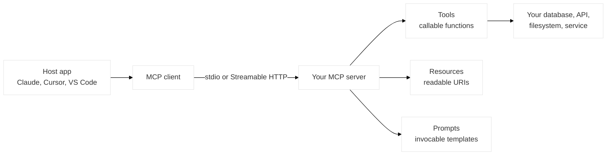
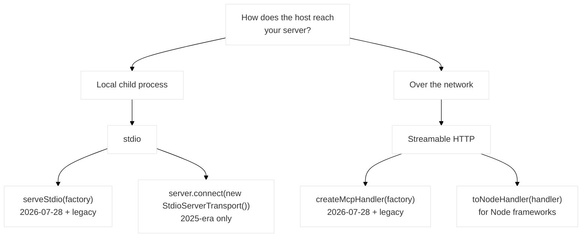

# Build an MCP Server in TypeScript: The 2026 Guide

Almost every MCP server tutorial you can find right now is describing a world that ended this month.

Two things moved at once. The TypeScript SDK split into new packages under a **v2** major, and the protocol itself shipped its largest revision since launch — `2026-07-28`, which removes the `initialize` handshake and the protocol-level session. A guide written against `@modelcontextprotocol/sdk` and `server.connect(new StdioServerTransport())` isn't wrong so much as it's describing the previous generation of both layers.

This guide builds a server against the current generation: v2 packages, Standard Schema tool contracts, and the serving entry points that speak `2026-07-28`. It's the long version — setup through deployment — and it assumes you write TypeScript but have never built an MCP server.

## Table of Contents
- [What You're Actually Building](#what-youre-actually-building)
- [Prerequisites and a Warning About Versions](#prerequisites-and-a-warning-about-versions)
- [Project Setup](#project-setup)
- [Your First Tool](#your-first-tool)
- [Structured Output](#structured-output)
- [Resources and Prompts: Choosing the Right Primitive](#resources-and-prompts-choosing-the-right-primitive)
- [Serving It: stdio](#serving-it-stdio)
- [Serving It: HTTP](#serving-it-http)
- [Verifying with the MCP Inspector](#verifying-with-the-mcp-inspector)
- [Testing Without a Socket](#testing-without-a-socket)
- [Deployment Checklist](#deployment-checklist)
- [Frequently Asked Questions (FAQ)](#frequently-asked-questions-faq)
- [Conclusion](#conclusion)
- [Resources and Links](#resources-and-links)

## What You're Actually Building

An MCP server is a program that publishes three kinds of thing to an AI host — Claude, ChatGPT, Cursor, VS Code, your own agent — over a standard protocol:

- **Tools** — functions the model can call. Side effects live here.
- **Resources** — data the host can read, addressed by URI. Read-only context.
- **Prompts** — parameterized templates a user can invoke deliberately.



The protocol is now stewarded by the [Agentic AI Foundation](https://blog.modelcontextprotocol.io/posts/2025-12-09-mcp-joins-agentic-ai-foundation/) under the Linux Foundation, so none of this is one vendor's API surface. Write to the spec and every compliant host can use your server.

The part most first servers get wrong isn't the wiring. It's that **your tool's schema is the entire user manual**. The model never reads your source. It reads `inputSchema`, and it calls your tool based on that alone. Keep that in mind through the whole build.

## Prerequisites and a Warning About Versions

You need **Node.js 20 or newer**. v2 runs on Node 20+, Bun, and Deno. It's ESM-first but ships a CommonJS build alongside, so a CJS project can `require()` the packages without a dynamic-import shim.

Now the awkward part, and it's worth being precise about because it determines what you should ship this week.

As of late July 2026, **SDK v2 is in beta.** A stable release is expected alongside the final spec on July 28, 2026. Until it lands, the maintainers' guidance is that **v1.x remains the supported release for production**, and it keeps getting bug fixes and security updates for at least six months after v2 ships.

So:

- **New project, shipping later this quarter** → build on v2 now, pin exact versions, expect to bump.
- **Production server today** → stay on v1.x and read the [migration guide](/articles/mcp-typescript-sdk-v2-migration/) when you're ready. Nothing breaks on July 28; that's a publication date, not a switch-off.

Pin exact versions either way. Public APIs can still shift between beta and stable.

## Project Setup

```bash
mkdir weather-mcp && cd weather-mcp
npm init -y
npm install @modelcontextprotocol/server@beta
npm install zod@^4.2.0
npm install -D typescript @types/node
```

Two notes on those installs.

**The package split is deliberate.** v1's single `@modelcontextprotocol/sdk` became `@modelcontextprotocol/server`, `@modelcontextprotocol/client`, and `@modelcontextprotocol/core` (public Zod schema constants), plus thin adapters — `@modelcontextprotocol/node`, `@modelcontextprotocol/express`, `@modelcontextprotocol/hono` — for wiring into a runtime or framework. You install the side you're building. A server doesn't pull in client code.

**Zod ≥ 4.2.0 matters more than it looks.** Tool schemas use [Standard Schema](https://standardschema.dev/), so Zod, Valibot, and ArkType all work. But Zod 4.2 is the version that self-converts to JSON Schema through `~standard.jsonSchema`. On 4.0–4.1 the SDK falls back to its own bundled Zod, which **silently drops your `.describe()` field descriptions** from the generated schema — meaning your carefully written per-argument documentation never reaches the model. On Zod 3 it's worse: the project typechecks cleanly and then the first `tools/list` answers with an error while the process keeps running.

Check the *declared range* in `package.json`, not the installed version.

`package.json`:

```json
{
  "name": "weather-mcp",
  "type": "module",
  "bin": { "weather-mcp": "./build/index.js" },
  "scripts": {
    "build": "tsc && chmod +x build/index.js",
    "dev": "tsc --watch"
  },
  "engines": { "node": ">=20" }
}
```

`tsconfig.json`:

```json
{
  "compilerOptions": {
    "target": "ES2022",
    "module": "Node16",
    "moduleResolution": "Node16",
    "outDir": "./build",
    "rootDir": "./src",
    "strict": true,
    "esModuleInterop": true,
    "skipLibCheck": true
  },
  "include": ["src/**/*"]
}
```

`strict: true` is not optional here. Handler argument types are inferred from your schemas, and that inference is most of what makes this pleasant.

## Your First Tool

```typescript
// src/index.ts
import { McpServer } from '@modelcontextprotocol/server';
import * as z from 'zod/v4';

const server = new McpServer({
    name: 'weather-mcp',
    version: '1.0.0'
});

server.registerTool(
    'get_forecast',
    {
        description: 'Get the weather forecast for a US location by coordinates.',
        inputSchema: z.object({
            latitude: z.number().min(-90).max(90).describe('Latitude in decimal degrees.'),
            longitude: z.number().min(-180).max(180).describe('Longitude in decimal degrees.'),
            days: z
                .number()
                .int()
                .min(1)
                .max(7)
                .default(3)
                .describe('Number of forecast days to return, 1 through 7.')
        })
    },
    async ({ latitude, longitude, days }) => {
        const forecast = await fetchForecast(latitude, longitude, days);
        return {
            content: [{ type: 'text', text: forecast.summary }]
        };
    }
);
```

`registerTool` takes three arguments: a name, a config object, and a handler. The handler's parameter is typed from `inputSchema` — `latitude` is a `number` because you said so once.

Everything expensive in that snippet is in the schema, and it's worth walking through what each part buys you:

| Schema element | What it prevents |
|----------------|------------------|
| `.min(-90).max(90)` | A model passing degrees-minutes-seconds, or swapping lat and long |
| `.int()` on `days` | `days: 2.5` |
| `.default(3)` | A required-argument error when the user just says "what's the weather" |
| `.describe(...)` | The model guessing what the argument means from its name |

Those `.describe()` calls are the single highest-leverage thing in the file. `latitude` is guessable; `days` bounded to 7 is not, and neither is your ID format or your enum semantics. Write them as if for a competent colleague who cannot ask you a follow-up question — because that's exactly the situation.

A tool with no arguments takes `z.object({})`. And note the shape: a tool or prompt registered **without** a schema gets the context object as its callback's single argument, not an args object. A one-parameter callback typechecks under either reading, so this is an easy hour to lose:

```typescript
// ctx is the context object here, NOT arguments
server.registerTool('ping', { description: 'Liveness check' }, async ctx => ({
    content: [{ type: 'text', text: 'ok' }]
}));
```

If you'd rather hand-write JSON Schema than use a schema library, `fromJsonSchema()` from `@modelcontextprotocol/server` takes raw JSON Schema directly.

## Structured Output

Text content is fine for prose. When a tool returns *data* — and something downstream will parse it — declare an `outputSchema` and return `structuredContent`:

```typescript
server.registerTool(
    'list_alerts',
    {
        description: 'List active weather alerts for a US state.',
        inputSchema: z.object({
            state: z.string().length(2).describe('Two-letter US state code, e.g. "CA".')
        }),
        outputSchema: z.object({
            count: z.number().int(),
            alerts: z.array(
                z.object({
                    id: z.string(),
                    severity: z.enum(['minor', 'moderate', 'severe', 'extreme']),
                    headline: z.string(),
                    expires: z.string().describe('ISO 8601 timestamp.')
                })
            )
        })
    },
    async ({ state }) => {
        const alerts = await fetchAlerts(state);
        return {
            content: [{ type: 'text', text: `${alerts.length} active alerts in ${state}.` }],
            structuredContent: { count: alerts.length, alerts }
        };
    }
);
```

Return both. `structuredContent` is for anything programmatic; the `text` block is what hosts render when they only render text.

The `2026-07-28` revision loosened this area considerably, and two changes are worth knowing:

- **Tool schemas are now full [JSON Schema 2020-12](https://json-schema.org/draft/2020-12).** Composition (`oneOf`, `anyOf`, `allOf`), conditionals, and `$ref`/`$defs` are all available. External `$ref` URIs are *not* dereferenced, so inline your definitions under `$defs` and reference them as `#/$defs/Name`.
- **`outputSchema` no longer has to be an object at the root.** An array or string root is legal, and `structuredContent` can be any JSON value. Toward 2025-era clients the SDK wraps a non-object root in a `{ result: … }` envelope, and a non-object `structuredContent` with no text block of its own gets a `JSON.stringify` text block appended automatically.

One consequence for clients: `structuredContent` is now typed `unknown`, and the presence check is `!== undefined`. `null`, `0`, `false`, and `""` are all legal values.

## Resources and Prompts: Choosing the Right Primitive

New servers tend to make everything a tool. Sometimes right, often not. The question is who initiates and whether anything changes.

| Primitive | Initiated by | Use when |
|-----------|-------------|----------|
| **Tool** | The model, mid-conversation | An action, or a query whose parameters the model must choose |
| **Resource** | The host or user, by URI | Stable context the host may want to attach — a file, a config, a record |
| **Prompt** | The user, deliberately | A workflow you want to package: "review this PR", "summarize this incident" |

A rough test: if the model has to *decide* to do it, it's a tool. If the host would sensibly show it in a picker, it's a resource or a prompt.

```typescript
// A resource: read-only, addressed by URI.
// Note the metadata argument — it is required. Pass {} if you have none.
server.registerResource(
    'station-config',
    'weather://config/stations',
    { description: 'Active weather station identifiers and locations.', mimeType: 'application/json' },
    async uri => ({
        contents: [
            {
                uri: uri.href,
                mimeType: 'application/json',
                text: JSON.stringify(await loadStations(), null, 2)
            }
        ]
    })
);

// A prompt: a workflow the user invokes on purpose.
server.registerPrompt(
    'severe-weather-brief',
    {
        description: 'Draft a public safety brief from active severe alerts in a state.',
        argsSchema: z.object({
            state: z.string().length(2).describe('Two-letter US state code.')
        })
    },
    ({ state }) => ({
        messages: [
            {
                role: 'user',
                content: {
                    type: 'text',
                    text: `Using the list_alerts tool for ${state}, draft a two-paragraph public safety brief. Lead with the most severe active alert. Include expiry times. Plain language, no jargon.`
                }
            }
        ]
    })
);
```

`registerResource` requiring an explicit `metadata` argument is a v2 change and a common first compile error. Pass `{}` if you have nothing to say.

## Serving It: stdio

stdio is for servers that run as a local child process of the host — the default for developer tooling and anything touching the local filesystem. If you're not sure this is the right transport for your case, [stdio vs Streamable HTTP](/articles/mcp-stdio-vs-streamable-http/) works through the decision properly.

Here the two-generations problem shows up concretely, because **which entry point you use decides which protocol revision you speak.**



The minimal version, and the one every tutorial shows, speaks the 2025-era protocol only:

```typescript
import { StdioServerTransport } from '@modelcontextprotocol/server/stdio';

const transport = new StdioServerTransport();
await server.connect(transport);
```

That still works. Upgrading the SDK does not change what it puts on the wire — serving `2026-07-28` is always an explicit opt-in. To serve the new revision on stdio, use `serveStdio` with a **factory**:

```typescript
// src/index.ts
import { McpServer } from '@modelcontextprotocol/server';
import { serveStdio } from '@modelcontextprotocol/server/stdio';
import * as z from 'zod/v4';

function buildServer() {
    const server = new McpServer({ name: 'weather-mcp', version: '1.0.0' });
    registerEverything(server); // your registerTool / registerResource / registerPrompt calls
    return server;
}

await serveStdio(buildServer);
```

The opening exchange selects the connection's era and one factory instance is pinned per connection. Pass `{ legacy: 'reject' }` to refuse 2025-era openings entirely.

On a 2026-pinned connection, `getClientCapabilities()` and `getClientVersion()` return `undefined` — there's no `initialize` handshake to populate them. Per-request identity comes from `ctx.mcpReq.envelope` instead.

And the rule that breaks more stdio servers than anything else: **`stdout` is the JSON-RPC channel.** A single `console.log` corrupts the message stream. Use `console.error`; the [MCP Inspector](/articles/mcp-inspector-debugging/) renders stderr in a dedicated pane. Watch your dependencies too — a library that logs to stdout poisons the stream just as effectively.

## Serving It: HTTP

Remote servers use Streamable HTTP, and this is where the stateless rework pays off. In `2025-11-25`, a remote server needed sticky sessions and a shared session store to scale horizontally. In `2026-07-28` every request is self-contained, so plain round-robin works.

The entry point is `createMcpHandler`:

```typescript
import { createMcpHandler, McpServer } from '@modelcontextprotocol/server';

const handler = createMcpHandler(() => {
    const server = new McpServer(
        { name: 'weather-mcp', version: '1.0.0' },
        { capabilities: { tools: {} } }
    );
    registerEverything(server);
    return server;
});

// Web-standard runtimes (Cloudflare Workers, Deno, Bun):
export default handler;
```

One factory, one endpoint, both eras: by default (`legacy: 'stateless'`) the handler also serves 2025-era traffic per request. The handler is web-standards-only — `{ fetch, close, notify, bus }`. On Node frameworks, wrap it once:

```typescript
import express from 'express';
import { toNodeHandler } from '@modelcontextprotocol/node';

const app = express();
app.all('/mcp', toNodeHandler(handler));
app.listen(3000);
```

Because the handler builds a fresh server per request, **there is no session to hang state on.** If your v1 server keyed state on `sessionId`, you have two options:

1. **Explicit handles.** Mint an identifier from a tool (`basket_id`, `browser_id`) and have the model pass it back as an ordinary argument on later calls. The state becomes visible to the model, which composes better than hidden session state — and it's visible to you in the Inspector.
2. **`requestState`**, for multi-round-trip flows where the server needs user input mid-call. The server returns `inputRequired(...)` with an opaque `requestState` string; the client gathers answers and retries with them plus a byte-exact echo of that string.

`requestState` round-trips through the client, which makes it **untrusted input**. The SDK ships `createRequestStateCodec({ key, ttlSeconds })` to HMAC-seal it, and a `ServerOptions.requestState.verify` hook that runs before your handler. It's signed, not encrypted — the client can decode the payload, so don't put secrets in it.

Two smaller HTTP details worth knowing before you deploy:

- **Routable headers.** The transport emits `Mcp-Method` and `Mcp-Name` on modern requests so gateways can route and rate-limit without parsing bodies. `createMcpHandler` validates those headers against the body and rejects disagreement with `400` and JSON-RPC `-32020`. Header/body mismatch is a new bug class.
- **Cache hints.** Serving `2026-07-28` always emits `ttlMs` and `cacheScope` on cacheable results, defaulting to the most conservative policy (`0` / `'private'`). To let clients cache your `tools/list`, set `ServerOptions.cacheHints`, or `cacheHint` on a `registerResource` metadata object.

## Verifying with the MCP Inspector

Before you wire the server into a host, run it under the Inspector:

```bash
npm run build
npx @modelcontextprotocol/inspector node build/index.js
```

Check four things, in this order:

1. **It connects.** No connection means a startup crash — read the server output pane.
2. **Tools list correctly.** Names, descriptions, and schemas all present.
3. **The raw `inputSchema` reads well.** Not the form — the JSON. Types, bounds, formats, descriptions, and `required`. This is the review that actually matters, and the Inspector's form hides some of it, so read the raw view.
4. **Errors are clean.** Call a tool with a missing required argument and a wrong-typed argument. You want a clear protocol error, not a stack trace or a silent `undefined`.

The full loop — including why you must reconnect after every rebuild, and which parts of the schema the UI drops — is in [MCP Inspector: a complete debugging workflow](/articles/mcp-inspector-debugging/).

Once it's clean, wire it into a host. For a local stdio server that's a client config entry:

```json
{
  "mcpServers": {
    "weather": {
      "command": "node",
      "args": ["/absolute/path/to/weather-mcp/build/index.js"]
    }
  }
}
```

Absolute paths. Hosts don't share your shell's working directory.

## Testing Without a Socket

Interactive checks don't survive refactors. Tests do.

For 2025-era coverage, `InMemoryTransport.createLinkedPair()` links a client and server in process. One caveat: `@modelcontextprotocol/server` and `@modelcontextprotocol/client` each bundle their own copy with private state, so both halves of a pair must come from the *same* package's import.

For `2026-07-28` behavior there's no in-memory serving entry — drive `createMcpHandler` through its fetch function instead:

```typescript
import { createMcpHandler } from '@modelcontextprotocol/server';
import { StreamableHTTPClientTransport } from '@modelcontextprotocol/client';

const handler = createMcpHandler(buildServer);
const transport = new StreamableHTTPClientTransport(new URL('http://test.local/mcp'), {
    fetch: (url, init) => handler.fetch(new Request(url, init))
});
```

The URL is never dialed. `handler.fetch` serves the request in-process — no subprocess, no port, fast enough to run on every commit.

Worth asserting on: every tool lists with the schema you expect, a missing required argument produces a protocol error, a wrong type is rejected before your handler runs, bounds are enforced, and `structuredContent` matches `outputSchema`. That last one catches the regression where a schema tweak quietly makes a previously-invalid input valid.

## Deployment Checklist

**Before you ship**

- Exact versions pinned — no `^` on beta packages
- `zod` declared at `^4.2.0` or later, verified in the lockfile
- No `console.log` anywhere in the process, dependencies included
- Every tool argument has a `.describe()` that explains purpose, not just type
- `required` reflects what the tool genuinely can't run without
- Error paths return protocol errors, not thrown stack traces
- Secrets from environment, never from tool arguments

**For HTTP deployments**

- Health check endpoint separate from `/mcp`
- `ttlMs` / `cacheScope` set deliberately via `cacheHints` if you want caching
- `requestState` sealed with `createRequestStateCodec` and a verify hook configured
- Auth: the `2026-07-28` authorization hardening is a set of SDK-level opt-ins, not automatic — `iss` validation per RFC 9207, the `issuer` stamp on stored credentials, `application_type` in Dynamic Client Registration
- Load-balancer config actually round-robin, with no leftover session affinity
- Gateway routing on `Mcp-Method` rather than body inspection

**What to monitor**

- Tool call rate, latency, and error rate **per tool** — an aggregate number hides the one tool that's broken
- Validation-rejection rate. A spike means the model can't read your schema. That's a documentation bug, not a client bug.
- W3C Trace Context propagation via `_meta` (`traceparent`, `tracestate`, `baggage`) — the key names are fixed in the spec, so a trace starting in the host follows the call through client, server, and whatever you call downstream, as one span tree in any OpenTelemetry backend
- stderr volume, since that's now your log channel

On the deprecation front: **roots, sampling, and logging are deprecated** in `2026-07-28` — annotation-only, with at least twelve months before anything can be removed. Roots move to tool parameters, resource URIs, or server config; sampling to direct LLM provider integration; logging to stderr and OpenTelemetry. Nothing breaks today, but don't build new work on them.

## Frequently Asked Questions (FAQ)

**Should I build on SDK v1 or v2 right now?**
For a new project shipping in the next few months, v2 — pin exact versions and expect one bump when stable lands. For a production server today, stay on v1.x: it's the maintainers' supported production release until v2 ships, and it keeps getting fixes and security updates for at least six months afterward.

**Do I have to adopt the 2026-07-28 protocol revision when I upgrade to v2?**
No, and this is the most useful thing to know about both migrations. They're independent. Nothing in v2 puts a `2026-07-28` byte on the wire by default — a hand-constructed server keeps speaking the 2025-era protocol. You opt in per entry point with `serveStdio` or `createMcpHandler`.

**Why do my tool argument descriptions disappear?**
Almost certainly Zod 4.0 or 4.1. Those versions lack `~standard.jsonSchema`, so the SDK falls back to its bundled Zod for conversion, and `.describe()` descriptions live in the *authoring* Zod's registry — the fallback drops them. Upgrade to `zod@^4.2.0`. You'll also get a one-time `[mcp-sdk]` console warning on the fallback path.

**stdio or Streamable HTTP?**
stdio if the host runs your server as a local child process — developer tooling, filesystem access, anything single-user. Streamable HTTP if it's a service reached over the network, multi-tenant, or needs its own auth. Transport is a wiring choice at the end of your code, not an architecture, so supporting both from one codebase is normal. The [full transport comparison](/articles/mcp-stdio-vs-streamable-http/) has a threshold-based decision table if your case isn't obvious.

**How do I keep state across tool calls without sessions?**
Mint an explicit handle from a tool and have the model pass it back as an argument. It's what HTTP APIs have always done, it composes better than hidden session state — the model can reason about a handle and hand it between steps — and it's visible in the Inspector while you debug. For input needed mid-call, use `inputRequired(...)` with a sealed `requestState`.

**Can I write tool schemas as plain JSON Schema instead of Zod?**
Yes. `fromJsonSchema()` from `@modelcontextprotocol/server` accepts raw JSON Schema. Note that the default validator accepts the 2020-12 dialect only, and external `$ref` URIs aren't dereferenced — inline definitions under `$defs`.

## Conclusion

The mechanical part of building an MCP server is a couple of hours: install two packages, register a tool, pick a transport, verify in the Inspector. The part that determines whether anyone's agent can actually use it is the schema — the types, the bounds, the descriptions, the honest `required` list.

If you take three things from this guide: pin exact versions while v2 is in beta, treat `.describe()` on every argument as mandatory rather than nice-to-have, and remember that upgrading the SDK and adopting `2026-07-28` are two separate decisions you make on your own schedule.

Already have a v1 server? The [v1 to v2 migration guide](/articles/mcp-typescript-sdk-v2-migration/) covers the codemod, the package split, and the Zod version trap in detail.

## Resources and Links

- [MCP TypeScript SDK](https://github.com/modelcontextprotocol/typescript-sdk) — v2 on `main`, v1 on the `v1.x` branch
- [v2 documentation](https://ts.sdk.modelcontextprotocol.io/v2/) — starts with a ten-minute server tutorial
- [Upgrading from v1 to v2](https://github.com/modelcontextprotocol/typescript-sdk/blob/main/docs/migration/upgrade-to-v2.md)
- [Adopting the 2026-07-28 revision](https://github.com/modelcontextprotocol/typescript-sdk/blob/main/docs/migration/support-2026-07-28.md)
- [The 2026-07-28 specification release candidate](https://blog.modelcontextprotocol.io/posts/2026-07-28-release-candidate/)
- [Beta SDKs announcement](https://blog.modelcontextprotocol.io/posts/sdk-betas-2026-07-28/)
- [Standard Schema](https://standardschema.dev/)
- [MCP Inspector](https://github.com/modelcontextprotocol/inspector)
