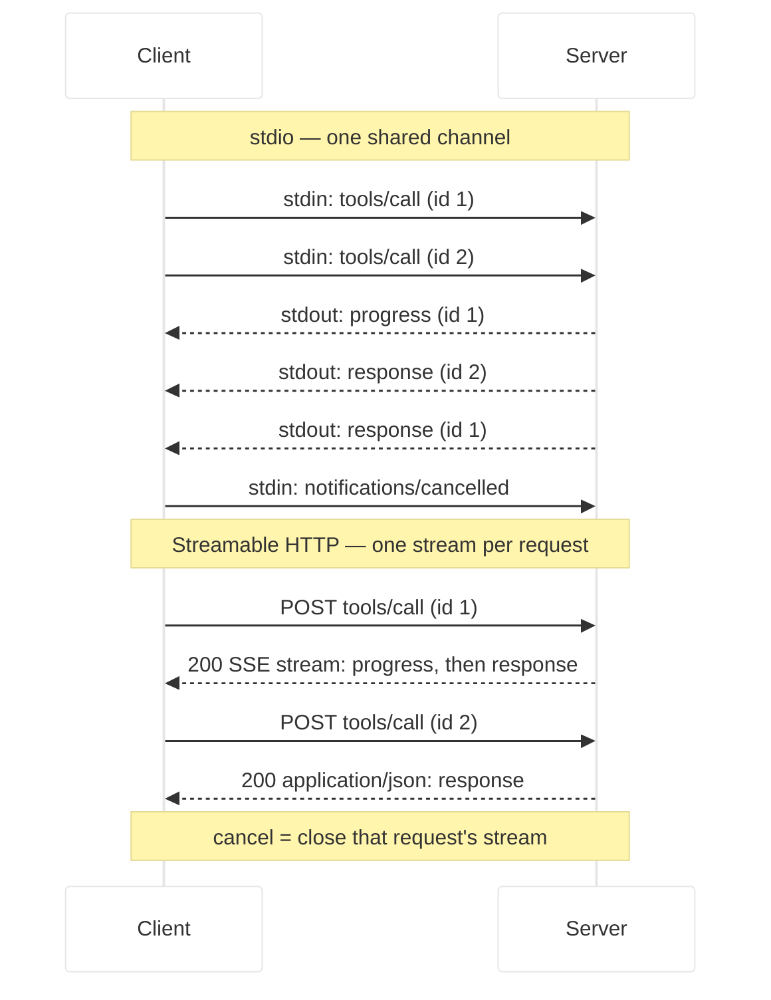
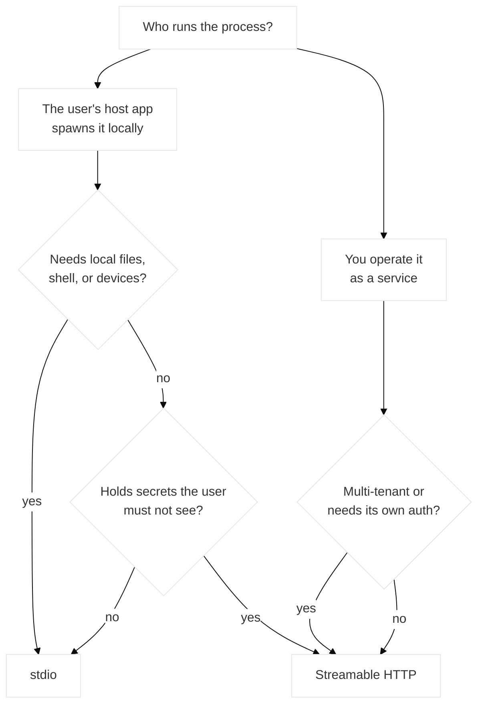

# stdio vs Streamable HTTP: Picking an MCP Transport

MCP has exactly two standard transports, and you pick one in the first ten minutes of a project — before you know enough to pick well.

Most comparisons answer with "it depends." That's true and useless. This one gives you thresholds: concrete conditions where the answer flips, plus the capabilities that only exist on one side, so you can tell whether you're making a reversible decision or a load-bearing one.

The timing matters too. The `2026-07-28` revision changed Streamable HTTP substantially — sessions removed, the standalone GET stream removed, server-initiated requests removed — and made it meaningfully cheaper to operate. The break-even point between the two moved this year, so advice written before it is out of date.

## Table of Contents
- [The Short Answer](#the-short-answer)
- [stdio at the Byte Level](#stdio-at-the-byte-level)
- [Streamable HTTP at the Byte Level](#streamable-http-at-the-byte-level)
- [The Decision Table](#the-decision-table)
- [What Only stdio Gives You](#what-only-stdio-gives-you)
- [What Only Streamable HTTP Gives You](#what-only-streamable-http-gives-you)
- [What 2026-07-28 Changed](#what-2026-07-28-changed)
- [Supporting Both From One Codebase](#supporting-both-from-one-codebase)
- [Why MCP Won't Add a Third Transport](#why-mcp-wont-add-a-third-transport)
- [Frequently Asked Questions (FAQ)](#frequently-asked-questions-faq)
- [Conclusion](#conclusion)
- [Resources and Links](#resources-and-links)

## The Short Answer

**Does the host run your server as a child process on the user's machine?** stdio.

**Is your server a service that something connects to over a network?** Streamable HTTP.

That covers most cases, and if you're still unsure the honest answer is that you're probably building the first kind. But the reason it's usually this easy is worth understanding, because the protocol semantics are *identical* on both. A transport in MCP is a **binding**: it defines how messages are framed and delivered, how request metadata travels, and how cancellation and termination are signaled. It does not define what the messages mean.

That's why transport is a wiring choice at the end of your code rather than an architecture at the start of it.

## stdio at the Byte Level

The client launches your server as a subprocess and talks to it over its standard streams. That's the whole mechanism.

- The server reads JSON-RPC messages from `stdin` and writes them to `stdout`.
- One message per line. Messages are newline-delimited and **must not** contain embedded newlines. UTF-8.
- The server **must not** write anything to `stdout` that isn't a valid MCP message.
- The server **may** write anything it likes to `stderr`. The client may capture, forward, or ignore it, and — per spec — should not assume stderr output indicates an error.

```
→ stdin   {"jsonrpc":"2.0","id":1,"method":"tools/call","params":{...}}
← stdout  {"jsonrpc":"2.0","id":1,"result":{...}}
← stderr  [debug] fetched 3 rows in 14ms
```

The `stdout` rule is the single most common way to break a working MCP server. A `console.log` anywhere in the process — including inside a dependency — injects text into the JSON-RPC stream and corrupts the parser. Use `console.error`. The [MCP Inspector](/articles/mcp-inspector-debugging/) renders stderr in a dedicated pane, which makes it a genuinely good log channel rather than a consolation prize.

One structural property to keep in mind: **stdio is a single shared bidirectional channel.** There are no per-request streams. Responses, progress notifications, and subscription notifications all interleave on `stdout`, correlated by JSON-RPC `id` or by `io.modelcontextprotocol/subscriptionId` in `_meta`. There's no header layer at all — all request metadata rides inline in the message body.

Lifecycle is where stdio has real rules rather than conventions:

| Phase | Behavior |
|-------|----------|
| Startup | Client spawns the process, passes env and args |
| Shutdown | Client closes `stdin`, waits, then escalates — `SIGTERM` → `SIGKILL` on POSIX; `TerminateProcess` or Job Objects on Windows |
| Graceful exit | Your server **should** exit promptly when `stdin` closes or reads return EOF. It's the primary signal and the only portable one. |
| Crash | The client should restart the process. In-flight requests are simply lost and retried against the fresh process. |

That last row is quietly load-bearing, and it's new-ish: because the protocol is now stateless, a crashed stdio server loses nothing but the in-flight calls. Active `subscriptions/listen` streams do need re-establishing after a restart.

## Streamable HTTP at the Byte Level

Your server is an ordinary HTTP service exposing **one endpoint** that accepts POST.

- Every JSON-RPC request or notification is its own HTTP POST to that endpoint.
- The client must send `Accept: application/json, text/event-stream` — it has to support both response shapes.
- A notification POST gets `202 Accepted` with no body.
- A request POST gets either a single JSON object (`Content-Type: application/json`) or an SSE stream scoped to that request (`Content-Type: text/event-stream`), carrying request-related notifications followed by the final response.

The request looks like this, and the headers are the interesting part:

```http
POST /mcp HTTP/1.1
Content-Type: application/json
MCP-Protocol-Version: 2026-07-28
Mcp-Method: tools/call
Mcp-Name: get_weather

{
  "jsonrpc": "2.0",
  "id": 1,
  "method": "tools/call",
  "params": {
    "name": "get_weather",
    "arguments": { "location": "Seattle, WA" },
    "_meta": {
      "io.modelcontextprotocol/protocolVersion": "2026-07-28",
      "io.modelcontextprotocol/clientInfo": { "name": "ExampleClient", "version": "1.0.0" },
      "io.modelcontextprotocol/clientCapabilities": {}
    }
  }
}
```

`MCP-Protocol-Version`, `Mcp-Method`, and `Mcp-Name` are **required for compliance**, and they mirror fields from the body so that load balancers, gateways, and observability tooling can route and inspect without parsing JSON. The body stays the source of truth: if a header disagrees with it, the server must reject with `400` and JSON-RPC `-32020` (`HeaderMismatch`).

That rule exists for a specific reason worth internalizing — if a load balancer routes on the header while your server executes on the body, a mismatch is a security bug, not a cosmetic one.

Two security requirements are non-negotiable here. Servers **must** validate the `Origin` header and respond `403` when it's present and invalid, because without it a remote website can use DNS rebinding to reach a local MCP server. And when running locally, bind to `127.0.0.1` rather than `0.0.0.0`.

The structural difference between the two transports is easiest to see side by side — one shared channel versus one stream per request:



## The Decision Table

Thresholds, not vibes. Read down the left column; the first row that clearly applies to you decides it.

| Condition | stdio | Streamable HTTP |
|-----------|-------|-----------------|
| Server needs the user's local filesystem, shell, or installed tools | ✅ | ❌ |
| More than one user hits the same running instance | ❌ | ✅ |
| Server needs its own authorization (OAuth, tokens, tenancy) | ❌ | ✅ |
| Distributed as an npm/PyPI package users install | ✅ | — |
| Distributed as a service you operate and update | — | ✅ |
| Server holds credentials that must never reach the user's machine | ❌ | ✅ |
| Users are non-technical and "install" means pasting a config blob | ✅ | — |
| Users are non-technical and "install" means pasting a URL | — | ✅ |
| You need per-request rate limiting or quota enforcement at a gateway | ❌ | ✅ |
| You need horizontal scaling | ❌ | ✅ |
| Latency budget is tight and the work is local | ✅ | — |
| You need centralized audit logs across all users | ❌ | ✅ |
| Cold start per invocation is unacceptable | — | ✅ |

Three of those deserve a note.

**"More than one user hits the same instance"** is the cleanest discriminator in practice. stdio gives you one process per client by construction. If that's wasteful or wrong for your workload, you want HTTP.

**"Credentials that must never reach the user's machine"** decides more architectures than scale does. A stdio server runs with the user's privileges and its config lives in a file on their disk. If your server needs a production database credential, that's not a stdio server no matter how few users it has.

**Cold start** cuts the other way from what people expect. stdio pays process startup on every host launch; HTTP pays a network round trip per call. For a server that does local work in single-digit milliseconds, stdio wins. For one that wraps a remote API anyway, the round trip is already priced in.



## What Only stdio Gives You

**Access to the machine.** The filesystem, the shell, git, Docker, local databases, the user's SSH agent. This is the entire category of developer tooling, and it isn't replicable over HTTP.

**Zero network surface.** No TLS, no CORS, no `Origin` validation, no auth layer, no port. The security boundary is the OS process boundary.

**The user's own credentials, already there.** Your server inherits their environment. No token exchange, no OAuth dance, no credential storage design.

**Trivially cheap per-user isolation.** One process per client, for free. No tenancy model to build.

**`notifications/cancelled`.** Because stdio is one shared channel with no per-request stream to close, cancellation is an explicit notification referencing the request id — and as of `2026-07-28`, stdio is the *only* transport where that notification is used.

## What Only Streamable HTTP Gives You

**Horizontal scale on ordinary infrastructure.** This is the change that matters most this year, covered below.

**Header-level routing.** `Mcp-Method` and `Mcp-Name` ride on every request, so a gateway can route, rate-limit, or authorize per operation without touching the body. There is no header layer on stdio at all.

**Argument-level routing, if you want it.** Servers can annotate a tool parameter with `x-mcp-header` in its `inputSchema`, and conforming clients mirror that argument into an `Mcp-Param-{Name}` header:

```json
{
  "name": "execute_sql",
  "inputSchema": {
    "type": "object",
    "properties": {
      "region": { "type": "string", "x-mcp-header": "Region" },
      "query": { "type": "string" }
    },
    "required": ["region", "query"]
  }
}
```

That call arrives with `Mcp-Param-Region: us-west1`, so a gateway can route by region without parsing the body. The constraints are strict — primitive types only (`integer`, `string`, `boolean`; `number` is not permitted), and the property must be *statically reachable* from the schema root through a chain of `properties` keys only, never through `items`, `oneOf`/`anyOf`/`allOf`, conditionals, or `$ref`. Clients must reject tool definitions that violate this and exclude the offending tool from `tools/list`.

**Centralized everything.** One deployment to update, one place for audit logs, one set of credentials you control, one rollout to revert.

**Response caching.** `ttlMs` and `cacheScope` on list and resource-read results let clients cache `tools/list` legitimately, and tell them whether it's safe to share the cached copy across users.

## What 2026-07-28 Changed

Streamable HTTP in `2025-11-25` was operationally awkward. A session id pinned each client to whichever instance issued it, so horizontal scaling needed sticky routing and a shared session store, and gateways had to inspect bodies to make decisions.

The revision removed the machinery:

- **No `Mcp-Session-Id`.** No protocol-level session. Any request can land on any instance, so plain round-robin works.
- **No `initialize` handshake.** Protocol version, client info, and capabilities travel in `_meta` on every request; `server/discover` exists for clients that want capabilities up front.
- **No standalone GET stream.** The endpoint accepts POST only. GET or DELETE to it should answer `405`.
- **No server-initiated JSON-RPC requests.** A server that needs user input returns an `InputRequiredResult` and the client retries the original call with the answers — [Multi Round-Trip Requests](https://modelcontextprotocol.io/specification/draft/basic/patterns/mrtr). Holding an SSE stream open is no longer how that works.
- **Cancellation is closing the stream.** Each request has its own response stream, so the disconnect is unambiguous. `notifications/cancelled` is stdio-only now.
- **No resumable streams.** `Last-Event-ID` resumption is gone; a `Last-Event-ID` header should be ignored.

Net effect on the choice: **Streamable HTTP got significantly cheaper to run, and stdio got slightly simpler to reason about.** A remote server that previously needed sticky sessions, a session store, and body-inspecting gateway rules now needs a round-robin load balancer and a routing rule on one header. If you evaluated remote MCP in 2025 and concluded the ops burden wasn't worth it, that calculation has changed.

Two operational details for SSE responses, since they're easy to miss and produce confusing symptoms:

- Send `X-Accel-Buffering: no` on SSE responses, or reverse proxies like nginx will buffer events and destroy the streaming behavior you're paying for.
- On long-lived `subscriptions/listen` streams, emit a periodic SSE comment line (`:\r\n`) as a keep-alive so intermediaries and idle timeouts don't close a quiet connection.

## Supporting Both From One Codebase

Because the protocol semantics are identical, supporting both is a matter of two entry points around the same server. In the TypeScript SDK:

```typescript
import { McpServer, createMcpHandler } from '@modelcontextprotocol/server';
import { serveStdio } from '@modelcontextprotocol/server/stdio';

function buildServer() {
    const server = new McpServer({ name: 'my-server', version: '1.0.0' });
    registerEverything(server); // tools, resources, prompts — written once
    return server;
}

// stdio entry point
if (process.env.MCP_TRANSPORT === 'stdio') {
    await serveStdio(buildServer);
}

// HTTP entry point
export default createMcpHandler(buildServer);
```

Both take a **factory**, not an instance, which is the design that makes this work: `createMcpHandler` builds a fresh server per request, and `serveStdio` pins one instance per connection.

Two things won't transfer, and they're worth designing around from the start:

1. **Local access.** A tool that reads `~/.config` works on stdio and is meaningless over HTTP.
2. **Session-shaped state.** There isn't any, on either transport. If a tool needs to remember something across calls, mint an explicit handle and let the model pass it back as an argument. That pattern works identically on both, which is a good reason to adopt it even in a stdio-only server.

If you're building the server itself rather than just choosing a transport, the [TypeScript pillar guide](/articles/mcp-server-typescript/) covers both entry points in context.

## Why MCP Won't Add a Third Transport

People ask for WebSocket, gRPC, or a message-queue binding. The maintainers' 2026 roadmap is explicit: the plan is to **evolve the existing transport, not add more** — a deliberate decision grounded in the project's design principles. (The v2 TypeScript SDK removed `WebSocketClientTransport` for exactly this reason: WebSocket was never a spec transport.)

Two transports means every host supports every server. A fragmented transport matrix would mean checking compatibility before you could use anything, which is the problem MCP exists to eliminate.

There is still an escape hatch, and it's more useful than a third standard transport would be. Custom transports are permitted — you must preserve the JSON-RPC message format, the message patterns, and the per-request metadata model, and you should document your connection establishment, framing, and cancellation. And if your channel is a reliable bidirectional byte stream — a Unix domain socket, a TCP connection — the spec tells you to **reuse the stdio framing** rather than invent one:

> the stdio binding is just newline-delimited JSON-RPC over a byte stream, and only its process-lifecycle rules are specific to standard streams

So "stdio" is slightly misnamed. It's a byte-stream framing that happens to be specified over standard streams. Run it over a Unix socket and you've built a custom transport that every stdio implementation already knows how to speak.

One transport genuinely is deprecated: **HTTP+SSE** from `2024-11-05`, with its separate SSE and POST endpoints. It's been deprecated since `2025-03-26`, is now classified as Deprecated under the formal feature lifecycle policy, and is eligible for removal in a future revision. New implementations shouldn't adopt it. If you find a tutorial with two endpoints and an `endpoint` event, it's two generations stale.

## Frequently Asked Questions (FAQ)

**Which MCP transport should I use for a local developer tool?**
stdio. The host spawns your server as a child process, it inherits the user's environment and privileges, and you get per-user isolation for free with no network surface, no TLS, and no auth layer to design.

**Can one MCP server support both stdio and Streamable HTTP?**
Yes, and it's normal. Protocol semantics are identical across transports, so you register your tools, resources, and prompts once and wire two entry points around them — `serveStdio(factory)` and `createMcpHandler(factory)` in the TypeScript SDK. The only things that don't transfer are local-machine access and anything you built assuming session state.

**Is Streamable HTTP still hard to scale?**
Not the way it was. The `2026-07-28` revision removed `Mcp-Session-Id` and the protocol-level session, so any request can land on any instance and a plain round-robin load balancer is sufficient. The sticky sessions and shared session store that horizontal deployments needed in `2025-11-25` are no longer required at the protocol layer.

**Why does my stdio server disconnect with JSON parse errors?**
Something is writing to `stdout` that isn't an MCP message. On stdio, `stdout` is the JSON-RPC channel, and messages are newline-delimited with no embedded newlines allowed. A single `console.log` — yours or a dependency's — corrupts the stream. Log to `stderr` instead; the spec explicitly permits it and clients shouldn't treat stderr output as an error signal.

**What happened to SSE as an MCP transport?**
Two separate things get called "SSE." The `2024-11-05` HTTP+SSE transport, with its distinct SSE and POST endpoints, is deprecated and eligible for removal. Separately, Streamable HTTP still uses SSE — but as a *response* format scoped to a single request, not a long-lived channel for server-initiated messages. The standalone GET stream was removed in `2026-07-28`.

**Can I use WebSocket or gRPC with MCP?**
Not as a standard transport, and the roadmap says no new official transports this cycle. You may implement a custom transport if you preserve the JSON-RPC format, message patterns, and per-request metadata model. If your channel is a reliable bidirectional byte stream like a Unix socket or TCP, reuse the stdio framing — the spec recommends it, and existing implementations already speak it.

**How do I keep state between tool calls if there's no session?**
Mint an explicit handle from a tool and have the model pass it back as an ordinary argument on later calls. It works identically on both transports, it survives an instance dying or a stdio process restarting, and it's visible to you while debugging instead of hidden in transport metadata.

## Conclusion

The decision is usually made for you by one question: does the host spawn your server locally, or does it connect to a service you run? Local means stdio. Remote means Streamable HTTP.

What's worth updating is the assumption underneath. Remote MCP used to carry an ops tax — sticky sessions, a session store, gateways parsing bodies — that made stdio the default even for workloads that didn't belong there. `2026-07-28` removed that tax. If you chose stdio in 2025 partly to avoid the operational complexity of the alternative, the alternative is now a round-robin load balancer and one header-based routing rule.

And keep the choice cheap. Write your tools against a factory, avoid session-shaped state, and use explicit handles instead. Then the transport stays what it should be: four lines at the bottom of your entry file.

## Resources and Links

- [Transports overview](https://modelcontextprotocol.io/specification/draft/basic/transports) — what a binding must provide, and the rules for custom transports
- [stdio transport specification](https://modelcontextprotocol.io/specification/draft/basic/transports/stdio)
- [Streamable HTTP transport specification](https://modelcontextprotocol.io/specification/draft/basic/transports/streamable-http)
- [Multi Round-Trip Requests](https://modelcontextprotocol.io/specification/draft/basic/patterns/mrtr)
- [The 2026-07-28 specification release candidate](https://blog.modelcontextprotocol.io/posts/2026-07-28-release-candidate/)
- [The 2026 MCP roadmap](https://blog.modelcontextprotocol.io/posts/2026-mcp-roadmap/) — why the transport set stays small
- [MCP design principles](https://modelcontextprotocol.io/community/design-principles)
- [MCP TypeScript SDK](https://github.com/modelcontextprotocol/typescript-sdk)
