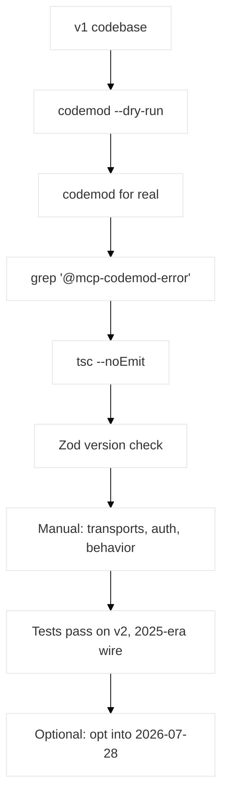

# MCP TypeScript SDK v1 to v2: A Migration Guide

There are two migrations happening in the MCP TypeScript ecosystem right now, and nearly every confused thread about them comes from treating them as one:

1. **`@modelcontextprotocol/sdk` v1.x → the v2 packages.** A package split and API refresh. Breaking for your code. Entirely on your schedule.
2. **The `2025-11-25` protocol revision → `2026-07-28`.** A wire-level change. Breaking for the protocol, but opt-in per entry point.

They are independent. You can do the first without the second, which is what most teams should do first. Nothing in v2 puts a `2026-07-28` byte on the wire by default — a hand-constructed `Client`, `Server`, or `McpServer` keeps speaking the 2025-era protocol it was written for.

This guide covers migration #1: what the codemod handles, what it can't, and the handful of changes that fail quietly enough to reach production.

## Table of Contents
- [Should You Migrate Yet?](#should-you-migrate-yet)
- [Run the Codemod First](#run-the-codemod-first)
- [The Package Split](#the-package-split)
- [Node 20, ESM, and CommonJS](#node-20-esm-and-commonjs)
- [The Zod Trap](#the-zod-trap)
- [Registration API Changes](#registration-api-changes)
- [Renames: Errors, Context, Handlers](#renames-errors-context-handlers)
- [Transports: Moved, Renamed, Removed](#transports-moved-renamed-removed)
- [The Quiet Ones](#the-quiet-ones)
- [Turning On 2026-07-28, Later](#turning-on-2026-07-28-later)
- [A Staged Migration Plan](#a-staged-migration-plan)
- [Frequently Asked Questions (FAQ)](#frequently-asked-questions-faq)
- [Conclusion](#conclusion)
- [Resources and Links](#resources-and-links)

## Should You Migrate Yet?

As of late July 2026, **v2 is in beta.** Stable is expected alongside the final `2026-07-28` spec on July 28, 2026. The maintainers' position is explicit: until then, **v1.x is the supported release for production**, and it continues to receive bug fixes and security updates for at least six months after v2 ships.

That gives you a comfortable window and a clear decision:

| Situation | Do this |
|-----------|---------|
| Production server, no urgent need | Stay on v1.x. Migrate on a branch, don't merge yet. |
| New project | Start on v2 with exact version pins. |
| You want `2026-07-28` on the wire | v2 is the prerequisite — it's the only generation that can serve it. |
| Library that depends on the SDK | Add an upper bound now so a stable v2 doesn't surprise your users. |

Migrating on a branch early is genuinely useful even if you don't merge: the codemod tells you the size of the job in about a minute, and running your real traffic against a beta is the feedback the SDK team is asking for.

## Run the Codemod First

Don't hand-edit imports. Most of this migration is mechanical renames, and there's a codemod that owns the mappings as its source of truth:

```bash
# See what it would do, without touching anything
npx @modelcontextprotocol/codemod@beta v1-to-v2 . --dry-run

# Then for real
npx @modelcontextprotocol/codemod@beta v1-to-v2 .
```

Then work the loop:

```bash
# 1. Find what it recognized but couldn't safely rewrite
grep -rn '@mcp-codemod-error' .

# 2. Type-check — remaining errors map to the manual changes below
npx tsc --noEmit

# 3. Format (the codemod rewrites the AST without reformatting)
npx prettier --write .

# 4. Run your tests
npm test
```



**What the codemod handles**, among other things: every `@modelcontextprotocol/sdk/...` import path, symbol renames (`McpError` → `ProtocolError`, `JSONRPCError` → `JSONRPCErrorResponse`, and the rest), `setRequestHandler(Schema, …)` → method strings, `extra.*` → `ctx.mcpReq.*` / `ctx.http?.*`, `.tool()`/`.prompt()`/`.resource()` → `registerTool`/`registerPrompt`/`registerResource` with raw Zod shapes wrapped in `z.object()`, dropping the result-schema argument from `client.request()` and `client.callTool()`, `ErrorCode` → `ProtocolErrorCode` with local-only members routed to `SdkErrorCode`, `StreamableHTTPError` → `SdkHttpError`, `IsomorphicHeaders` → Web Standard `Headers`, `RequestHandlerExtra` → `ServerContext`/`ClientContext`, and your `package.json` dependencies.

**What it doesn't**, and each is covered below: the Node 20 / ESM pre-flight, converting header bracket access to `.get()`, OAuth error-class consolidation, choosing which `SdkErrorCode` branch a `catch` should match, namespace schema imports, and behavioral adaptation.

One trap worth naming immediately: **the codemod is import-driven.** A file that receives an SDK surface as a parameter — dependency injection, factory seams — and has no SDK import is never rewritten, and the v1 idioms there fail at *runtime*, not compile time. The v1 schema-first `setRequestHandler(Schema, …)` form throws a `TypeError` at registration. Grep those seams for `setRequestHandler(`, `ErrorCode.`, and `extra.` by hand.

## The Package Split

The single package became several:

| v1 | v2 |
|----|-----|
| `@modelcontextprotocol/sdk` | `@modelcontextprotocol/client` — client implementation |
| | `@modelcontextprotocol/server` — server implementation |
| | `@modelcontextprotocol/core` — public Zod `*Schema` constants |
| | `@modelcontextprotocol/core-internal` — internal, **never import directly** |
| Built-in HTTP framework support | `@modelcontextprotocol/node` / `express` / `hono` adapters |

Install only the side you build. `client` and `server` both re-export shared types, so import types and error classes from whichever you already depend on.

Two things to check after the dependency swap:

**Framework peers.** The adapter packages declare their framework as a *peer* dependency, where v1 shipped them as direct deps. The codemod adds the `@modelcontextprotocol/*` packages but not the framework — `npm install express` (or `hono`) explicitly.

**Repo-local tooling that hard-codes the old package name.** Dependency-pin lints, version allowlists, CI gates, release scripts. The codemod rewrites sources and manifests, not bespoke gates, so:

```bash
grep -rn '@modelcontextprotocol/sdk' --exclude-dir=node_modules .
```

While you're in there, remove v1-era double casts on SDK types (`as unknown as Transport` and friends). v2's types satisfy those contracts directly, and a surviving cast keeps suppressing type checking that would otherwise catch real bugs.

In a monorepo, declare in each member exactly what its own sources import. The fastest way to answer "which packages does this member need" is to run the codemod against that member's directory with `--dry-run` and read the manifest summary — it's computed from that member's imports. Workspace-member manifests are never modified automatically; the codemod lists them for you to apply.

## Node 20, ESM, and CommonJS

v2 requires **Node.js 20+**. It runs on Node, Bun, and Deno.

On module format: v2 is ESM-first but **ships a CommonJS build alongside ESM**, so CommonJS projects can `require('@modelcontextprotocol/…')` directly. No dynamic-import shim needed. (Early beta announcements described v2 as ESM-only — that changed, so check the current docs rather than the June announcement if you read it at the time.)

One build-layout change that bites tooling rather than application code: v2 emits `.mjs`/`.cjs` siblings in a flat `dist/`, so v1's `/dist/cjs/` ↔ `/dist/esm/` path swaps have no equivalent. If anything of yours reads a constant out of a built file with `require.resolve` plus a regex, it will break in two stacked ways — the literal usually lives in a content-hashed sibling chunk rather than the subpath's entry module, and the emitted quote style differs from v1 so a quote-anchored pattern misses silently.

## The Zod Trap

This is the one to read twice, because it is the only change in the migration that **typechecks cleanly and then fails in production**.

**Zod 3 is no longer supported.** v1's peer range was `^3.25 || ^4.0`; v2 requires Zod 4. That sounds like a routine bump. The failure mode is not routine:

> A Zod 3 range that satisfied the v1 peer installs and typechecks cleanly under v2. The server starts. It connects. Then the first `tools/list` — so the first `client.listTools()` — answers with an error pointing at `fromJsonSchema()`, while the process keeps running.

Check the **declared range** in `package.json`, not the installed version. A caret range that happens to resolve to something acceptable today is still a liability.

And there's a second, subtler tier. Zod **≥ 4.2.0** self-converts via `~standard.jsonSchema` — the supported path. Zod **4.0–4.1** lacks it, so the SDK falls back to its own bundled Zod's `z.toJSONSchema()`, emits a one-time `[mcp-sdk]` console warning, and — because `.describe()` descriptions live in the *authoring* Zod's registry — **silently drops your field descriptions** from the generated JSON Schema.

Those descriptions are how you explain each argument to a model. Losing them doesn't break anything visibly. It just makes every agent using your server call your tools worse.

The fix ladder, in order:

1. **Upgrade to `zod@^4.2.0`.** Do this.
2. **If you must pin an older or separate Zod**, attach a `~standard.jsonSchema` provider backed by *your* Zod's `toJSONSchema`, so conversion and descriptions run through your instance.
3. **Author the schema as raw JSON Schema** via `fromJsonSchema()`.

Stuck in a monorepo pinned to Zod 3 workspace-wide? You can apply step 1 to one member only, with an alias:

```json
{
  "dependencies": {
    "zod-v4": "npm:zod@^4.2.0"
  }
}
```

```typescript
import { z } from 'zod-v4';
// author SDK-bound schemas with this one; leave the workspace's zod-3 schemas alone
```

The alias copy doesn't have to be the same instance as the SDK's bundled Zod — conversion runs through the authoring instance's `~standard.jsonSchema`, so `.describe()` survives and the emitted dialect is 2020-12. Keep the two `z`'s apart, though; alias-authored schemas are for the SDK and don't compose with the workspace's Zod 3 schemas.

**How a too-old Zod surfaces depends on your import.** With `import { z } from 'zod'` on a Zod 3 range, you get the quiet runtime path above. With `import * as z from 'zod/v4'` — or any Zod whose *typings* predate `~standard.jsonSchema` — the same code runs through the fallback but **fails to compile**, with `TS2769: No overload matches this call` on the registration call. The real cause is buried in the first overload's elaboration: `Property 'jsonSchema' is missing in type …`. If you see that two-overload error on a `registerTool` call, check your Zod version before anything else.

One more Zod-adjacent gotcha: the forced Zod 4 bump surfaces Zod's own type-level changes in your annotations. `z.ZodTypeDef` no longer exists and `z.ZodType`'s generics changed, so v3-era annotations like `z.ZodType<Output, z.ZodTypeDef, Input>` fail to compile. Consumer-only schemas can keep compiling via the `zod/v3` compat subpath; anything handed to the SDK must be Zod 4 or another Standard Schema implementation.

## Registration API Changes

The variadic `.tool()`, `.prompt()`, and `.resource()` are gone. Use the config-object form — the codemod converts the call shape for you:

```typescript
// v1 — raw shape, variadic
server.tool('greet', 'Greet a user', { name: z.string() }, async ({ name }) => {
    return { content: [{ type: 'text', text: `Hello, ${name}!` }] };
});

// v2 — config object, Standard Schema
server.registerTool(
    'greet',
    { description: 'Greet a user', inputSchema: z.object({ name: z.string() }) },
    async ({ name }) => {
        return { content: [{ type: 'text', text: `Hello, ${name}!` }] };
    }
);
```

Then the details the codemod can't decide for you:

- **`registerResource` requires a `metadata` argument.** Pass `{}` if you have none. Common first compile error.
- **Raw `{ field: z.string() }` shapes still work** through `@deprecated` overloads on `registerTool`/`registerPrompt` (auto-wrapped with `z.object()`), but prefer wrapping explicitly. Those deprecated overloads exist *only* on those two methods — a raw shape passed to `RegisteredTool.update()` is **not** auto-wrapped.
- **A tool or prompt with no schema gets the context as its callback's single argument.** v1 passed `(extra)`, v2 passes `(ctx)`. A one-parameter callback typechecks under either reading, so this is a silent behavior change in your own code:

```typescript
server.registerTool('ping', { description: 'Liveness check' }, async ctx => ({ content: [] }));
```

- **Optional completable arguments invert.** `completable(z.string(), cb).optional()`, not `completable(z.string().optional(), cb)`. The v1 nesting returns empty completion lists — nothing errors — and if no argument carries completion metadata in the v2 position, the server doesn't advertise the `completions` capability at all. The codemod inverts the common nesting and flags what it can't.
- **Removed Zod helpers**, each marked `@mcp-codemod-error`: `schemaToJson` (use `fromJsonSchema()` or your library's native conversion), `parseSchemaAsync` (use `.safeParseAsync()`), and the introspection helpers `getSchemaShape` / `getSchemaDescription` / `isOptionalSchema` / `unwrapOptionalSchema`, which have no replacement. `server/zod-json-schema-compat.js` is also gone and the codemod does *not* rewrite its import — expect `TS2307`.

Standard Schema means you're no longer tied to Zod at all. Valibot and ArkType both implement the spec:

```typescript
import { type } from 'arktype';
server.registerTool('greet', { inputSchema: type({ name: 'string' }) }, handler);
```

## Renames: Errors, Context, Handlers

Mostly mechanical, but the ones needing judgment are where errors hide.

**Errors split by origin.** `McpError` → `ProtocolError`, `ErrorCode` → `ProtocolErrorCode`, with the local-only members (`RequestTimeout`, `ConnectionClosed`) routed to a separate `SdkErrorCode` / `SdkError`. `StreamableHTTPError` → `SdkHttpError`, and its constructor argument shape changed, so the codemod marks construction sites for review. Guards mixing the two enums get flagged. Deciding which branch a given `catch` should match is on you — and it's worth doing properly rather than widening to `catch (e)`.

**Handler context.** `RequestHandlerExtra` → `ServerContext` / `ClientContext`, and the `extra` parameter is now `ctx`. Properties remap to `ctx.mcpReq.*` (protocol-level) and `ctx.http?.*` (transport-level).

**Header reads change shape.** `IsomorphicHeaders` is gone; `ctx.http?.req` is a standard Web `Request`, so its `headers` take `.get()` rather than bracket access. The codemod does the rename and the property remap but leaves the bracket-to-`.get()` conversion to you. Headers you *pass in* via `requestInit.headers` need no change — plain objects remain valid.

**Handler registration uses method strings.** `setRequestHandler(CallToolRequestSchema, …)` becomes `setRequestHandler('tools/call', …)`. The codemod handles it via a mapping, except for namespace imports (`import * as t from '…/types.js'` then `t.CallToolResultSchema.parse(…)`), which it can't split per symbol — re-import from `@modelcontextprotocol/core` by hand.

**Client calls drop the result-schema argument.** `client.request()` and `client.callTool()` infer the return type from the method name via `ResultTypeMap`. The codemod drops the argument for spec methods but leaves nested `ctx.mcpReq.send()` calls alone.

## Transports: Moved, Renamed, Removed

Three decisions the codemod can't make:

**`StreamableHTTPServerTransport` → which runtime?** The codemod renames it to `NodeStreamableHTTPServerTransport` from `@modelcontextprotocol/node`. If you deploy to a web-standard runtime — Cloudflare Workers, Deno, Bun — use `WebStandardStreamableHTTPServerTransport` from `@modelcontextprotocol/server` instead. The rule: Node `IncomingMessage`/`ServerResponse` → `@modelcontextprotocol/node`; web-standard `Request`/`Response` → `@modelcontextprotocol/server`.

**stdio transports moved to a `./stdio` subpath.** The root barrels deliberately don't export them, so browser and Workers bundlers can consume the root entries:

```typescript
// v1
import { StdioClientTransport } from '@modelcontextprotocol/sdk/client/stdio.js';
// v2
import { StdioClientTransport } from '@modelcontextprotocol/client/stdio';
```

`StdioServerTransport` comes from `@modelcontextprotocol/server/stdio`. The utilities `ReadBuffer`, `serializeMessage`, and `deserializeMessage` stay in the root barrel.

**Two transports are removed.** `SSEServerTransport` is gone — migrate to Streamable HTTP, with a frozen v1 copy at `@modelcontextprotocol/server-legacy/sse` as a temporary bridge. `WebSocketClientTransport` is gone too, since WebSocket was never a spec transport; use `StreamableHTTPClientTransport` for remote servers or `StdioClientTransport` for local ones. The `Transport` interface is exported if you need something custom.

Also worth noting: `InMemoryTransport` is now re-exported from both `client` and `server`, but the two packages bundle **separate copies with private state**. Both halves of a linked pair must come from the same package's import — mixing the client's with the server's silently fails to link.

**Auth split by role.** Resource Server helpers (`requireBearerAuth`, `mcpAuthMetadataRouter`, `OAuthTokenVerifier`) go to `@modelcontextprotocol/express`, with a runtime-neutral core also exported from `@modelcontextprotocol/server`. Authorization Server helpers (`mcpAuthRouter`, `OAuthServerProvider`, `ProxyOAuthServerProvider`, the handler functions) go to `@modelcontextprotocol/server-legacy/auth` — a deprecated frozen v1 copy. The message there is clear: migrate your authorization server to a dedicated IdP or OAuth library rather than running one out of the MCP SDK. The codemod's routing is conservative, so re-point RS-only call sites at `@modelcontextprotocol/express` yourself.

## The Quiet Ones

Five changes that compile fine and behave differently.

**1. `structuredContent` is typed `unknown`.** SEP-2106 lifted the object-root restriction, so `structuredContent` widened from `{ [k: string]: unknown }` to `unknown`, and the presence check is now `!== undefined` rather than falsy — `null`, `0`, `false`, and `""` are legal values. Narrow before you index:

```typescript
// v1
if (result.structuredContent) { result.structuredContent.count }

// v2
const sc = result.structuredContent;
if (typeof sc === 'object' && sc !== null && 'count' in sc) { sc.count }
```

**2. The default JSON Schema validator is 2020-12, not draft-07.** Schemas declaring a different `$schema` are rejected outright with an unsupported-dialect error. If you relied on draft-07 idioms, either construct an `AjvJsonSchemaValidator` explicitly or update the schemas. Note that the `McpServer`/`Client` `jsonSchemaValidator` option does *not* reach `fromJsonSchema`-authored schemas — pass the validator to `fromJsonSchema()` directly.

**3. Absolute-URI `$ref` no longer works.** External `$ref` is not dereferenced. Inline definitions under `$defs` and reference them as `#/$defs/Name`.

**4. Experimental tasks interception is removed** (SEP-2663). Tasks shipped as an experimental core feature in `2025-11-25`; production use surfaced enough redesign that it moved to an extension with a different lifecycle. Task-handler schema constants used as `setRequestHandler` args are *not* rewritten — each registration gets an action-required diagnostic. If you shipped against the experimental API, you're rewriting that part against the new extension.

**5. Behavioral changes with no rename to catch them:** list auto-aggregation, capability empties, lazy validator compilation, and output-schema validation rules all shifted. These are the ones your tests catch and your types don't, which is the argument for having tests before you start.

## Turning On 2026-07-28, Later

Once you're on v2 and green, the protocol revision is a separate, small, deliberate change. Nothing is switched on for you.

**Serving over HTTP** — replace your transport wiring with a factory-based handler:

```typescript
import { createMcpHandler } from '@modelcontextprotocol/server';

const handler = createMcpHandler(() => buildServer());
// Web-standard runtimes: export default handler;
// Node frameworks: app.all('/mcp', toNodeHandler(handler));
```

By default (`legacy: 'stateless'`) that one endpoint also serves 2025-era traffic per request. A v1 *stateless* Streamable HTTP hosting (`sessionIdGenerator: undefined`, fresh transport per request) maps directly onto it. A v1 **sessionful** setup is the harder case: keep it behind a strict handler and route with `isLegacyRequest(request)`.

**Serving over stdio** — replace `await server.connect(new StdioServerTransport())` with:

```typescript
import { serveStdio } from '@modelcontextprotocol/server/stdio';

await serveStdio(() => buildServer());
```

**On the client** — opt in via `ClientOptions.versionNegotiation`:

```typescript
const client = new Client({ name: 'my-client', version: '1.0.0' }, { versionNegotiation: { mode: 'auto' } });
```

`'auto'` probes with `server/discover` and falls back to the 2025 handshake against an older server, at the cost of one extra round trip. `{ pin: '2026-07-28' }` is modern-only and rejects. Default is legacy, no probe.

One caveat if you build tooling: **spawn-per-invocation CLI and debugging tools should not default to `'auto'`.** On stdio, a legacy server that never answers unknown pre-`initialize` requests stalls `connect()` for the full probe timeout before falling back, and the probe round trip changes recorded transcripts — which matters when byte-stable observation is the tool's whole value.

If you need the details of what changes on the wire, the [pillar guide](/articles/mcp-server-typescript/) covers the serving entry points, and the sessionless state patterns (explicit handles, sealed `requestState`) in context.

## A Staged Migration Plan

For anything non-trivial, don't do it in one pass:

1. **Pre-flight.** Confirm Node 20+, then check your declared Zod range and bump to `^4.2.0`. Do this *before* the codemod — it removes the most confusing class of error from the pile.
2. **Codemod with `--dry-run`.** Read the diff summary. This is your estimate.
3. **Codemod for real, on a branch.** Then `grep -rn '@mcp-codemod-error' .` and work the list.
4. **`tsc --noEmit`.** Each remaining error maps to a section above.
5. **Grep for the old package name outside `src/`.** CI gates, lints, release scripts, dist-text readers.
6. **Run tests.** Focus on the quiet ones: `structuredContent` narrowing, validator dialect, error-branch guards.
7. **Verify in the Inspector.** Every tool lists, schemas look right, errors are clean. The [Inspector workflow](/articles/mcp-inspector-debugging/) has the checklist — read the raw `inputSchema`, since that's where a dropped `.describe()` from a Zod fallback shows up.
8. **Ship v2 on the 2025-era wire.** Let it run.
9. **Then, separately, opt into `2026-07-28`.**

Steps 8 and 9 being distinct is the whole point. Two changes, two deploys, two chances to bisect.

## Frequently Asked Questions (FAQ)

**Do I have to migrate to v2 by July 28, 2026?**
No. July 28 is when the specification text publishes — not a switch-off for anything. Existing clients and servers keep working. v1.x stays supported for at least six months after v2 ships stable.

**Does upgrading to v2 change what my server puts on the wire?**
No. That's the key property of this migration. A hand-constructed `Server` or `McpServer` on v2 speaks the same 2025-era protocol it spoke on v1. Serving `2026-07-28` requires explicitly moving to `createMcpHandler` or `serveStdio`.

**Is v2 ESM-only?**
No, though early beta announcements said so. v2 is ESM-first but ships a CommonJS build alongside, so CJS projects can `require()` the packages without a dynamic-import shim. It requires Node 20+.

**Why does my server start fine and then fail on the first `tools/list`?**
Zod 3. A Zod 3 range that satisfied v1's peer installs and typechecks cleanly under v2, then fails at the first `tools/list` with an error pointing at `fromJsonSchema()` while the process keeps running. Check the declared range in `package.json` and bump to `^4.2.0`.

**What does the codemod not handle that will actually bite me?**
Three things, in order of how much time they cost: the Zod version (fix it before you start), files that receive SDK surfaces via dependency injection and therefore have no imports to rewrite — those fail at runtime, not compile time — and behavioral changes with no rename attached, like `structuredContent` narrowing and the validator dialect switch.

**Can I migrate a monorepo one package at a time?**
Yes, and you should. Run the codemod per member directory; the manifest summary is computed from that member's own imports. For a workspace pinned to Zod 3, add a `"zod-v4": "npm:zod@^4.2.0"` alias to just the migrating member and author SDK-bound schemas with it.

## Conclusion

Most of this migration is a codemod and a type-check loop. The parts that aren't are worth the attention they cost: pick the right Streamable HTTP transport for your runtime, decide which error branch each `catch` wants, narrow `structuredContent` before indexing it.

And fix Zod first. A `zod@^4.2.0` bump before you run the codemod removes both the silent production failure and the confusing two-overload compile error from the pile you're about to work through — and it's the difference between your `.describe()` documentation reaching the model or being quietly dropped on the way to the schema.

Building something new instead of migrating? Start with the [2026 guide to building an MCP server in TypeScript](/articles/mcp-server-typescript/).

## Resources and Links

- [Upgrading from v1 to v2](https://github.com/modelcontextprotocol/typescript-sdk/blob/main/docs/migration/upgrade-to-v2.md) — the authoritative guide; mappings live in the codemod package
- [Adopting the 2026-07-28 revision](https://github.com/modelcontextprotocol/typescript-sdk/blob/main/docs/migration/support-2026-07-28.md)
- [MCP TypeScript SDK](https://github.com/modelcontextprotocol/typescript-sdk)
- [v2 documentation](https://ts.sdk.modelcontextprotocol.io/v2/) · [v1 documentation](https://ts.sdk.modelcontextprotocol.io/)
- [Beta SDKs announcement](https://blog.modelcontextprotocol.io/posts/sdk-betas-2026-07-28/)
- [The 2026-07-28 specification release candidate](https://blog.modelcontextprotocol.io/posts/2026-07-28-release-candidate/)
- [Standard Schema](https://standardschema.dev/) · [Zod v4 changelog](https://zod.dev/v4/changelog)
