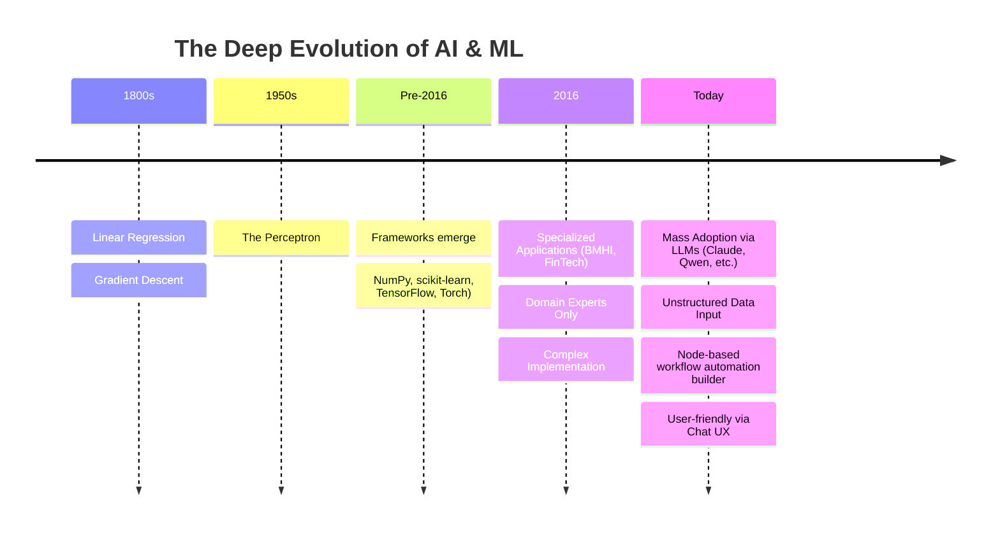

# Production AI in 2016: Machine Learning Before the LLM Boom

> I don’t think LLMs alone are gonna get us to AGI, but they’re the main reason why AI got mass adoption. Obviously LLMs are a type of machine learning (AI). The thing is, for a ton of tasks they’re total overkill, like smashing a nail with an anvil when a hammer would do the job. I mean AI is not only about LLMs but AI includes other phorms of ML.
> AGI gonna come from orchestrating a bunch of different AIs (specialized models, ML stuff, whatever you wanna call them) all playing together nicely. One big Swiss Army knife instead of just one giant blade. (c) [from my LinkedIn post](https://www.linkedin.com/posts/shapkarin_ai-ml-philosophy-activity-7416732830384369664-abHO)

refs: 
1. https://www.linkedin.com/posts/shapkarin_ai-ml-llm-share-7444364079034683392-FgPT
2. https://www.linkedin.com/posts/shapkarin_ai-ml-activity-7428858006001352705-4vlg
3. https://www.linkedin.com/posts/shapkarin_ai-ml-llm-activity-7444364079584014336-hwG_

If you see “AI in the BMHI (Biomedical and Health Informatics) field (2016)” in my professional headline, let me clear something up: it doesn’t mean I was chatting with Claude, Qwen, or MiMo a decade ago. What it *does* mean is that my understanding of this foundation and technology runs deep and long before the current hype cycle.

## AI vs. Machine Learning: The Technical Reality

Let's get the terminology straight for the modern web: **AI is largely a marketing term, whereas Machine Learning (ML) is the technical reality.** Not all AI is about Large Language Models (LLMs). Humanity has had robust ML frameworks and libraries since well before 2016. Heavyweights like **Torch, PyTorch, scikit-learn (sklearn), NumPy, and TensorFlow** are practically veterans in the tech world. 

Tthe foundational blocks of today's AI are actually centuries old:
* **1800s:** The mathematical concepts of linear regression and gradient descent were established.
* **1950s:** The perceptron, a fundamental building block of neural networks, was born. 

Naturally, it took decades of research papers, computational upgrades, and iterative improvements to get where we are today, but the roots are deeply historical.

## The 2016 Experience: Niche Apps

The first time I worked on projects using production machine learning was in 2016, bridging Bioinformatics and FinTech. Back then, working on-site, I remember colleagues deeply discussing how to apply those 1950s perceptrons and concepts like simulated annealing to model training. We collaborated closely with bioinformaticians to optimize applications built *exclusively* for domain experts. 

A massive hurdle back then was data quality. **The training data had to be meticulously clean and structured.** To be fair, this is still true for most core model training processes today, shoutout to the data engineers doing the heavy lifting behind the scenes.

In addition, your translator and voice recognition tools have been using AI for a long time as well.

Today, the industry focus has overwhelmingly shifted toward LLMs and that’s not a bad thing!

## Conclusion: UX Changed the Game

It's ironic. Despite our 2016 projects yielding solid, tangible results, almost no one took the ML approach seriously outside of highly niche applications. It was considered the realm of futurists and dreamers. 

Now, it's serious business. AI is used everywhere—sometimes even where it's not really needed (like smashing a nail with an anvil)—simply because computation is cheaper and chat interfaces have made it frictionless. In my view, the key driver of real progress wasn't just algorithmic optimization. It also was the UX convenience that finally brought AI to the masses. **LLMs changed the game by making the complex accessible.**
